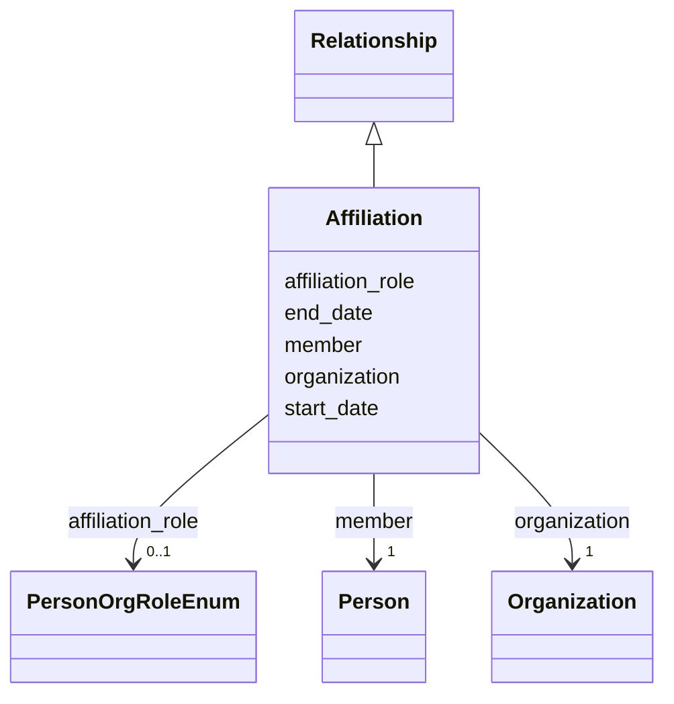

---
search:
  boost: 10.0
---

# Class: Affiliation 


_A person's employment or membership at an organization, with a position and dates. Use for the person's institutional home(s), independent of any project._


<div data-search-exclude markdown="1">


URI: [cerif:Person_OrganisationUnit](https://w3id.org/cerif/model#Person_OrganisationUnit)





## Inheritance
* [Relationship](../classes/Relationship.md)
    * **Affiliation**


## Class Properties

| Property | Value |
| --- | --- |
| Class URI | [cerif:Person_OrganisationUnit](https://w3id.org/cerif/model#Person_OrganisationUnit) |


## Slots

| Name | Cardinality and Range | Description | Inheritance |
| ---  | --- | --- | --- |
| [member](../slots/member.md) | 1 <br/> [Person](../classes/Person.md) | The person affiliated with the organization (by IDHI URN) | direct |
| [organization](../slots/organization.md) | 1 <br/> [Organization](../classes/Organization.md) | The organization side of the relationship (by IDHI URN) | direct |
| [affiliation_role](../slots/affiliation_role.md) | 0..1 <br/> [PersonOrgRoleEnum](../enums/PersonOrgRoleEnum.md) | The person's position at the organization (their job/status, not their projec... | direct |
| [start_date](../slots/start_date.md) | 0..1 <br/> [Date](../types/Date.md) | Start of the event, of the project's runtime, or of a relationship's validity... | [Relationship](../classes/Relationship.md) |
| [end_date](../slots/end_date.md) | 0..1 <br/> [Date](../types/Date.md) | End of the event, project runtime or relationship | [Relationship](../classes/Relationship.md) |


## Usages

| used by | used in | type | used |
| ---  | --- | --- | --- |
| [Person](../classes/Person.md) | [affiliations](../slots/affiliations.md) | range | [Affiliation](../classes/Affiliation.md) |


## Identifier and Mapping Information


### Schema Source


* from schema: https://idhi.co.il/linkml/idhi


## Mappings

| Mapping Type | Mapped Value |
| ---  | ---  |
| self | cerif:Person_OrganisationUnit |
| native | idhi:Affiliation |


## LinkML Source

<!-- TODO: investigate https://stackoverflow.com/questions/37606292/how-to-create-tabbed-code-blocks-in-mkdocs-or-sphinx -->

### Direct

<details>
```yaml
name: Affiliation
description: A person's employment or membership at an organization, with a position
  and dates. Use for the person's institutional home(s), independent of any project.
from_schema: https://idhi.co.il/linkml/idhi
is_a: Relationship
slots:
- member
- organization
- affiliation_role
class_uri: cerif:Person_OrganisationUnit

```
</details>

### Induced

<details>
```yaml
name: Affiliation
description: A person's employment or membership at an organization, with a position
  and dates. Use for the person's institutional home(s), independent of any project.
from_schema: https://idhi.co.il/linkml/idhi
is_a: Relationship
attributes:
  member:
    name: member
    description: The person affiliated with the organization (by IDHI URN).
    from_schema: https://idhi.co.il/linkml/idhi
    rank: 1000
    owner: Affiliation
    domain_of:
    - Affiliation
    range: Person
    required: true
  organization:
    name: organization
    description: The organization side of the relationship (by IDHI URN).
    from_schema: https://idhi.co.il/linkml/idhi
    rank: 1000
    owner: Affiliation
    domain_of:
    - Affiliation
    - OrganizationProjectRole
    - FacilityAffiliation
    range: Organization
    required: true
  affiliation_role:
    name: affiliation_role
    description: The person's position at the organization (their job/status, not
      their project role). Use EMPLOYEE when no finer value fits; AFFILIATE is for
      formal association without employment.
    from_schema: https://idhi.co.il/linkml/idhi
    rank: 1000
    slot_uri: schema:roleName
    owner: Affiliation
    domain_of:
    - Affiliation
    range: PersonOrgRoleEnum
  start_date:
    name: start_date
    description: Start of the event, of the project's runtime, or of a relationship's
      validity (e.g. when a person joined a project or organization).
    from_schema: https://idhi.co.il/linkml/idhi
    rank: 1000
    slot_uri: schema:startDate
    owner: Affiliation
    domain_of:
    - Project
    - Event
    - Relationship
    range: date
  end_date:
    name: end_date
    description: End of the event, project runtime or relationship. Omit for ongoing
      relationships and open-ended projects.
    from_schema: https://idhi.co.il/linkml/idhi
    rank: 1000
    slot_uri: schema:endDate
    owner: Affiliation
    domain_of:
    - Project
    - Event
    - Relationship
    range: date
class_uri: cerif:Person_OrganisationUnit

```
</details></div>