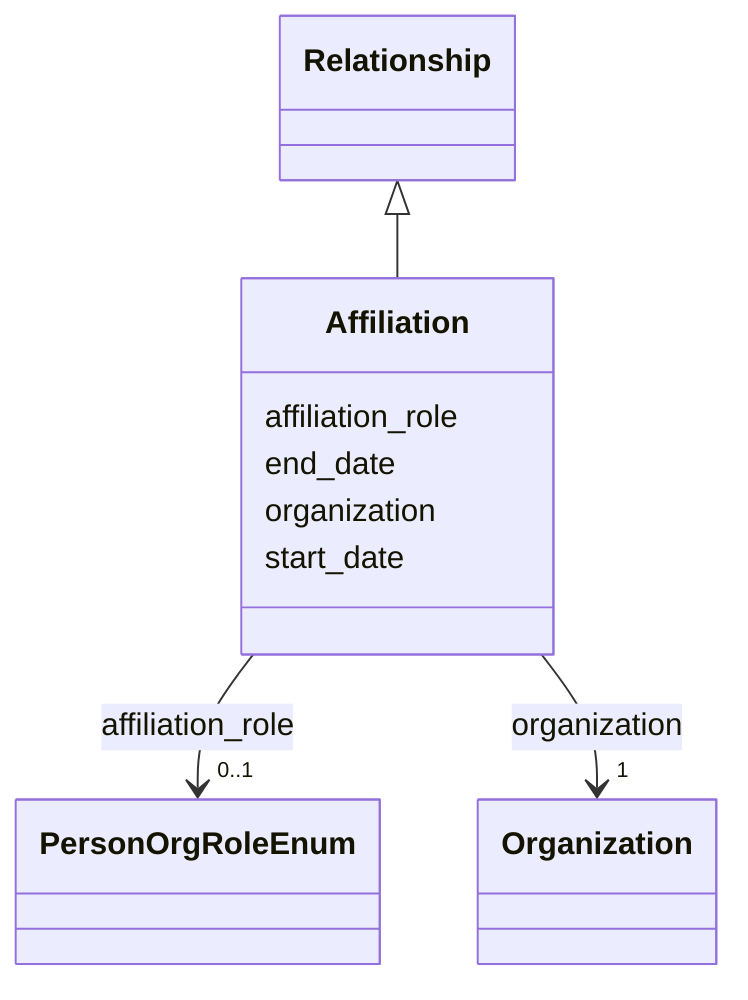

---
search:
  boost: 10.0
---

# Class: Affiliation 


_A person's formal relationship with an organization, nested in a Person so the person is inferred from the containing record. Use in Person.affiliations for employment, faculty, study, membership, ownership and other organization-level statuses independent of any project; do not provide the containing person's ID in the relationship._


<div data-search-exclude markdown="1">


URI: [cerif:Person_OrganisationUnit](https://w3id.org/cerif/model#Person_OrganisationUnit)





## Inheritance
* [Relationship](../classes/Relationship.md)
    * **Affiliation**


## Class Properties

| Property | Value |
| --- | --- |
| Class URI | [cerif:Person_OrganisationUnit](https://w3id.org/cerif/model#Person_OrganisationUnit) |


## Slots

| Name | Cardinality and Range | Description | Inheritance |
| ---  | --- | --- | --- |
| [organization](../slots/organization.md) | <span title="Required: exactly one value">1</span> <br/> [Organization](../classes/Organization.md) | <span title="The organization referenced by a person affiliation or project role (by IDHI URN). The Person or Project containing the relationship supplies its other endpoint. This uses an IDHI-specific property because one slot serves two relationship types whose external terms differ (schema:affiliation for Affiliation, schema:participant for OrganizationProjectRole), so neither can be asserted for both.">The organization referenced by a person affiliation or project role (by IDHI ...</span> | direct |
| [affiliation_role](../slots/affiliation_role.md) | <span title="Optional: at most one value">0..1</span> <br/> [PersonOrgRoleEnum](../enums/PersonOrgRoleEnum.md) | <span title="The person's role or status in the organization, not their role in a project. Prefer the most specific applicable value, use EMPLOYEE or MEMBER only when no finer role fits, and create separate Affiliation instances when materially distinct roles coexist or apply during different dates.">The person's role or status in the organization, not their role in a project</span> | direct |
| [start_date](../slots/start_date.md) | <span title="Optional: at most one value">0..1</span> <br/> [Date](../types/Date.md) | <span title="Start of the event, of the project's runtime, or of a relationship's validity, such as when participation, affiliation, maintenance responsibility or formal containment began.">Start of the event, of the project's runtime, or of a relationship's validity...</span> | [Relationship](../classes/Relationship.md) |
| [end_date](../slots/end_date.md) | <span title="Optional: at most one value">0..1</span> <br/> [Date](../types/Date.md) | <span title="End of the event, project runtime or relationship. Omit for ongoing relationships and open-ended projects.">End of the event, project runtime or relationship</span> | [Relationship](../classes/Relationship.md) |


## Usages

| used by | used in | type | used |
| ---  | --- | --- | --- |
| [Person](../classes/Person.md) | [affiliations](../slots/affiliations.md) | range | [Affiliation](../classes/Affiliation.md) |


## Identifier and Mapping Information


### Schema Source


* from schema: https://idhi_placeholder/linkml/idhi


## Mappings

| Mapping Type | Mapped Value |
| ---  | ---  |
| self | cerif:Person_OrganisationUnit |
| native | idhi:Affiliation |


## LinkML Source

### Direct

<details>
```yaml
name: Affiliation
description: A person's formal relationship with an organization, nested in a Person
  so the person is inferred from the containing record. Use in Person.affiliations
  for employment, faculty, study, membership, ownership and other organization-level
  statuses independent of any project; do not provide the containing person's ID in
  the relationship.
from_schema: https://idhi_placeholder/linkml/idhi
is_a: Relationship
slots:
- organization
- affiliation_role
class_uri: cerif:Person_OrganisationUnit

```
</details>

### Induced

<details>
```yaml
name: Affiliation
description: A person's formal relationship with an organization, nested in a Person
  so the person is inferred from the containing record. Use in Person.affiliations
  for employment, faculty, study, membership, ownership and other organization-level
  statuses independent of any project; do not provide the containing person's ID in
  the relationship.
from_schema: https://idhi_placeholder/linkml/idhi
is_a: Relationship
attributes:
  organization:
    name: organization
    description: The organization referenced by a person affiliation or project role
      (by IDHI URN). The Person or Project containing the relationship supplies its
      other endpoint. This uses an IDHI-specific property because one slot serves
      two relationship types whose external terms differ (schema:affiliation for Affiliation,
      schema:participant for OrganizationProjectRole), so neither can be asserted
      for both.
    from_schema: https://idhi_placeholder/linkml/idhi
    rank: 1000
    slot_uri: idhi:relatedOrganization
    owner: Affiliation
    domain_of:
    - Affiliation
    - OrganizationProjectRole
    range: Organization
    required: true
  affiliation_role:
    name: affiliation_role
    description: The person's role or status in the organization, not their role in
      a project. Prefer the most specific applicable value, use EMPLOYEE or MEMBER
      only when no finer role fits, and create separate Affiliation instances when
      materially distinct roles coexist or apply during different dates.
    from_schema: https://idhi_placeholder/linkml/idhi
    rank: 1000
    slot_uri: schema:roleName
    owner: Affiliation
    domain_of:
    - Affiliation
    range: PersonOrgRoleEnum
  start_date:
    name: start_date
    description: Start of the event, of the project's runtime, or of a relationship's
      validity, such as when participation, affiliation, maintenance responsibility
      or formal containment began.
    from_schema: https://idhi_placeholder/linkml/idhi
    rank: 1000
    slot_uri: schema:startDate
    owner: Affiliation
    domain_of:
    - Project
    - Event
    - Relationship
    - Funding
    range: date
  end_date:
    name: end_date
    description: End of the event, project runtime or relationship. Omit for ongoing
      relationships and open-ended projects.
    from_schema: https://idhi_placeholder/linkml/idhi
    rank: 1000
    slot_uri: schema:endDate
    owner: Affiliation
    domain_of:
    - Project
    - Event
    - Relationship
    - Funding
    range: date
class_uri: cerif:Person_OrganisationUnit

```
</details></div>