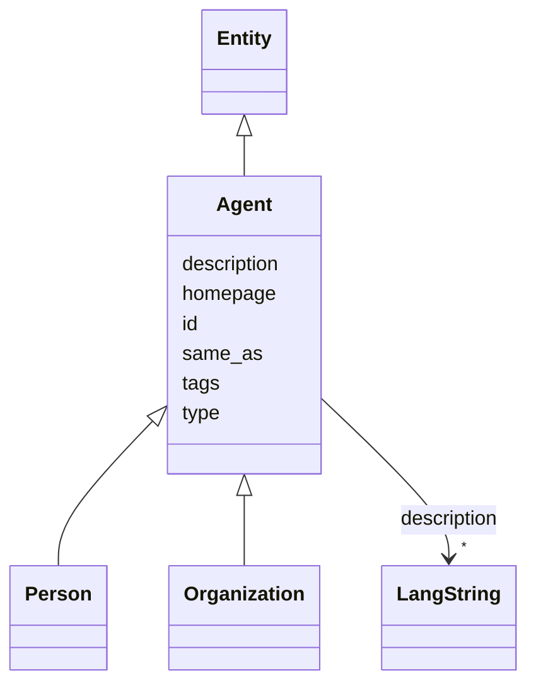

---
search:
  boost: 10.0
---

# Class: Agent 


_A person or an organization._


<div data-search-exclude markdown="1">


* __NOTE__: this is an abstract class and should not be instantiated directly


URI: [foaf:Agent](https://xmlns.com/foaf/spec/#term_Agent)





## Inheritance
* [Entity](../classes/Entity.md)
    * **Agent**
        * [Person](../classes/Person.md)
        * [Organization](../classes/Organization.md)


## Class Properties

| Property | Value |
| --- | --- |
| Class URI | [foaf:Agent](https://xmlns.com/foaf/spec/#term_Agent) |


## Slots

| Name | Cardinality and Range | Description | Inheritance |
| ---  | --- | --- | --- |
| [type](../slots/type.md) | 1 <br/> [Curie](../types/Curie.md) | Discriminator identifying the record's class; used for polymorphic serializat... | [Entity](../classes/Entity.md) |
| [id](../slots/id.md) | 1 <br/> [String](../types/String.md) | The entity's primary identifier: an IDHI URN of the form | [Entity](../classes/Entity.md) |
| [description](../slots/description.md) | * <br/> [LangString](../classes/LangString.md) | Multilingual free-text description (a few sentences aimed at index visitors, ... | [Entity](../classes/Entity.md) |
| [homepage](../slots/homepage.md) | 0..1 <br/> [Uri](../types/Uri.md) | Public landing page of the entity, if one exists | [Entity](../classes/Entity.md) |
| [same_as](../slots/same_as.md) | * <br/> [Uri](../types/Uri.md) | URIs of records in OTHER systems describing the same real-world entity (Wikid... | [Entity](../classes/Entity.md) |
| [tags](../slots/tags.md) | * <br/> [String](../types/String.md) | Free-text tags for discovery, filtering and grouping; usable on any top-level... | [Entity](../classes/Entity.md) |


## Identifier and Mapping Information


### Schema Source


* from schema: https://idhi_placeholder/linkml/idhi


## Mappings

| Mapping Type | Mapped Value |
| ---  | ---  |
| self | foaf:Agent |
| native | idhi:Agent |


## LinkML Source

<!-- TODO: investigate https://stackoverflow.com/questions/37606292/how-to-create-tabbed-code-blocks-in-mkdocs-or-sphinx -->

### Direct

<details>
```yaml
name: Agent
description: A person or an organization.
from_schema: https://idhi_placeholder/linkml/idhi
is_a: Entity
abstract: true
class_uri: foaf:Agent

```
</details>

### Induced

<details>
```yaml
name: Agent
description: A person or an organization.
from_schema: https://idhi_placeholder/linkml/idhi
is_a: Entity
abstract: true
attributes:
  type:
    name: type
    description: Discriminator identifying the record's class; used for polymorphic
      serialization and deserialization.
    from_schema: https://idhi_placeholder/linkml/idhi
    rank: 1000
    slot_uri: rdf:type
    owner: Agent
    domain_of:
    - Entity
    range: curie
    required: true
  id:
    name: id
    description: "The entity's primary identifier: an IDHI URN of the form\n  idhi:<class\
      \ name>:<random short alphanumeric id>\ne.g. idhi:person:x7k2m9 or idhi:project:a83bq1.\
      \ Minted by IDHI at record creation and never reused or changed. The class token\
      \ is the lowercase snake_case class name; each concrete class enforces its own\
      \ token via slot_usage. External identifiers (ORCID, ROR, DOI...) are supplementary\
      \ and go in their dedicated slots — never here."
    from_schema: https://idhi_placeholder/linkml/idhi
    rank: 1000
    slot_uri: dcterms:identifier
    identifier: true
    owner: Agent
    domain_of:
    - Entity
    range: string
    required: true
    pattern: ^idhi:[a-z_]+:[0-9a-z]{4,12}$
  description:
    name: description
    description: Multilingual free-text description (a few sentences aimed at index
      visitors, not internal notes).
    from_schema: https://idhi_placeholder/linkml/idhi
    rank: 1000
    slot_uri: dcterms:description
    owner: Agent
    domain_of:
    - Entity
    range: LangString
    multivalued: true
    inlined: true
    inlined_as_list: true
  homepage:
    name: homepage
    description: Public landing page of the entity, if one exists.
    from_schema: https://idhi_placeholder/linkml/idhi
    rank: 1000
    slot_uri: foaf:homepage
    owner: Agent
    domain_of:
    - Entity
    range: uri
  same_as:
    name: same_as
    description: URIs of records in OTHER systems describing the same real-world entity
      (Wikidata, PeriodO, GeoNames...). Use for linked-data alignment, not for the
      entity's own pages (use homepage).
    from_schema: https://idhi_placeholder/linkml/idhi
    rank: 1000
    slot_uri: schema:sameAs
    owner: Agent
    domain_of:
    - Entity
    range: uri
    multivalued: true
  tags:
    name: tags
    description: Free-text tags for discovery, filtering and grouping; usable on any
      top-level entity. Deliberately NOT a controlled enum, but prefer wording that
      matches a concept in an established ontology or thesaurus (e.g. Wikidata, Getty
      AAT, TaDiRAH) so tags can later be reconciled against it.
    from_schema: https://idhi_placeholder/linkml/idhi
    rank: 1000
    slot_uri: dcat:keyword
    owner: Agent
    domain_of:
    - Entity
    range: string
    multivalued: true
class_uri: foaf:Agent

```
</details></div>