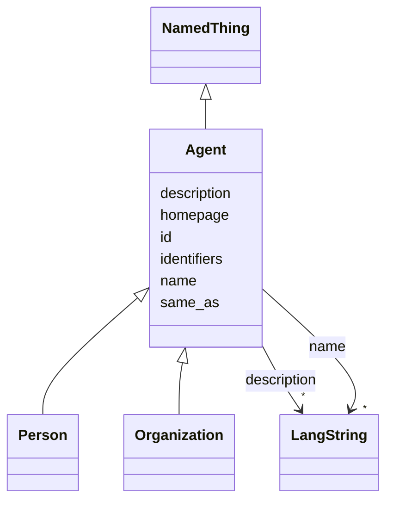

---
search:
  boost: 10.0
---

# Class: Agent 


_A person or organization (a FOAF Agent). Abstract; use Person or Organization._


<div data-search-exclude markdown="1">


* __NOTE__: this is an abstract class and should not be instantiated directly


URI: [foaf:Agent](http://xmlns.com/foaf/0.1/Agent)





## Inheritance
* [NamedThing](../classes/NamedThing.md)
    * **Agent**
        * [Person](../classes/Person.md)
        * [Organization](../classes/Organization.md)


## Class Properties

| Property | Value |
| --- | --- |
| Class URI | [foaf:Agent](http://xmlns.com/foaf/0.1/Agent) |


## Slots

| Name | Cardinality and Range | Description | Inheritance |
| ---  | --- | --- | --- |
| [id](../slots/id.md) | 1 <br/> [String](../types/String.md) | The entity's primary identifier: an IDHI URN of the form | [NamedThing](../classes/NamedThing.md) |
| [name](../slots/name.md) | * <br/> [LangString](../classes/LangString.md) | Multilingual name/title | [NamedThing](../classes/NamedThing.md) |
| [description](../slots/description.md) | * <br/> [LangString](../classes/LangString.md) | Multilingual free-text description (a few sentences aimed at index visitors, ... | [NamedThing](../classes/NamedThing.md) |
| [homepage](../slots/homepage.md) | 0..1 <br/> [Uri](../types/Uri.md) | Public landing page of the entity, if one exists | [NamedThing](../classes/NamedThing.md) |
| [identifiers](../slots/identifiers.md) | * <br/> [Uriorcurie](../types/Uriorcurie.md) | Additional EXTERNAL identifiers beyond the primary IDHI URN and the dedicated... | [NamedThing](../classes/NamedThing.md) |
| [same_as](../slots/same_as.md) | * <br/> [Uri](../types/Uri.md) | URIs of records in OTHER systems describing the same real-world entity (Wikid... | [NamedThing](../classes/NamedThing.md) |


## Identifier and Mapping Information


### Schema Source


* from schema: https://idhi.co.il/linkml/idhi


## Mappings

| Mapping Type | Mapped Value |
| ---  | ---  |
| self | foaf:Agent |
| native | idhi:Agent |


## LinkML Source

<!-- TODO: investigate https://stackoverflow.com/questions/37606292/how-to-create-tabbed-code-blocks-in-mkdocs-or-sphinx -->

### Direct

<details>
```yaml
name: Agent
description: A person or organization (a FOAF Agent). Abstract; use Person or Organization.
from_schema: https://idhi.co.il/linkml/idhi
is_a: NamedThing
abstract: true
class_uri: foaf:Agent

```
</details>

### Induced

<details>
```yaml
name: Agent
description: A person or organization (a FOAF Agent). Abstract; use Person or Organization.
from_schema: https://idhi.co.il/linkml/idhi
is_a: NamedThing
abstract: true
attributes:
  id:
    name: id
    description: "The entity's primary identifier: an IDHI URN of the form\n  idhi:<class\
      \ name>:<random short alphanumeric id>\ne.g. idhi:person:x7k2m9 or idhi:project:a83bq1.\
      \ Minted by IDHI at record creation and never reused or changed. The class token\
      \ is the lowercase snake_case class name (Organization subclasses use \"organization\"\
      ); each concrete class enforces its own token via slot_usage. External identifiers\
      \ (ORCID, ROR, DOI...) are supplementary and go in their dedicated slots — never\
      \ here."
    from_schema: https://idhi.co.il/linkml/idhi
    rank: 1000
    slot_uri: dcterms:identifier
    identifier: true
    owner: Agent
    domain_of:
    - NamedThing
    range: string
    required: true
    pattern: ^idhi:[a-z_]+:[0-9a-z]{4,12}$
  name:
    name: name
    description: Multilingual name/title. Provide at least one language; English,
      Hebrew and Arabic variants are each a separate LangString. Preferably a sortable
      name (e.g. "Smith, John" rather than "John Smith") for people and organizations;
      for projects, tools and services, use the name the team itself uses.
    from_schema: https://idhi.co.il/linkml/idhi
    rank: 1000
    slot_uri: skos:prefLabel
    owner: Agent
    domain_of:
    - NamedThing
    range: LangString
    multivalued: true
    inlined: true
    inlined_as_list: true
  description:
    name: description
    description: Multilingual free-text description (a few sentences aimed at index
      visitors, not internal notes).
    from_schema: https://idhi.co.il/linkml/idhi
    rank: 1000
    slot_uri: dcterms:description
    owner: Agent
    domain_of:
    - NamedThing
    range: LangString
    multivalued: true
    inlined: true
    inlined_as_list: true
  homepage:
    name: homepage
    description: Public landing page of the entity, if one exists.
    from_schema: https://idhi.co.il/linkml/idhi
    rank: 1000
    slot_uri: foaf:homepage
    owner: Agent
    domain_of:
    - NamedThing
    range: uri
  identifiers:
    name: identifiers
    description: Additional EXTERNAL identifiers beyond the primary IDHI URN and the
      dedicated ORCID/ROR/DOI slots, as CURIEs/URIs (e.g. Wikidata QIDs, VIAF, ISNI).
    from_schema: https://idhi.co.il/linkml/idhi
    rank: 1000
    slot_uri: dcterms:identifier
    owner: Agent
    domain_of:
    - NamedThing
    range: uriorcurie
    multivalued: true
  same_as:
    name: same_as
    description: URIs of records in OTHER systems describing the same real-world entity
      (Wikidata, PeriodO, GeoNames...). Use for linked-data alignment, not for the
      entity's own pages (use homepage).
    from_schema: https://idhi.co.il/linkml/idhi
    rank: 1000
    slot_uri: schema:sameAs
    owner: Agent
    domain_of:
    - NamedThing
    range: uri
    multivalued: true
class_uri: foaf:Agent

```
</details></div>