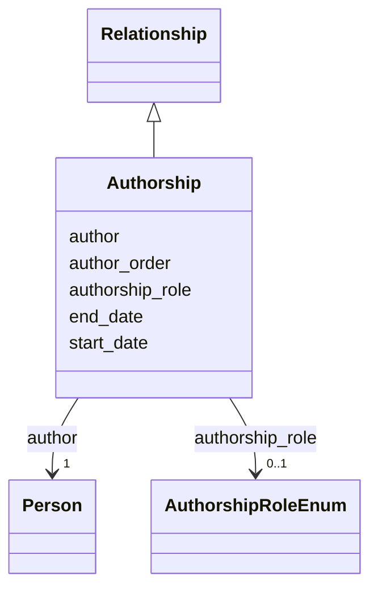

---
search:
  boost: 10.0
---

# Class: Authorship 


_A person's contribution nested in a Publication, so the publication is inferred from the containing record. Use one instance per author in Publication.authorships and do not define authorship in Person; author_order preserves the byline sequence with 1 as the first author._


<div data-search-exclude markdown="1">


URI: [schema:Role](http://schema.org/Role)





## Inheritance
* [Relationship](../classes/Relationship.md)
    * **Authorship**


## Class Properties

| Property | Value |
| --- | --- |
| Class URI | [schema:Role](http://schema.org/Role) |


## Slots

| Name | Cardinality and Range | Description | Inheritance |
| ---  | --- | --- | --- |
| [author](../slots/author.md) | <span title="Required: exactly one value">1</span> <br/> [Person](../classes/Person.md) | <span title="The person contributing to the containing publication (by IDHI URN). Use in Publication.authorships; do not define the relationship on the Person.">The person contributing to the containing publication (by IDHI URN)</span> | direct |
| [author_order](../slots/author_order.md) | <span title="Optional: at most one value">0..1</span> <br/> [Integer](../types/Integer.md) | <span title="Position in the byline; 1 = first author.">Position in the byline; 1 = first author</span> | direct |
| [authorship_role](../slots/authorship_role.md) | <span title="Optional: at most one value">0..1</span> <br/> [AuthorshipRoleEnum](../enums/AuthorshipRoleEnum.md) | <span title="The kind of contribution. AUTHOR is the default for byline authors; use EDITOR/TRANSLATOR for edited volumes and translations; CONTRIBUTOR for named non-byline contributions.">The kind of contribution</span> | direct |
| [start_date](../slots/start_date.md) | <span title="Optional: at most one value">0..1</span> <br/> [Date](../types/Date.md) | <span title="Start of the event, of the project's runtime, or of a relationship's validity, such as when participation, affiliation, maintenance responsibility or formal containment began.">Start of the event, of the project's runtime, or of a relationship's validity...</span> | [Relationship](../classes/Relationship.md) |
| [end_date](../slots/end_date.md) | <span title="Optional: at most one value">0..1</span> <br/> [Date](../types/Date.md) | <span title="End of the event, project runtime or relationship. Omit for ongoing relationships and open-ended projects.">End of the event, project runtime or relationship</span> | [Relationship](../classes/Relationship.md) |


## Usages

| used by | used in | type | used |
| ---  | --- | --- | --- |
| [Publication](../classes/Publication.md) | [authorships](../slots/authorships.md) | range | [Authorship](../classes/Authorship.md) |


## Identifier and Mapping Information


### Schema Source


* from schema: https://idhi_placeholder/linkml/idhi


## Mappings

| Mapping Type | Mapped Value |
| ---  | ---  |
| self | schema:Role |
| native | idhi:Authorship |


## LinkML Source

### Direct

<details>
```yaml
name: Authorship
description: A person's contribution nested in a Publication, so the publication is
  inferred from the containing record. Use one instance per author in Publication.authorships
  and do not define authorship in Person; author_order preserves the byline sequence
  with 1 as the first author.
from_schema: https://idhi_placeholder/linkml/idhi
is_a: Relationship
slots:
- author
- author_order
- authorship_role
class_uri: schema:Role

```
</details>

### Induced

<details>
```yaml
name: Authorship
description: A person's contribution nested in a Publication, so the publication is
  inferred from the containing record. Use one instance per author in Publication.authorships
  and do not define authorship in Person; author_order preserves the byline sequence
  with 1 as the first author.
from_schema: https://idhi_placeholder/linkml/idhi
is_a: Relationship
attributes:
  author:
    name: author
    description: The person contributing to the containing publication (by IDHI URN).
      Use in Publication.authorships; do not define the relationship on the Person.
    from_schema: https://idhi_placeholder/linkml/idhi
    rank: 1000
    owner: Authorship
    domain_of:
    - Authorship
    range: Person
    required: true
  author_order:
    name: author_order
    description: Position in the byline; 1 = first author.
    from_schema: https://idhi_placeholder/linkml/idhi
    rank: 1000
    slot_uri: schema:position
    owner: Authorship
    domain_of:
    - Authorship
    range: integer
  authorship_role:
    name: authorship_role
    description: The kind of contribution. AUTHOR is the default for byline authors;
      use EDITOR/TRANSLATOR for edited volumes and translations; CONTRIBUTOR for named
      non-byline contributions.
    from_schema: https://idhi_placeholder/linkml/idhi
    rank: 1000
    slot_uri: schema:roleName
    owner: Authorship
    domain_of:
    - Authorship
    range: AuthorshipRoleEnum
  start_date:
    name: start_date
    description: Start of the event, of the project's runtime, or of a relationship's
      validity, such as when participation, affiliation, maintenance responsibility
      or formal containment began.
    from_schema: https://idhi_placeholder/linkml/idhi
    rank: 1000
    slot_uri: schema:startDate
    owner: Authorship
    domain_of:
    - Project
    - Event
    - Relationship
    - Funding
    range: date
  end_date:
    name: end_date
    description: End of the event, project runtime or relationship. Omit for ongoing
      relationships and open-ended projects.
    from_schema: https://idhi_placeholder/linkml/idhi
    rank: 1000
    slot_uri: schema:endDate
    owner: Authorship
    domain_of:
    - Project
    - Event
    - Relationship
    - Funding
    range: date
class_uri: schema:Role

```
</details></div>