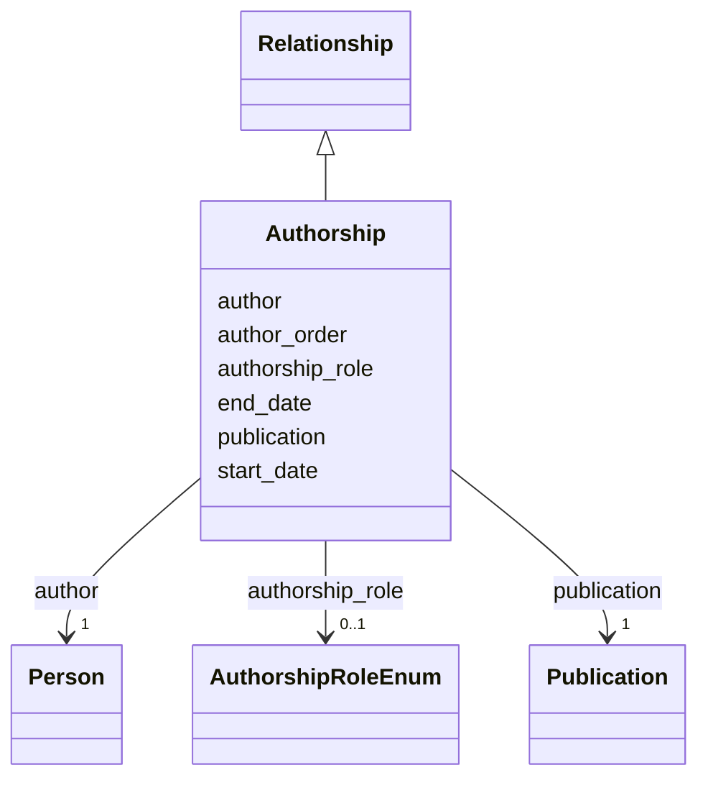

---
search:
  boost: 10.0
---

# Class: Authorship 


_A person's contribution to a publication, with author order and role. Create one instance per (person, publication); author_order preserves the byline sequence (1 = first author)._


<div data-search-exclude markdown="1">


URI: [schema:Role](http://schema.org/Role)





## Inheritance
* [Relationship](../classes/Relationship.md)
    * **Authorship**


## Class Properties

| Property | Value |
| --- | --- |
| Class URI | [schema:Role](http://schema.org/Role) |


## Slots

| Name | Cardinality and Range | Description | Inheritance |
| ---  | --- | --- | --- |
| [author](../slots/author.md) | 1 <br/> [Person](../classes/Person.md) | The contributing person (by IDHI URN) | direct |
| [publication](../slots/publication.md) | 1 <br/> [Publication](../classes/Publication.md) | The publication contributed to (by IDHI URN) | direct |
| [author_order](../slots/author_order.md) | 0..1 <br/> [Integer](../types/Integer.md) | Position in the byline; 1 = first author | direct |
| [authorship_role](../slots/authorship_role.md) | 0..1 <br/> [AuthorshipRoleEnum](../enums/AuthorshipRoleEnum.md) | The kind of contribution | direct |
| [start_date](../slots/start_date.md) | 0..1 <br/> [Date](../types/Date.md) | Start of the event or of a relationship's validity (e | [Relationship](../classes/Relationship.md) |
| [end_date](../slots/end_date.md) | 0..1 <br/> [Date](../types/Date.md) | End of the event, relationship or time period | [Relationship](../classes/Relationship.md) |


## Usages

| used by | used in | type | used |
| ---  | --- | --- | --- |
| [Person](../classes/Person.md) | [authorships](../slots/authorships.md) | range | [Authorship](../classes/Authorship.md) |
| [Publication](../classes/Publication.md) | [authorships](../slots/authorships.md) | range | [Authorship](../classes/Authorship.md) |


## Identifier and Mapping Information


### Schema Source


* from schema: https://idhi.co.il/linkml/idhi


## Mappings

| Mapping Type | Mapped Value |
| ---  | ---  |
| self | schema:Role |
| native | idhi:Authorship |


## LinkML Source

<!-- TODO: investigate https://stackoverflow.com/questions/37606292/how-to-create-tabbed-code-blocks-in-mkdocs-or-sphinx -->

### Direct

<details>
```yaml
name: Authorship
description: A person's contribution to a publication, with author order and role.
  Create one instance per (person, publication); author_order preserves the byline
  sequence (1 = first author).
from_schema: https://idhi.co.il/linkml/idhi
is_a: Relationship
slots:
- author
- publication
- author_order
- authorship_role
class_uri: schema:Role

```
</details>

### Induced

<details>
```yaml
name: Authorship
description: A person's contribution to a publication, with author order and role.
  Create one instance per (person, publication); author_order preserves the byline
  sequence (1 = first author).
from_schema: https://idhi.co.il/linkml/idhi
is_a: Relationship
attributes:
  author:
    name: author
    description: The contributing person (by IDHI URN).
    from_schema: https://idhi.co.il/linkml/idhi
    rank: 1000
    owner: Authorship
    domain_of:
    - Authorship
    range: Person
    required: true
  publication:
    name: publication
    description: The publication contributed to (by IDHI URN).
    from_schema: https://idhi.co.il/linkml/idhi
    rank: 1000
    owner: Authorship
    domain_of:
    - Authorship
    range: Publication
    required: true
  author_order:
    name: author_order
    description: Position in the byline; 1 = first author.
    from_schema: https://idhi.co.il/linkml/idhi
    rank: 1000
    slot_uri: schema:position
    owner: Authorship
    domain_of:
    - Authorship
    range: integer
  authorship_role:
    name: authorship_role
    description: The kind of contribution. AUTHOR is the default for byline authors;
      use EDITOR/TRANSLATOR for edited volumes and translations; CONTRIBUTOR for named
      non-byline contributions.
    from_schema: https://idhi.co.il/linkml/idhi
    rank: 1000
    slot_uri: schema:roleName
    owner: Authorship
    domain_of:
    - Authorship
    range: AuthorshipRoleEnum
  start_date:
    name: start_date
    description: Start of the event or of a relationship's validity (e.g. when a person
      joined a project or organization).
    from_schema: https://idhi.co.il/linkml/idhi
    rank: 1000
    slot_uri: schema:startDate
    owner: Authorship
    domain_of:
    - Event
    - Relationship
    range: date
  end_date:
    name: end_date
    description: End of the event, relationship or time period. Omit for ongoing relationships
      and open-ended periods.
    from_schema: https://idhi.co.il/linkml/idhi
    rank: 1000
    slot_uri: schema:endDate
    owner: Authorship
    domain_of:
    - Event
    - TimePeriod
    - Relationship
    range: date
class_uri: schema:Role

```
</details></div>