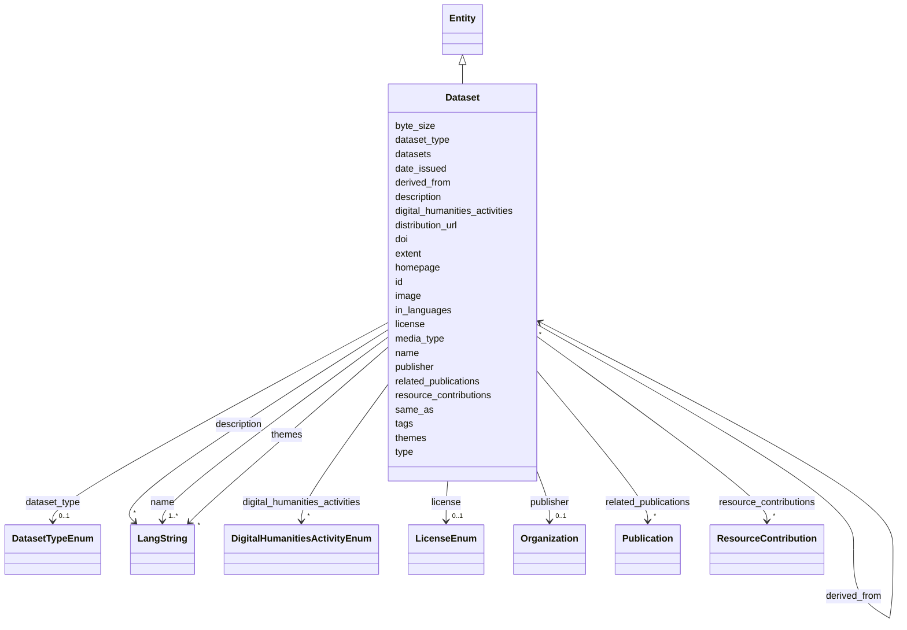

---
search:
  boost: 10.0
---

# Class: Dataset 


_A dataset or dataset-like intellectual object produced or curated by a project: digital editions, corpora, databases, gazetteers, image collections, annotation sets and metadata catalogs. Use Dataset for research data, digital scholarly editions and catalogs that describe other resources; a catalog can link the datasets it aggregates through datasets._


<div data-search-exclude markdown="1">


URI: [dcat:Dataset](http://www.w3.org/ns/dcat#Dataset)





## Inheritance
* [Entity](../classes/Entity.md)
    * **Dataset**


## Class Properties

| Property | Value |
| --- | --- |
| Class URI | [dcat:Dataset](http://www.w3.org/ns/dcat#Dataset) |


## Slots

| Name | Cardinality and Range | Description | Inheritance |
| ---  | --- | --- | --- |
| [name](../slots/name.md) | <span title="Required: one or more values">1..*</span> <br/> [LangString](../classes/LangString.md) | <span title="The multilingual name or title used to identify the entity. Use one LangString per available language and do not repeat a language. Prefer the official localized name for organizations; for projects, tools and services, use localized names supplied by the team rather than translating branded names without authority.">The multilingual name or title used to identify the entity</span> | direct |
| [doi](../slots/doi.md) | <span title="Optional: at most one value">0..1</span> <br/> [Uri](../types/Uri.md) | <span title="The publication, dataset, tool or training material's DOI persistent identifier. Record it whenever one exists; it is the preferred deduplication key and is supplementary to the IDHI URN.">The publication, dataset, tool or training material's DOI persistent identifi...</span> | direct |
| [dataset_type](../slots/dataset_type.md) | <span title="Optional: at most one value">0..1</span> <br/> [DatasetTypeEnum](../enums/DatasetTypeEnum.md) | <span title="The dataset's primary intellectual or collection form. Use this for discovery categories such as digital edition, corpus or gazetteer; use media_type for its technical serialization.">The dataset's primary intellectual or collection form</span> | direct |
| [digital_humanities_activities](../slots/digital_humanities_activities.md) | <span title="Optional: zero or more values allowed">*</span> <br/> [DigitalHumanitiesActivityEnum](../enums/DigitalHumanitiesActivityEnum.md) | <span title="Digital-humanities research activities practiced in this project, tool, service or dataset, or taught by this training material. Prefer the most specific applicable activity; multiple values are expected. This is the primary DH-facet for discovery.">Digital-humanities research activities practiced in this project, tool, servi...</span> | direct |
| [datasets](../slots/datasets.md) | <span title="Optional: zero or more values allowed">*</span> <br/> [Dataset](../classes/Dataset.md) | <span title="Datasets aggregated by a Dataset that functions as a catalog (by id).">Datasets aggregated by a Dataset that functions as a catalog (by id)</span> | direct |
| [derived_from](../slots/derived_from.md) | <span title="Optional: zero or more values allowed">*</span> <br/> [Dataset](../classes/Dataset.md) | <span title="Source datasets from which this dataset was re-OCRed, cleaned, transformed, subsetted or otherwise derived. Reference each immediate source by IDHI URN; use datasets only for catalog aggregation rather than provenance.">Source datasets from which this dataset was re-OCRed, cleaned, transformed, s...</span> | direct |
| [publisher](../slots/publisher.md) | <span title="Optional: at most one value">0..1</span> <br/> [Organization](../classes/Organization.md) | <span title="The organization formally publishing the dataset, publication or training material (by IDHI URN); use creators for responsibility for making a training material.">The organization formally publishing the dataset, publication or training mat...</span> | direct |
| [license](../slots/license.md) | <span title="Optional: at most one value">0..1</span> <br/> [LicenseEnum](../enums/LicenseEnum.md) | <span title="The license under which the tool, dataset or training material is released. Required for anything advertised as reusable; omit only if genuinely unknown.">The license under which the tool, dataset or training material is released</span> | direct |
| [date_issued](../slots/date_issued.md) | <span title="Optional: at most one value">0..1</span> <br/> [Date](../types/Date.md) | <span title="Formal publication date (or year-01-01 if only the year is known).">Formal publication date (or year-01-01 if only the year is known)</span> | direct |
| [distribution_url](../slots/distribution_url.md) | <span title="Optional: at most one value">0..1</span> <br/> [Uri](../types/Uri.md) | <span title="Direct download or access URL for the dataset.">Direct download or access URL for the dataset</span> | direct |
| [extent](../slots/extent.md) | <span title="Optional: zero or more values allowed">*</span> <br/> [String](../types/String.md) | <span title="Technical extent statements such as record, item, issue, image or file counts. Use one concise statement per measure, include its unit, and use byte_size rather than prose for total bytes.">Technical extent statements such as record, item, issue, image or file counts</span> | direct |
| [byte_size](../slots/byte_size.md) | <span title="Optional: at most one value">0..1</span> <br/> [Integer](../types/Integer.md) | <span title="Total size of the described dataset distribution in bytes. Use an exact or documented aggregate byte count and omit it when only an unreliable estimate is available.">Total size of the described dataset distribution in bytes</span> | direct |
| [in_languages](../slots/in_languages.md) | <span title="Optional: zero or more values allowed">*</span> <br/> [String](../types/String.md) | <span title="Languages substantially represented in a dataset or in which instructional content is available, using BCP-47 tags. For training material, record every complete language version and do not include a language used only in captions or examples; for datasets, record the languages of the data rather than its metadata page.">Languages substantially represented in a dataset or in which instructional co...</span> | direct |
| [media_type](../slots/media_type.md) | <span title="Optional: zero or more values allowed">*</span> <br/> [String](../types/String.md) | <span title="Technical media type of the primary dataset distribution or training resource, preferably an IANA media type such as text/html, application/pdf, application/vnd.apache.parquet or video/mp4. Dataset records may list multiple formats; do not use this for an intellectual or didactic form, which belongs in dataset_type or training_material_type.">Technical media type of the primary dataset distribution or training resource...</span> | direct |
| [related_publications](../slots/related_publications.md) | <span title="Optional: zero or more values allowed">*</span> <br/> [Publication](../classes/Publication.md) | <span title="Publications that are counterparts or direct scholarly companions of the dataset, such as the print counterpart of a digital edition. Reference Publication records by IDHI URN; use outputs_publications on Project for outputs that are related only by their project of origin.">Publications that are counterparts or direct scholarly companions of the data...</span> | direct |
| [themes](../slots/themes.md) | <span title="Optional: zero or more values allowed">*</span> <br/> [LangString](../classes/LangString.md) | <span title="Thematic keywords for the dataset, multilingual.">Thematic keywords for the dataset, multilingual</span> | direct |
| [resource_contributions](../slots/resource_contributions.md) | <span title="Optional: zero or more values allowed">*</span> <br/> [ResourceContribution](../classes/ResourceContribution.md) | <span title="Named contributions to the containing Tool or Dataset, with contributor, role and optional dates. Define each contribution only on the resource; use publisher where supported for the organization formally releasing it and Project.project_participations for work described only at project level.">Named contributions to the containing Tool or Dataset, with contributor, role...</span> | direct |
| [type](../slots/type.md) | <span title="Required: exactly one value">1</span> <br/> [Curie](../types/Curie.md) | <span title="Discriminator identifying the record's class; used for polymorphic serialization and deserialization.">Discriminator identifying the record's class; used for polymorphic serializat...</span> | [Entity](../classes/Entity.md) |
| [id](../slots/id.md) | <span title="Required: exactly one value">1</span> <br/> [String](../types/String.md) | <span title="The entity's primary identifier: an IDHI URN of the form&#10;  idhi:&lt;class name>:&lt;random short alphanumeric id>&#10;e.g. idhi:person:x7k2m9 or idhi:project:a83bq1. Minted by IDHI at record creation and never reused or changed. The class token is the lowercase snake_case class name; each concrete class enforces its own token via slot_usage. External identifiers (ORCID, ROR, DOI...) are supplementary and go in their dedicated slots — never here.">The entity's primary identifier: an IDHI URN of the form</span> | [Entity](../classes/Entity.md) |
| [description](../slots/description.md) | <span title="Optional: zero or more values allowed">*</span> <br/> [LangString](../classes/LangString.md) | <span title="Multilingual free-text description (a few sentences aimed at index visitors, not internal notes).">Multilingual free-text description (a few sentences aimed at index visitors, ...</span> | [Entity](../classes/Entity.md) |
| [image](../slots/image.md) | <span title="Optional: at most one value">0..1</span> <br/> [Base64binary](../types/Base64binary.md) | <span title="A representative image embedded as Base64-encoded binary content. Use for a single image that must travel with the entity record; omit it when no image is available, and use homepage or additional_urls for externally hosted pages rather than encoding a URL here.">A representative image embedded as Base64-encoded binary content</span> | [Entity](../classes/Entity.md) |
| [homepage](../slots/homepage.md) | <span title="Optional: at most one value">0..1</span> <br/> [Uri](../types/Uri.md) | <span title="Public landing page of the entity, if one exists.">Public landing page of the entity, if one exists</span> | [Entity](../classes/Entity.md) |
| [same_as](../slots/same_as.md) | <span title="Optional: zero or more values allowed">*</span> <br/> [Uri](../types/Uri.md) | <span title="URIs of records in OTHER systems describing the same real-world entity (Wikidata, PeriodO, GeoNames...). Use for linked-data alignment, not for the entity's own pages (use homepage).">URIs of records in OTHER systems describing the same real-world entity (Wikid...</span> | [Entity](../classes/Entity.md) |
| [tags](../slots/tags.md) | <span title="Optional: zero or more values allowed">*</span> <br/> [String](../types/String.md) | <span title="Free-text tags for discovery, filtering and grouping; usable on any top-level entity. Deliberately NOT a controlled enum, but prefer wording that matches a concept in an established ontology or thesaurus (e.g. Wikidata, Getty AAT, TaDiRAH) so tags can later be reconciled against it.">Free-text tags for discovery, filtering and grouping; usable on any top-level...</span> | [Entity](../classes/Entity.md) |


## Usages

| used by | used in | type | used |
| ---  | --- | --- | --- |
| [Project](../classes/Project.md) | [uses_datasets](../slots/uses_datasets.md) | range | [Dataset](../classes/Dataset.md) |
| [Project](../classes/Project.md) | [outputs_datasets](../slots/outputs_datasets.md) | range | [Dataset](../classes/Dataset.md) |
| [Dataset](../classes/Dataset.md) | [datasets](../slots/datasets.md) | range | [Dataset](../classes/Dataset.md) |
| [Dataset](../classes/Dataset.md) | [derived_from](../slots/derived_from.md) | range | [Dataset](../classes/Dataset.md) |
| [TrainingMaterial](../classes/TrainingMaterial.md) | [related_datasets](../slots/related_datasets.md) | range | [Dataset](../classes/Dataset.md) |
| [IndexContainer](../classes/IndexContainer.md) | [datasets](../slots/datasets.md) | range | [Dataset](../classes/Dataset.md) |


## In Subsets


* [ToplevelEntity](../subsets/ToplevelEntity.md)


## Identifier and Mapping Information


### Schema Source


* from schema: https://idhi_placeholder/linkml/idhi


## Mappings

| Mapping Type | Mapped Value |
| ---  | ---  |
| self | dcat:Dataset |
| native | idhi:Dataset |


## LinkML Source

### Direct

<details>
```yaml
name: Dataset
description: 'A dataset or dataset-like intellectual object produced or curated by
  a project: digital editions, corpora, databases, gazetteers, image collections,
  annotation sets and metadata catalogs. Use Dataset for research data, digital scholarly
  editions and catalogs that describe other resources; a catalog can link the datasets
  it aggregates through datasets.'
in_subset:
- toplevel_entity
from_schema: https://idhi_placeholder/linkml/idhi
is_a: Entity
slots:
- name
- doi
- dataset_type
- digital_humanities_activities
- datasets
- derived_from
- publisher
- license
- date_issued
- distribution_url
- extent
- byte_size
- in_languages
- media_type
- related_publications
- themes
- resource_contributions
slot_usage:
  type:
    name: type
    equals_string: idhi:Dataset
  id:
    name: id
    structured_pattern:
      syntax: ^idhi:dataset:{shortid}$
      interpolated: true
  media_type:
    name: media_type
    multivalued: true
class_uri: dcat:Dataset

```
</details>

### Induced

<details>
```yaml
name: Dataset
description: 'A dataset or dataset-like intellectual object produced or curated by
  a project: digital editions, corpora, databases, gazetteers, image collections,
  annotation sets and metadata catalogs. Use Dataset for research data, digital scholarly
  editions and catalogs that describe other resources; a catalog can link the datasets
  it aggregates through datasets.'
in_subset:
- toplevel_entity
from_schema: https://idhi_placeholder/linkml/idhi
is_a: Entity
slot_usage:
  type:
    name: type
    equals_string: idhi:Dataset
  id:
    name: id
    structured_pattern:
      syntax: ^idhi:dataset:{shortid}$
      interpolated: true
  media_type:
    name: media_type
    multivalued: true
attributes:
  name:
    name: name
    description: The multilingual name or title used to identify the entity. Use one
      LangString per available language and do not repeat a language. Prefer the official
      localized name for organizations; for projects, tools and services, use localized
      names supplied by the team rather than translating branded names without authority.
    from_schema: https://idhi_placeholder/linkml/idhi
    rank: 1000
    slot_uri: skos:prefLabel
    owner: Dataset
    domain_of:
    - Organization
    - Facility
    - Project
    - Tool
    - Service
    - Publication
    - Event
    - Dataset
    - TrainingMaterial
    range: LangString
    required: true
    multivalued: true
    inlined: true
    inlined_as_list: true
  doi:
    name: doi
    description: The publication, dataset, tool or training material's DOI persistent
      identifier. Record it whenever one exists; it is the preferred deduplication
      key and is supplementary to the IDHI URN.
    from_schema: https://idhi_placeholder/linkml/idhi
    rank: 1000
    slot_uri: bibo:doi
    owner: Dataset
    domain_of:
    - Tool
    - Publication
    - Dataset
    - TrainingMaterial
    range: uri
    structured_pattern:
      syntax: https://doi.org/{doi}
      interpolated: true
  dataset_type:
    name: dataset_type
    description: The dataset's primary intellectual or collection form. Use this for
      discovery categories such as digital edition, corpus or gazetteer; use media_type
      for its technical serialization.
    from_schema: https://idhi_placeholder/linkml/idhi
    rank: 1000
    slot_uri: dcterms:type
    owner: Dataset
    domain_of:
    - Dataset
    range: DatasetTypeEnum
  digital_humanities_activities:
    name: digital_humanities_activities
    description: Digital-humanities research activities practiced in this project,
      tool, service or dataset, or taught by this training material. Prefer the most
      specific applicable activity; multiple values are expected. This is the primary
      DH-facet for discovery.
    from_schema: https://idhi_placeholder/linkml/idhi
    rank: 1000
    slot_uri: dcterms:subject
    owner: Dataset
    domain_of:
    - Project
    - Tool
    - Service
    - Dataset
    - TrainingMaterial
    range: DigitalHumanitiesActivityEnum
    multivalued: true
  datasets:
    name: datasets
    description: Datasets aggregated by a Dataset that functions as a catalog (by
      id).
    from_schema: https://idhi_placeholder/linkml/idhi
    rank: 1000
    slot_uri: dcat:dataset
    owner: Dataset
    domain_of:
    - Dataset
    - IndexContainer
    range: Dataset
    multivalued: true
  derived_from:
    name: derived_from
    description: Source datasets from which this dataset was re-OCRed, cleaned, transformed,
      subsetted or otherwise derived. Reference each immediate source by IDHI URN;
      use datasets only for catalog aggregation rather than provenance.
    from_schema: https://idhi_placeholder/linkml/idhi
    rank: 1000
    slot_uri: prov:wasDerivedFrom
    owner: Dataset
    domain_of:
    - Dataset
    range: Dataset
    multivalued: true
  publisher:
    name: publisher
    description: The organization formally publishing the dataset, publication or
      training material (by IDHI URN); use creators for responsibility for making
      a training material.
    from_schema: https://idhi_placeholder/linkml/idhi
    rank: 1000
    slot_uri: dcterms:publisher
    owner: Dataset
    domain_of:
    - Publication
    - Dataset
    - TrainingMaterial
    range: Organization
  license:
    name: license
    description: The license under which the tool, dataset or training material is
      released. Required for anything advertised as reusable; omit only if genuinely
      unknown.
    from_schema: https://idhi_placeholder/linkml/idhi
    rank: 1000
    slot_uri: dcterms:license
    owner: Dataset
    domain_of:
    - Tool
    - Dataset
    - TrainingMaterial
    range: LicenseEnum
  date_issued:
    name: date_issued
    description: Formal publication date (or year-01-01 if only the year is known).
    from_schema: https://idhi_placeholder/linkml/idhi
    rank: 1000
    slot_uri: dcterms:issued
    owner: Dataset
    domain_of:
    - Publication
    - Dataset
    - TrainingMaterial
    range: date
  distribution_url:
    name: distribution_url
    description: Direct download or access URL for the dataset.
    from_schema: https://idhi_placeholder/linkml/idhi
    rank: 1000
    slot_uri: dcat:downloadURL
    owner: Dataset
    domain_of:
    - Dataset
    range: uri
  extent:
    name: extent
    description: Technical extent statements such as record, item, issue, image or
      file counts. Use one concise statement per measure, include its unit, and use
      byte_size rather than prose for total bytes.
    from_schema: https://idhi_placeholder/linkml/idhi
    rank: 1000
    slot_uri: dcterms:extent
    owner: Dataset
    domain_of:
    - Dataset
    range: string
    multivalued: true
  byte_size:
    name: byte_size
    description: Total size of the described dataset distribution in bytes. Use an
      exact or documented aggregate byte count and omit it when only an unreliable
      estimate is available.
    from_schema: https://idhi_placeholder/linkml/idhi
    rank: 1000
    slot_uri: dcat:byteSize
    owner: Dataset
    domain_of:
    - Dataset
    range: integer
  in_languages:
    name: in_languages
    description: Languages substantially represented in a dataset or in which instructional
      content is available, using BCP-47 tags. For training material, record every
      complete language version and do not include a language used only in captions
      or examples; for datasets, record the languages of the data rather than its
      metadata page.
    from_schema: https://idhi_placeholder/linkml/idhi
    rank: 1000
    slot_uri: dcterms:language
    owner: Dataset
    domain_of:
    - Dataset
    - TrainingMaterial
    range: string
    multivalued: true
    pattern: ^[A-Za-z]{1,8}(-[A-Za-z0-9]{1,8})*$
  media_type:
    name: media_type
    description: Technical media type of the primary dataset distribution or training
      resource, preferably an IANA media type such as text/html, application/pdf,
      application/vnd.apache.parquet or video/mp4. Dataset records may list multiple
      formats; do not use this for an intellectual or didactic form, which belongs
      in dataset_type or training_material_type.
    from_schema: https://idhi_placeholder/linkml/idhi
    rank: 1000
    slot_uri: dcterms:format
    owner: Dataset
    domain_of:
    - Dataset
    - TrainingMaterial
    range: string
    multivalued: true
  related_publications:
    name: related_publications
    description: Publications that are counterparts or direct scholarly companions
      of the dataset, such as the print counterpart of a digital edition. Reference
      Publication records by IDHI URN; use outputs_publications on Project for outputs
      that are related only by their project of origin.
    from_schema: https://idhi_placeholder/linkml/idhi
    rank: 1000
    slot_uri: dcterms:relation
    owner: Dataset
    domain_of:
    - Dataset
    range: Publication
    multivalued: true
  themes:
    name: themes
    description: Thematic keywords for the dataset, multilingual.
    from_schema: https://idhi_placeholder/linkml/idhi
    rank: 1000
    slot_uri: dcat:theme
    owner: Dataset
    domain_of:
    - Dataset
    range: LangString
    multivalued: true
    inlined: true
    inlined_as_list: true
  resource_contributions:
    name: resource_contributions
    description: Named contributions to the containing Tool or Dataset, with contributor,
      role and optional dates. Define each contribution only on the resource; use
      publisher where supported for the organization formally releasing it and Project.project_participations
      for work described only at project level.
    from_schema: https://idhi_placeholder/linkml/idhi
    rank: 1000
    slot_uri: dcterms:contributor
    owner: Dataset
    domain_of:
    - Tool
    - Dataset
    range: ResourceContribution
    multivalued: true
    inlined: true
    inlined_as_list: true
  type:
    name: type
    description: Discriminator identifying the record's class; used for polymorphic
      serialization and deserialization.
    from_schema: https://idhi_placeholder/linkml/idhi
    rank: 1000
    slot_uri: rdf:type
    owner: Dataset
    domain_of:
    - Entity
    range: curie
    required: true
    equals_string: idhi:Dataset
  id:
    name: id
    description: "The entity's primary identifier: an IDHI URN of the form\n  idhi:<class\
      \ name>:<random short alphanumeric id>\ne.g. idhi:person:x7k2m9 or idhi:project:a83bq1.\
      \ Minted by IDHI at record creation and never reused or changed. The class token\
      \ is the lowercase snake_case class name; each concrete class enforces its own\
      \ token via slot_usage. External identifiers (ORCID, ROR, DOI...) are supplementary\
      \ and go in their dedicated slots — never here."
    from_schema: https://idhi_placeholder/linkml/idhi
    rank: 1000
    slot_uri: dcterms:identifier
    identifier: true
    owner: Dataset
    domain_of:
    - Entity
    range: string
    required: true
    pattern: ^idhi:[a-z_]+:[0-9a-z]{4,12}$
    structured_pattern:
      syntax: ^idhi:dataset:{shortid}$
      interpolated: true
  description:
    name: description
    description: Multilingual free-text description (a few sentences aimed at index
      visitors, not internal notes).
    from_schema: https://idhi_placeholder/linkml/idhi
    rank: 1000
    slot_uri: dcterms:description
    owner: Dataset
    domain_of:
    - Entity
    range: LangString
    multivalued: true
    inlined: true
    inlined_as_list: true
  image:
    name: image
    description: A representative image embedded as Base64-encoded binary content.
      Use for a single image that must travel with the entity record; omit it when
      no image is available, and use homepage or additional_urls for externally hosted
      pages rather than encoding a URL here.
    from_schema: https://idhi_placeholder/linkml/idhi
    rank: 1000
    slot_uri: schema:image
    owner: Dataset
    domain_of:
    - Entity
    range: base64binary
  homepage:
    name: homepage
    description: Public landing page of the entity, if one exists.
    from_schema: https://idhi_placeholder/linkml/idhi
    rank: 1000
    slot_uri: foaf:homepage
    owner: Dataset
    domain_of:
    - Entity
    range: uri
  same_as:
    name: same_as
    description: URIs of records in OTHER systems describing the same real-world entity
      (Wikidata, PeriodO, GeoNames...). Use for linked-data alignment, not for the
      entity's own pages (use homepage).
    from_schema: https://idhi_placeholder/linkml/idhi
    rank: 1000
    slot_uri: schema:sameAs
    owner: Dataset
    domain_of:
    - Entity
    range: uri
    multivalued: true
  tags:
    name: tags
    description: Free-text tags for discovery, filtering and grouping; usable on any
      top-level entity. Deliberately NOT a controlled enum, but prefer wording that
      matches a concept in an established ontology or thesaurus (e.g. Wikidata, Getty
      AAT, TaDiRAH) so tags can later be reconciled against it.
    from_schema: https://idhi_placeholder/linkml/idhi
    rank: 1000
    slot_uri: dcat:keyword
    owner: Dataset
    domain_of:
    - Entity
    range: string
    multivalued: true
class_uri: dcat:Dataset

```
</details></div>