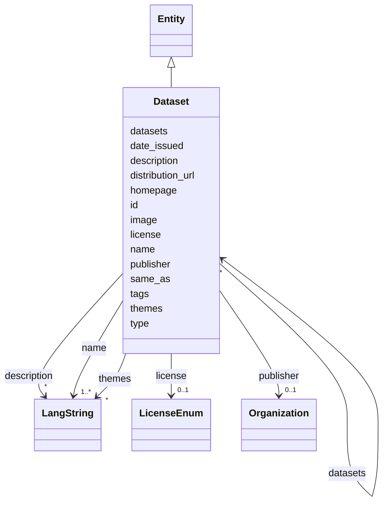

---
search:
  boost: 10.0
---

# Class: Dataset 


_A dataset, digital archive or catalog produced or curated by a project: corpora, databases, image collections, annotation sets and collections of metadata records. Use Dataset for both research data and catalogs that describe other resources; a catalog can link the datasets it aggregates through datasets._


<div data-search-exclude markdown="1">


URI: [dcat:Dataset](http://www.w3.org/ns/dcat#Dataset)





## Inheritance
* [Entity](../classes/Entity.md)
    * **Dataset**


## Class Properties

| Property | Value |
| --- | --- |
| Class URI | [dcat:Dataset](http://www.w3.org/ns/dcat#Dataset) |


## Slots

| Name | Cardinality and Range | Description | Inheritance |
| ---  | --- | --- | --- |
| [name](../slots/name.md) | <span title="Required: one or more values">1..*</span> <br/> [LangString](../classes/LangString.md) | <span title="The multilingual name or title used to identify the entity. Use one LangString per available language and do not repeat a language. Prefer the official localized name for organizations; for projects, tools and services, use localized names supplied by the team rather than translating branded names without authority.">The multilingual name or title used to identify the entity</span> | direct |
| [datasets](../slots/datasets.md) | <span title="Optional: zero or more values allowed">*</span> <br/> [Dataset](../classes/Dataset.md) | <span title="Datasets aggregated by a Dataset that functions as a catalog (by id).">Datasets aggregated by a Dataset that functions as a catalog (by id)</span> | direct |
| [publisher](../slots/publisher.md) | <span title="Optional: at most one value">0..1</span> <br/> [Organization](../classes/Organization.md) | <span title="The organization formally publishing the dataset, publication or training material (by IDHI URN); use creators for responsibility for making a training material.">The organization formally publishing the dataset, publication or training mat...</span> | direct |
| [license](../slots/license.md) | <span title="Optional: at most one value">0..1</span> <br/> [LicenseEnum](../enums/LicenseEnum.md) | <span title="The license under which the tool, dataset or training material is released. Required for anything advertised as reusable; omit only if genuinely unknown.">The license under which the tool, dataset or training material is released</span> | direct |
| [date_issued](../slots/date_issued.md) | <span title="Optional: at most one value">0..1</span> <br/> [Date](../types/Date.md) | <span title="Formal publication date (or year-01-01 if only the year is known).">Formal publication date (or year-01-01 if only the year is known)</span> | direct |
| [distribution_url](../slots/distribution_url.md) | <span title="Optional: at most one value">0..1</span> <br/> [Uri](../types/Uri.md) | <span title="Direct download or access URL for the dataset.">Direct download or access URL for the dataset</span> | direct |
| [themes](../slots/themes.md) | <span title="Optional: zero or more values allowed">*</span> <br/> [LangString](../classes/LangString.md) | <span title="Thematic keywords for the dataset, multilingual.">Thematic keywords for the dataset, multilingual</span> | direct |
| [type](../slots/type.md) | <span title="Required: exactly one value">1</span> <br/> [Curie](../types/Curie.md) | <span title="Discriminator identifying the record's class; used for polymorphic serialization and deserialization.">Discriminator identifying the record's class; used for polymorphic serializat...</span> | [Entity](../classes/Entity.md) |
| [id](../slots/id.md) | <span title="Required: exactly one value">1</span> <br/> [String](../types/String.md) | <span title="The entity's primary identifier: an IDHI URN of the form&#10;  idhi:&lt;class name>:&lt;random short alphanumeric id>&#10;e.g. idhi:person:x7k2m9 or idhi:project:a83bq1. Minted by IDHI at record creation and never reused or changed. The class token is the lowercase snake_case class name; each concrete class enforces its own token via slot_usage. External identifiers (ORCID, ROR, DOI...) are supplementary and go in their dedicated slots — never here.">The entity's primary identifier: an IDHI URN of the form</span> | [Entity](../classes/Entity.md) |
| [description](../slots/description.md) | <span title="Optional: zero or more values allowed">*</span> <br/> [LangString](../classes/LangString.md) | <span title="Multilingual free-text description (a few sentences aimed at index visitors, not internal notes).">Multilingual free-text description (a few sentences aimed at index visitors, ...</span> | [Entity](../classes/Entity.md) |
| [image](../slots/image.md) | <span title="Optional: at most one value">0..1</span> <br/> [Base64binary](../types/Base64binary.md) | <span title="A representative image embedded as Base64-encoded binary content. Use for a single image that must travel with the entity record; omit it when no image is available, and use homepage or additional_urls for externally hosted pages rather than encoding a URL here.">A representative image embedded as Base64-encoded binary content</span> | [Entity](../classes/Entity.md) |
| [homepage](../slots/homepage.md) | <span title="Optional: at most one value">0..1</span> <br/> [Uri](../types/Uri.md) | <span title="Public landing page of the entity, if one exists.">Public landing page of the entity, if one exists</span> | [Entity](../classes/Entity.md) |
| [same_as](../slots/same_as.md) | <span title="Optional: zero or more values allowed">*</span> <br/> [Uri](../types/Uri.md) | <span title="URIs of records in OTHER systems describing the same real-world entity (Wikidata, PeriodO, GeoNames...). Use for linked-data alignment, not for the entity's own pages (use homepage).">URIs of records in OTHER systems describing the same real-world entity (Wikid...</span> | [Entity](../classes/Entity.md) |
| [tags](../slots/tags.md) | <span title="Optional: zero or more values allowed">*</span> <br/> [String](../types/String.md) | <span title="Free-text tags for discovery, filtering and grouping; usable on any top-level entity. Deliberately NOT a controlled enum, but prefer wording that matches a concept in an established ontology or thesaurus (e.g. Wikidata, Getty AAT, TaDiRAH) so tags can later be reconciled against it.">Free-text tags for discovery, filtering and grouping; usable on any top-level...</span> | [Entity](../classes/Entity.md) |


## Usages

| used by | used in | type | used |
| ---  | --- | --- | --- |
| [Project](../classes/Project.md) | [outputs_datasets](../slots/outputs_datasets.md) | range | [Dataset](../classes/Dataset.md) |
| [Dataset](../classes/Dataset.md) | [datasets](../slots/datasets.md) | range | [Dataset](../classes/Dataset.md) |
| [TrainingMaterial](../classes/TrainingMaterial.md) | [related_datasets](../slots/related_datasets.md) | range | [Dataset](../classes/Dataset.md) |
| [IndexContainer](../classes/IndexContainer.md) | [datasets](../slots/datasets.md) | range | [Dataset](../classes/Dataset.md) |


## In Subsets


* [ToplevelEntity](../subsets/ToplevelEntity.md)


## Identifier and Mapping Information


### Schema Source


* from schema: https://idhi_placeholder/linkml/idhi


## Mappings

| Mapping Type | Mapped Value |
| ---  | ---  |
| self | dcat:Dataset |
| native | idhi:Dataset |


## LinkML Source

### Direct

<details>
```yaml
name: Dataset
description: 'A dataset, digital archive or catalog produced or curated by a project:
  corpora, databases, image collections, annotation sets and collections of metadata
  records. Use Dataset for both research data and catalogs that describe other resources;
  a catalog can link the datasets it aggregates through datasets.'
in_subset:
- toplevel_entity
from_schema: https://idhi_placeholder/linkml/idhi
is_a: Entity
slots:
- name
- datasets
- publisher
- license
- date_issued
- distribution_url
- themes
slot_usage:
  type:
    name: type
    equals_string: idhi:Dataset
  id:
    name: id
    structured_pattern:
      syntax: ^idhi:dataset:{shortid}$
      interpolated: true
class_uri: dcat:Dataset

```
</details>

### Induced

<details>
```yaml
name: Dataset
description: 'A dataset, digital archive or catalog produced or curated by a project:
  corpora, databases, image collections, annotation sets and collections of metadata
  records. Use Dataset for both research data and catalogs that describe other resources;
  a catalog can link the datasets it aggregates through datasets.'
in_subset:
- toplevel_entity
from_schema: https://idhi_placeholder/linkml/idhi
is_a: Entity
slot_usage:
  type:
    name: type
    equals_string: idhi:Dataset
  id:
    name: id
    structured_pattern:
      syntax: ^idhi:dataset:{shortid}$
      interpolated: true
attributes:
  name:
    name: name
    description: The multilingual name or title used to identify the entity. Use one
      LangString per available language and do not repeat a language. Prefer the official
      localized name for organizations; for projects, tools and services, use localized
      names supplied by the team rather than translating branded names without authority.
    from_schema: https://idhi_placeholder/linkml/idhi
    rank: 1000
    slot_uri: skos:prefLabel
    owner: Dataset
    domain_of:
    - Organization
    - Facility
    - Project
    - Tool
    - Service
    - Publication
    - Event
    - Dataset
    - TrainingMaterial
    range: LangString
    required: true
    multivalued: true
    inlined: true
    inlined_as_list: true
  datasets:
    name: datasets
    description: Datasets aggregated by a Dataset that functions as a catalog (by
      id).
    from_schema: https://idhi_placeholder/linkml/idhi
    rank: 1000
    slot_uri: dcat:dataset
    owner: Dataset
    domain_of:
    - Dataset
    - IndexContainer
    range: Dataset
    multivalued: true
  publisher:
    name: publisher
    description: The organization formally publishing the dataset, publication or
      training material (by IDHI URN); use creators for responsibility for making
      a training material.
    from_schema: https://idhi_placeholder/linkml/idhi
    rank: 1000
    slot_uri: dcterms:publisher
    owner: Dataset
    domain_of:
    - Publication
    - Dataset
    - TrainingMaterial
    range: Organization
  license:
    name: license
    description: The license under which the tool, dataset or training material is
      released. Required for anything advertised as reusable; omit only if genuinely
      unknown.
    from_schema: https://idhi_placeholder/linkml/idhi
    rank: 1000
    slot_uri: dcterms:license
    owner: Dataset
    domain_of:
    - Tool
    - Dataset
    - TrainingMaterial
    range: LicenseEnum
  date_issued:
    name: date_issued
    description: Formal publication date (or year-01-01 if only the year is known).
    from_schema: https://idhi_placeholder/linkml/idhi
    rank: 1000
    slot_uri: dcterms:issued
    owner: Dataset
    domain_of:
    - Publication
    - Dataset
    - TrainingMaterial
    range: date
  distribution_url:
    name: distribution_url
    description: Direct download or access URL for the dataset.
    from_schema: https://idhi_placeholder/linkml/idhi
    rank: 1000
    slot_uri: dcat:downloadURL
    owner: Dataset
    domain_of:
    - Dataset
    range: uri
  themes:
    name: themes
    description: Thematic keywords for the dataset, multilingual.
    from_schema: https://idhi_placeholder/linkml/idhi
    rank: 1000
    slot_uri: dcat:theme
    owner: Dataset
    domain_of:
    - Dataset
    range: LangString
    multivalued: true
    inlined: true
    inlined_as_list: true
  type:
    name: type
    description: Discriminator identifying the record's class; used for polymorphic
      serialization and deserialization.
    from_schema: https://idhi_placeholder/linkml/idhi
    rank: 1000
    slot_uri: rdf:type
    owner: Dataset
    domain_of:
    - Entity
    range: curie
    required: true
    equals_string: idhi:Dataset
  id:
    name: id
    description: "The entity's primary identifier: an IDHI URN of the form\n  idhi:<class\
      \ name>:<random short alphanumeric id>\ne.g. idhi:person:x7k2m9 or idhi:project:a83bq1.\
      \ Minted by IDHI at record creation and never reused or changed. The class token\
      \ is the lowercase snake_case class name; each concrete class enforces its own\
      \ token via slot_usage. External identifiers (ORCID, ROR, DOI...) are supplementary\
      \ and go in their dedicated slots — never here."
    from_schema: https://idhi_placeholder/linkml/idhi
    rank: 1000
    slot_uri: dcterms:identifier
    identifier: true
    owner: Dataset
    domain_of:
    - Entity
    range: string
    required: true
    pattern: ^idhi:[a-z_]+:[0-9a-z]{4,12}$
    structured_pattern:
      syntax: ^idhi:dataset:{shortid}$
      interpolated: true
  description:
    name: description
    description: Multilingual free-text description (a few sentences aimed at index
      visitors, not internal notes).
    from_schema: https://idhi_placeholder/linkml/idhi
    rank: 1000
    slot_uri: dcterms:description
    owner: Dataset
    domain_of:
    - Entity
    range: LangString
    multivalued: true
    inlined: true
    inlined_as_list: true
  image:
    name: image
    description: A representative image embedded as Base64-encoded binary content.
      Use for a single image that must travel with the entity record; omit it when
      no image is available, and use homepage or additional_urls for externally hosted
      pages rather than encoding a URL here.
    from_schema: https://idhi_placeholder/linkml/idhi
    rank: 1000
    slot_uri: schema:image
    owner: Dataset
    domain_of:
    - Entity
    range: base64binary
  homepage:
    name: homepage
    description: Public landing page of the entity, if one exists.
    from_schema: https://idhi_placeholder/linkml/idhi
    rank: 1000
    slot_uri: foaf:homepage
    owner: Dataset
    domain_of:
    - Entity
    range: uri
  same_as:
    name: same_as
    description: URIs of records in OTHER systems describing the same real-world entity
      (Wikidata, PeriodO, GeoNames...). Use for linked-data alignment, not for the
      entity's own pages (use homepage).
    from_schema: https://idhi_placeholder/linkml/idhi
    rank: 1000
    slot_uri: schema:sameAs
    owner: Dataset
    domain_of:
    - Entity
    range: uri
    multivalued: true
  tags:
    name: tags
    description: Free-text tags for discovery, filtering and grouping; usable on any
      top-level entity. Deliberately NOT a controlled enum, but prefer wording that
      matches a concept in an established ontology or thesaurus (e.g. Wikidata, Getty
      AAT, TaDiRAH) so tags can later be reconciled against it.
    from_schema: https://idhi_placeholder/linkml/idhi
    rank: 1000
    slot_uri: dcat:keyword
    owner: Dataset
    domain_of:
    - Entity
    range: string
    multivalued: true
class_uri: dcat:Dataset

```
</details></div>