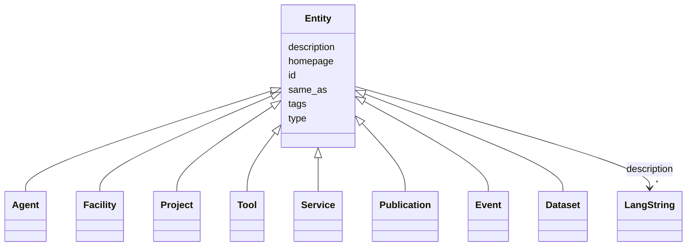

---
search:
  boost: 10.0
---

# Class: Entity 


_Root class for any identifiable IDHI entity. Provides the IDHI URN id, multilingual description, homepage, same_as links and tags. Never instantiated directly; every concrete entity inherits from it and constrains the id's class token via slot_usage._


<div data-search-exclude markdown="1">


* __NOTE__: this is an abstract class and should not be instantiated directly


URI: [schema:Thing](http://schema.org/Thing)





## Inheritance
* **Entity**
    * [Agent](../classes/Agent.md)
    * [Facility](../classes/Facility.md)
    * [Project](../classes/Project.md)
    * [Tool](../classes/Tool.md)
    * [Service](../classes/Service.md)
    * [Publication](../classes/Publication.md)
    * [Event](../classes/Event.md)
    * [Dataset](../classes/Dataset.md)


## Class Properties

| Property | Value |
| --- | --- |
| Class URI | [schema:Thing](http://schema.org/Thing) |


## Slots

| Name | Cardinality and Range | Description | Inheritance |
| ---  | --- | --- | --- |
| [type](../slots/type.md) | 1 <br/> [Curie](../types/Curie.md) | Discriminator identifying the record's class; used for polymorphic serializat... | direct |
| [id](../slots/id.md) | 1 <br/> [String](../types/String.md) | The entity's primary identifier: an IDHI URN of the form | direct |
| [description](../slots/description.md) | * <br/> [LangString](../classes/LangString.md) | Multilingual free-text description (a few sentences aimed at index visitors, ... | direct |
| [homepage](../slots/homepage.md) | 0..1 <br/> [Uri](../types/Uri.md) | Public landing page of the entity, if one exists | direct |
| [same_as](../slots/same_as.md) | * <br/> [Uri](../types/Uri.md) | URIs of records in OTHER systems describing the same real-world entity (Wikid... | direct |
| [tags](../slots/tags.md) | * <br/> [String](../types/String.md) | Free-text tags for discovery, filtering and grouping; usable on any top-level... | direct |


## Identifier and Mapping Information


### Schema Source


* from schema: https://idhi_placeholder/linkml/idhi


## Mappings

| Mapping Type | Mapped Value |
| ---  | ---  |
| self | schema:Thing |
| native | idhi:Entity |


## LinkML Source

### Direct

<details>
```yaml
name: Entity
description: Root class for any identifiable IDHI entity. Provides the IDHI URN id,
  multilingual description, homepage, same_as links and tags. Never instantiated directly;
  every concrete entity inherits from it and constrains the id's class token via slot_usage.
from_schema: https://idhi_placeholder/linkml/idhi
abstract: true
slots:
- type
- id
- description
- homepage
- same_as
- tags
class_uri: schema:Thing

```
</details>

### Induced

<details>
```yaml
name: Entity
description: Root class for any identifiable IDHI entity. Provides the IDHI URN id,
  multilingual description, homepage, same_as links and tags. Never instantiated directly;
  every concrete entity inherits from it and constrains the id's class token via slot_usage.
from_schema: https://idhi_placeholder/linkml/idhi
abstract: true
attributes:
  type:
    name: type
    description: Discriminator identifying the record's class; used for polymorphic
      serialization and deserialization.
    from_schema: https://idhi_placeholder/linkml/idhi
    rank: 1000
    slot_uri: rdf:type
    owner: Entity
    domain_of:
    - Entity
    range: curie
    required: true
  id:
    name: id
    description: "The entity's primary identifier: an IDHI URN of the form\n  idhi:<class\
      \ name>:<random short alphanumeric id>\ne.g. idhi:person:x7k2m9 or idhi:project:a83bq1.\
      \ Minted by IDHI at record creation and never reused or changed. The class token\
      \ is the lowercase snake_case class name; each concrete class enforces its own\
      \ token via slot_usage. External identifiers (ORCID, ROR, DOI...) are supplementary\
      \ and go in their dedicated slots — never here."
    from_schema: https://idhi_placeholder/linkml/idhi
    rank: 1000
    slot_uri: dcterms:identifier
    identifier: true
    owner: Entity
    domain_of:
    - Entity
    range: string
    required: true
    pattern: ^idhi:[a-z_]+:[0-9a-z]{4,12}$
  description:
    name: description
    description: Multilingual free-text description (a few sentences aimed at index
      visitors, not internal notes).
    from_schema: https://idhi_placeholder/linkml/idhi
    rank: 1000
    slot_uri: dcterms:description
    owner: Entity
    domain_of:
    - Entity
    range: LangString
    multivalued: true
    inlined: true
    inlined_as_list: true
  homepage:
    name: homepage
    description: Public landing page of the entity, if one exists.
    from_schema: https://idhi_placeholder/linkml/idhi
    rank: 1000
    slot_uri: foaf:homepage
    owner: Entity
    domain_of:
    - Entity
    range: uri
  same_as:
    name: same_as
    description: URIs of records in OTHER systems describing the same real-world entity
      (Wikidata, PeriodO, GeoNames...). Use for linked-data alignment, not for the
      entity's own pages (use homepage).
    from_schema: https://idhi_placeholder/linkml/idhi
    rank: 1000
    slot_uri: schema:sameAs
    owner: Entity
    domain_of:
    - Entity
    range: uri
    multivalued: true
  tags:
    name: tags
    description: Free-text tags for discovery, filtering and grouping; usable on any
      top-level entity. Deliberately NOT a controlled enum, but prefer wording that
      matches a concept in an established ontology or thesaurus (e.g. Wikidata, Getty
      AAT, TaDiRAH) so tags can later be reconciled against it.
    from_schema: https://idhi_placeholder/linkml/idhi
    rank: 1000
    slot_uri: dcat:keyword
    owner: Entity
    domain_of:
    - Entity
    range: string
    multivalued: true
class_uri: schema:Thing

```
</details></div>