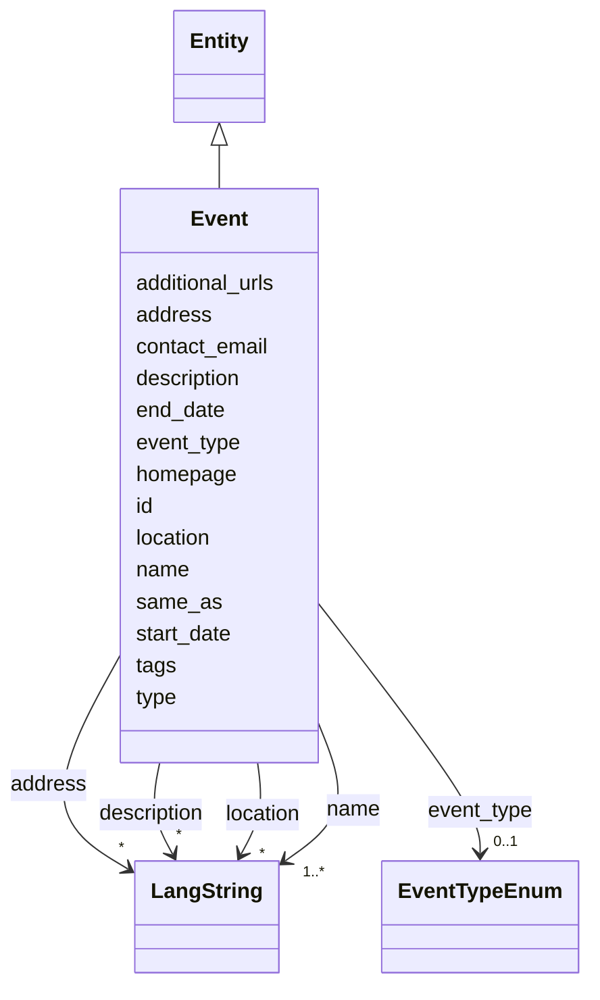

---
search:
  boost: 10.0
---

# Class: Event 


_A scholarly event: conference, workshop, seminar, lecture, hackathon or exhibition. Use Event for time-bounded gatherings; recurring series should be modeled as one Event per occurrence._


<div data-search-exclude markdown="1">


URI: [schema:Event](http://schema.org/Event)





## Inheritance
* [Entity](../classes/Entity.md)
    * **Event**


## Class Properties

| Property | Value |
| --- | --- |
| Class URI | [schema:Event](http://schema.org/Event) |


## Slots

| Name | Cardinality and Range | Description | Inheritance |
| ---  | --- | --- | --- |
| [name](../slots/name.md) | 1..* <br/> [LangString](../classes/LangString.md) | Multilingual name/title | direct |
| [event_type](../slots/event_type.md) | 0..1 <br/> [EventTypeEnum](../enums/EventTypeEnum.md) | The kind of scholarly event | direct |
| [start_date](../slots/start_date.md) | 0..1 <br/> [Date](../types/Date.md) | Start of the event, of the project's runtime, or of a relationship's validity... | direct |
| [end_date](../slots/end_date.md) | 0..1 <br/> [Date](../types/Date.md) | End of the event, project runtime or relationship | direct |
| [location](../slots/location.md) | * <br/> [LangString](../classes/LangString.md) | Place name where the organization, facility or event is physically situated (... | direct |
| [address](../slots/address.md) | * <br/> [LangString](../classes/LangString.md) | Postal address, multilingual | direct |
| [additional_urls](../slots/additional_urls.md) | * <br/> [Uri](../types/Uri.md) | Further relevant web pages beyond the homepage (blog, social-media profile, r... | direct |
| [contact_email](../slots/contact_email.md) | 0..1 <br/> [String](../types/String.md) | A published contact address for the entity (office, team or service-desk mail... | direct |
| [type](../slots/type.md) | 1 <br/> [Curie](../types/Curie.md) | Discriminator identifying the record's class; used for polymorphic serializat... | [Entity](../classes/Entity.md) |
| [id](../slots/id.md) | 1 <br/> [String](../types/String.md) | The entity's primary identifier: an IDHI URN of the form | [Entity](../classes/Entity.md) |
| [description](../slots/description.md) | * <br/> [LangString](../classes/LangString.md) | Multilingual free-text description (a few sentences aimed at index visitors, ... | [Entity](../classes/Entity.md) |
| [homepage](../slots/homepage.md) | 0..1 <br/> [Uri](../types/Uri.md) | Public landing page of the entity, if one exists | [Entity](../classes/Entity.md) |
| [same_as](../slots/same_as.md) | * <br/> [Uri](../types/Uri.md) | URIs of records in OTHER systems describing the same real-world entity (Wikid... | [Entity](../classes/Entity.md) |
| [tags](../slots/tags.md) | * <br/> [String](../types/String.md) | Free-text tags for discovery, filtering and grouping; usable on any top-level... | [Entity](../classes/Entity.md) |


## Usages

| used by | used in | type | used |
| ---  | --- | --- | --- |
| [Publication](../classes/Publication.md) | [presented_at](../slots/presented_at.md) | range | [Event](../classes/Event.md) |
| [IndexContainer](../classes/IndexContainer.md) | [events](../slots/events.md) | range | [Event](../classes/Event.md) |


## In Subsets


* [ToplevelEntity](../subsets/ToplevelEntity.md)


## Identifier and Mapping Information


### Schema Source


* from schema: https://idhi_placeholder/linkml/idhi


## Mappings

| Mapping Type | Mapped Value |
| ---  | ---  |
| self | schema:Event |
| native | idhi:Event |


## LinkML Source

### Direct

<details>
```yaml
name: Event
description: 'A scholarly event: conference, workshop, seminar, lecture, hackathon
  or exhibition. Use Event for time-bounded gatherings; recurring series should be
  modeled as one Event per occurrence.'
in_subset:
- toplevel_entity
from_schema: https://idhi_placeholder/linkml/idhi
is_a: Entity
slots:
- name
- event_type
- start_date
- end_date
- location
- address
- additional_urls
- contact_email
slot_usage:
  type:
    name: type
    equals_string: idhi:Event
  id:
    name: id
    structured_pattern:
      syntax: ^idhi:event:{shortid}$
      interpolated: true
class_uri: schema:Event

```
</details>

### Induced

<details>
```yaml
name: Event
description: 'A scholarly event: conference, workshop, seminar, lecture, hackathon
  or exhibition. Use Event for time-bounded gatherings; recurring series should be
  modeled as one Event per occurrence.'
in_subset:
- toplevel_entity
from_schema: https://idhi_placeholder/linkml/idhi
is_a: Entity
slot_usage:
  type:
    name: type
    equals_string: idhi:Event
  id:
    name: id
    structured_pattern:
      syntax: ^idhi:event:{shortid}$
      interpolated: true
attributes:
  name:
    name: name
    description: Multilingual name/title. Provide at least one language; English,
      Hebrew and Arabic variants are each a separate LangString. Preferably a sortable
      name for organizations; for projects, tools and services, use the name the team
      itself uses.
    from_schema: https://idhi_placeholder/linkml/idhi
    rank: 1000
    slot_uri: skos:prefLabel
    owner: Event
    domain_of:
    - Organization
    - Facility
    - Project
    - Tool
    - Service
    - Publication
    - Event
    - Dataset
    range: LangString
    multivalued: true
    inlined: true
    inlined_as_list: true
    minimum_cardinality: 1
  event_type:
    name: event_type
    description: The kind of scholarly event.
    from_schema: https://idhi_placeholder/linkml/idhi
    rank: 1000
    slot_uri: dcterms:type
    owner: Event
    domain_of:
    - Event
    range: EventTypeEnum
  start_date:
    name: start_date
    description: Start of the event, of the project's runtime, or of a relationship's
      validity (e.g. when a person joined a project or organization).
    from_schema: https://idhi_placeholder/linkml/idhi
    rank: 1000
    slot_uri: schema:startDate
    owner: Event
    domain_of:
    - Project
    - Event
    - Relationship
    range: date
  end_date:
    name: end_date
    description: End of the event, project runtime or relationship. Omit for ongoing
      relationships and open-ended projects.
    from_schema: https://idhi_placeholder/linkml/idhi
    rank: 1000
    slot_uri: schema:endDate
    owner: Event
    domain_of:
    - Project
    - Event
    - Relationship
    range: date
  location:
    name: location
    description: Place name where the organization, facility or event is physically
      situated (e.g. a city), as free multilingual text.
    from_schema: https://idhi_placeholder/linkml/idhi
    rank: 1000
    slot_uri: schema:location
    owner: Event
    domain_of:
    - Organization
    - Facility
    - Event
    range: LangString
    multivalued: true
    inlined: true
    inlined_as_list: true
  address:
    name: address
    description: Postal address, multilingual.
    from_schema: https://idhi_placeholder/linkml/idhi
    rank: 1000
    slot_uri: schema:address
    owner: Event
    domain_of:
    - Organization
    - Facility
    - Event
    range: LangString
    multivalued: true
    inlined: true
    inlined_as_list: true
  additional_urls:
    name: additional_urls
    description: Further relevant web pages beyond the homepage (blog, social-media
      profile, registry entry, press coverage...). For records describing the same
      entity in other systems use same_as instead.
    from_schema: https://idhi_placeholder/linkml/idhi
    rank: 1000
    slot_uri: foaf:page
    owner: Event
    domain_of:
    - Organization
    - Facility
    - Project
    - Tool
    - Service
    - Event
    range: uri
    multivalued: true
  contact_email:
    name: contact_email
    description: A published contact address for the entity (office, team or service-desk
      mailbox). For a person's own addresses use 'emails'.
    from_schema: https://idhi_placeholder/linkml/idhi
    rank: 1000
    slot_uri: schema:email
    owner: Event
    domain_of:
    - Organization
    - Facility
    - Project
    - Tool
    - Service
    - Event
    range: string
  type:
    name: type
    description: Discriminator identifying the record's class; used for polymorphic
      serialization and deserialization.
    from_schema: https://idhi_placeholder/linkml/idhi
    rank: 1000
    slot_uri: rdf:type
    owner: Event
    domain_of:
    - Entity
    range: curie
    required: true
    equals_string: idhi:Event
  id:
    name: id
    description: "The entity's primary identifier: an IDHI URN of the form\n  idhi:<class\
      \ name>:<random short alphanumeric id>\ne.g. idhi:person:x7k2m9 or idhi:project:a83bq1.\
      \ Minted by IDHI at record creation and never reused or changed. The class token\
      \ is the lowercase snake_case class name; each concrete class enforces its own\
      \ token via slot_usage. External identifiers (ORCID, ROR, DOI...) are supplementary\
      \ and go in their dedicated slots — never here."
    from_schema: https://idhi_placeholder/linkml/idhi
    rank: 1000
    slot_uri: dcterms:identifier
    identifier: true
    owner: Event
    domain_of:
    - Entity
    range: string
    required: true
    pattern: ^idhi:[a-z_]+:[0-9a-z]{4,12}$
    structured_pattern:
      syntax: ^idhi:event:{shortid}$
      interpolated: true
  description:
    name: description
    description: Multilingual free-text description (a few sentences aimed at index
      visitors, not internal notes).
    from_schema: https://idhi_placeholder/linkml/idhi
    rank: 1000
    slot_uri: dcterms:description
    owner: Event
    domain_of:
    - Entity
    range: LangString
    multivalued: true
    inlined: true
    inlined_as_list: true
  homepage:
    name: homepage
    description: Public landing page of the entity, if one exists.
    from_schema: https://idhi_placeholder/linkml/idhi
    rank: 1000
    slot_uri: foaf:homepage
    owner: Event
    domain_of:
    - Entity
    range: uri
  same_as:
    name: same_as
    description: URIs of records in OTHER systems describing the same real-world entity
      (Wikidata, PeriodO, GeoNames...). Use for linked-data alignment, not for the
      entity's own pages (use homepage).
    from_schema: https://idhi_placeholder/linkml/idhi
    rank: 1000
    slot_uri: schema:sameAs
    owner: Event
    domain_of:
    - Entity
    range: uri
    multivalued: true
  tags:
    name: tags
    description: Free-text tags for discovery, filtering and grouping; usable on any
      top-level entity. Deliberately NOT a controlled enum, but prefer wording that
      matches a concept in an established ontology or thesaurus (e.g. Wikidata, Getty
      AAT, TaDiRAH) so tags can later be reconciled against it.
    from_schema: https://idhi_placeholder/linkml/idhi
    rank: 1000
    slot_uri: dcat:keyword
    owner: Event
    domain_of:
    - Entity
    range: string
    multivalued: true
class_uri: schema:Event

```
</details></div>