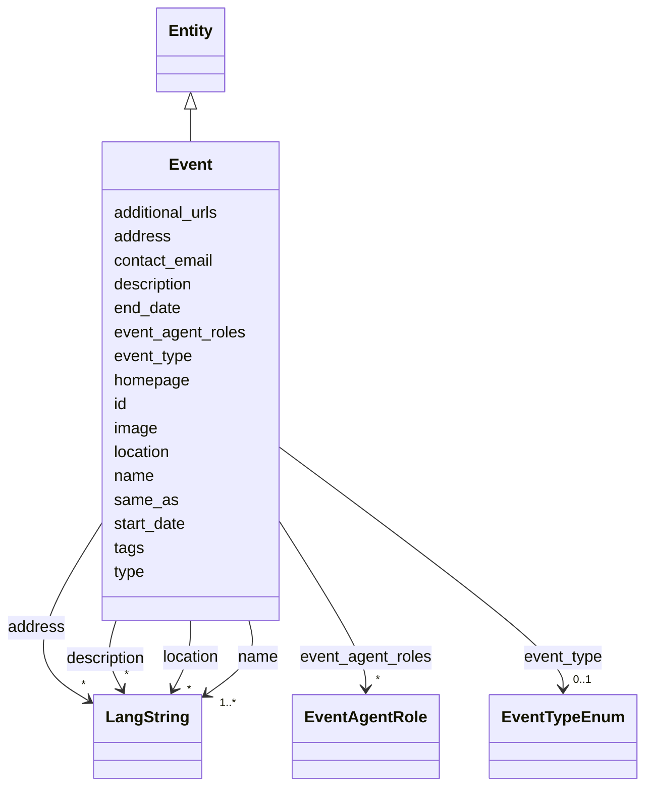

---
search:
  boost: 10.0
---

# Class: Event 


_A scholarly event: conference, workshop, seminar, lecture, hackathon or exhibition. Use Event for time-bounded gatherings; recurring series should be modeled as one Event per occurrence._


<div data-search-exclude markdown="1">


URI: [schema:Event](http://schema.org/Event)





## Inheritance
* [Entity](../classes/Entity.md)
    * **Event**


## Class Properties

| Property | Value |
| --- | --- |
| Class URI | [schema:Event](http://schema.org/Event) |


## Slots

| Name | Cardinality and Range | Description | Inheritance |
| ---  | --- | --- | --- |
| [name](../slots/name.md) | <span title="Required: one or more values">1..*</span> <br/> [LangString](../classes/LangString.md) | <span title="The multilingual name or title used to identify the entity. Use one LangString per available language and do not repeat a language. Prefer the official localized name for organizations; for projects, tools and services, use localized names supplied by the team rather than translating branded names without authority.">The multilingual name or title used to identify the entity</span> | direct |
| [event_type](../slots/event_type.md) | <span title="Optional: at most one value">0..1</span> <br/> [EventTypeEnum](../enums/EventTypeEnum.md) | <span title="The kind of scholarly event.">The kind of scholarly event</span> | direct |
| [start_date](../slots/start_date.md) | <span title="Optional: at most one value">0..1</span> <br/> [Date](../types/Date.md) | <span title="Start of the event, of the project's runtime, or of a relationship's validity, such as when participation, affiliation, maintenance responsibility or formal containment began.">Start of the event, of the project's runtime, or of a relationship's validity...</span> | direct |
| [end_date](../slots/end_date.md) | <span title="Optional: at most one value">0..1</span> <br/> [Date](../types/Date.md) | <span title="End of the event, project runtime or relationship. Omit for ongoing relationships and open-ended projects.">End of the event, project runtime or relationship</span> | direct |
| [location](../slots/location.md) | <span title="Optional: zero or more values allowed">*</span> <br/> [LangString](../classes/LangString.md) | <span title="Place name where the organization, facility or event is physically situated (e.g. a city), as free multilingual text.">Place name where the organization, facility or event is physically situated (...</span> | direct |
| [address](../slots/address.md) | <span title="Optional: zero or more values allowed">*</span> <br/> [LangString](../classes/LangString.md) | <span title="Postal address, multilingual.">Postal address, multilingual</span> | direct |
| [event_agent_roles](../slots/event_agent_roles.md) | <span title="Optional: zero or more values allowed">*</span> <br/> [EventAgentRole](../classes/EventAgentRole.md) | <span title="People and organizations involved in the containing event, with their role and optional relationship dates. Define each involvement only on the Event; use Publication.authorships for authorship and presented_at for the event at which a publication was presented.">People and organizations involved in the containing event, with their role an...</span> | direct |
| [additional_urls](../slots/additional_urls.md) | <span title="Optional: zero or more values allowed">*</span> <br/> [Uri](../types/Uri.md) | <span title="Further relevant web pages beyond the homepage (blog, social-media profile, registry entry, press coverage...). For records describing the same entity in other systems use same_as instead.">Further relevant web pages beyond the homepage (blog, social-media profile, r...</span> | direct |
| [contact_email](../slots/contact_email.md) | <span title="Optional: at most one value">0..1</span> <br/> [String](../types/String.md) | <span title="A published contact address for the entity (office, team or service-desk mailbox). For a person's own addresses use 'emails'.">A published contact address for the entity (office, team or service-desk mail...</span> | direct |
| [type](../slots/type.md) | <span title="Required: exactly one value">1</span> <br/> [Curie](../types/Curie.md) | <span title="Discriminator identifying the record's class; used for polymorphic serialization and deserialization.">Discriminator identifying the record's class; used for polymorphic serializat...</span> | [Entity](../classes/Entity.md) |
| [id](../slots/id.md) | <span title="Required: exactly one value">1</span> <br/> [String](../types/String.md) | <span title="The entity's primary identifier: an IDHI URN of the form&#10;  idhi:&lt;class name>:&lt;random short alphanumeric id>&#10;e.g. idhi:person:x7k2m9 or idhi:project:a83bq1. Minted by IDHI at record creation and never reused or changed. The class token is the lowercase snake_case class name; each concrete class enforces its own token via slot_usage. External identifiers (ORCID, ROR, DOI...) are supplementary and go in their dedicated slots — never here.">The entity's primary identifier: an IDHI URN of the form</span> | [Entity](../classes/Entity.md) |
| [description](../slots/description.md) | <span title="Optional: zero or more values allowed">*</span> <br/> [LangString](../classes/LangString.md) | <span title="Multilingual free-text description (a few sentences aimed at index visitors, not internal notes).">Multilingual free-text description (a few sentences aimed at index visitors, ...</span> | [Entity](../classes/Entity.md) |
| [image](../slots/image.md) | <span title="Optional: at most one value">0..1</span> <br/> [Base64binary](../types/Base64binary.md) | <span title="A representative image embedded as Base64-encoded binary content. Use for a single image that must travel with the entity record; omit it when no image is available, and use homepage or additional_urls for externally hosted pages rather than encoding a URL here.">A representative image embedded as Base64-encoded binary content</span> | [Entity](../classes/Entity.md) |
| [homepage](../slots/homepage.md) | <span title="Optional: at most one value">0..1</span> <br/> [Uri](../types/Uri.md) | <span title="Public landing page of the entity, if one exists.">Public landing page of the entity, if one exists</span> | [Entity](../classes/Entity.md) |
| [same_as](../slots/same_as.md) | <span title="Optional: zero or more values allowed">*</span> <br/> [Uri](../types/Uri.md) | <span title="URIs of records in OTHER systems describing the same real-world entity (Wikidata, PeriodO, GeoNames...). Use for linked-data alignment, not for the entity's own pages (use homepage).">URIs of records in OTHER systems describing the same real-world entity (Wikid...</span> | [Entity](../classes/Entity.md) |
| [tags](../slots/tags.md) | <span title="Optional: zero or more values allowed">*</span> <br/> [String](../types/String.md) | <span title="Free-text tags for discovery, filtering and grouping; usable on any top-level entity. Deliberately NOT a controlled enum, but prefer wording that matches a concept in an established ontology or thesaurus (e.g. Wikidata, Getty AAT, TaDiRAH) so tags can later be reconciled against it.">Free-text tags for discovery, filtering and grouping; usable on any top-level...</span> | [Entity](../classes/Entity.md) |


## Usages

| used by | used in | type | used |
| ---  | --- | --- | --- |
| [Publication](../classes/Publication.md) | [presented_at](../slots/presented_at.md) | range | [Event](../classes/Event.md) |
| [IndexContainer](../classes/IndexContainer.md) | [events](../slots/events.md) | range | [Event](../classes/Event.md) |


## In Subsets


* [ToplevelEntity](../subsets/ToplevelEntity.md)


## Identifier and Mapping Information


### Schema Source


* from schema: https://idhi_placeholder/linkml/idhi


## Mappings

| Mapping Type | Mapped Value |
| ---  | ---  |
| self | schema:Event |
| native | idhi:Event |


## LinkML Source

### Direct

<details>
```yaml
name: Event
description: 'A scholarly event: conference, workshop, seminar, lecture, hackathon
  or exhibition. Use Event for time-bounded gatherings; recurring series should be
  modeled as one Event per occurrence.'
in_subset:
- toplevel_entity
from_schema: https://idhi_placeholder/linkml/idhi
is_a: Entity
slots:
- name
- event_type
- start_date
- end_date
- location
- address
- event_agent_roles
- additional_urls
- contact_email
slot_usage:
  type:
    name: type
    equals_string: idhi:Event
  id:
    name: id
    structured_pattern:
      syntax: ^idhi:event:{shortid}$
      interpolated: true
class_uri: schema:Event

```
</details>

### Induced

<details>
```yaml
name: Event
description: 'A scholarly event: conference, workshop, seminar, lecture, hackathon
  or exhibition. Use Event for time-bounded gatherings; recurring series should be
  modeled as one Event per occurrence.'
in_subset:
- toplevel_entity
from_schema: https://idhi_placeholder/linkml/idhi
is_a: Entity
slot_usage:
  type:
    name: type
    equals_string: idhi:Event
  id:
    name: id
    structured_pattern:
      syntax: ^idhi:event:{shortid}$
      interpolated: true
attributes:
  name:
    name: name
    description: The multilingual name or title used to identify the entity. Use one
      LangString per available language and do not repeat a language. Prefer the official
      localized name for organizations; for projects, tools and services, use localized
      names supplied by the team rather than translating branded names without authority.
    from_schema: https://idhi_placeholder/linkml/idhi
    rank: 1000
    slot_uri: skos:prefLabel
    owner: Event
    domain_of:
    - Organization
    - Facility
    - Project
    - Tool
    - Service
    - Publication
    - Event
    - Dataset
    - TrainingMaterial
    range: LangString
    required: true
    multivalued: true
    inlined: true
    inlined_as_list: true
  event_type:
    name: event_type
    description: The kind of scholarly event.
    from_schema: https://idhi_placeholder/linkml/idhi
    rank: 1000
    slot_uri: dcterms:type
    owner: Event
    domain_of:
    - Event
    range: EventTypeEnum
  start_date:
    name: start_date
    description: Start of the event, of the project's runtime, or of a relationship's
      validity, such as when participation, affiliation, maintenance responsibility
      or formal containment began.
    from_schema: https://idhi_placeholder/linkml/idhi
    rank: 1000
    slot_uri: schema:startDate
    owner: Event
    domain_of:
    - Project
    - Event
    - Relationship
    - Funding
    range: date
  end_date:
    name: end_date
    description: End of the event, project runtime or relationship. Omit for ongoing
      relationships and open-ended projects.
    from_schema: https://idhi_placeholder/linkml/idhi
    rank: 1000
    slot_uri: schema:endDate
    owner: Event
    domain_of:
    - Project
    - Event
    - Relationship
    - Funding
    range: date
  location:
    name: location
    description: Place name where the organization, facility or event is physically
      situated (e.g. a city), as free multilingual text.
    from_schema: https://idhi_placeholder/linkml/idhi
    rank: 1000
    slot_uri: schema:location
    owner: Event
    domain_of:
    - Organization
    - Facility
    - Event
    range: LangString
    multivalued: true
    inlined: true
    inlined_as_list: true
  address:
    name: address
    description: Postal address, multilingual.
    from_schema: https://idhi_placeholder/linkml/idhi
    rank: 1000
    slot_uri: schema:address
    owner: Event
    domain_of:
    - Organization
    - Facility
    - Event
    range: LangString
    multivalued: true
    inlined: true
    inlined_as_list: true
  event_agent_roles:
    name: event_agent_roles
    description: People and organizations involved in the containing event, with their
      role and optional relationship dates. Define each involvement only on the Event;
      use Publication.authorships for authorship and presented_at for the event at
      which a publication was presented.
    from_schema: https://idhi_placeholder/linkml/idhi
    rank: 1000
    slot_uri: schema:participant
    owner: Event
    domain_of:
    - Event
    range: EventAgentRole
    multivalued: true
    inlined: true
    inlined_as_list: true
  additional_urls:
    name: additional_urls
    description: Further relevant web pages beyond the homepage (blog, social-media
      profile, registry entry, press coverage...). For records describing the same
      entity in other systems use same_as instead.
    from_schema: https://idhi_placeholder/linkml/idhi
    rank: 1000
    slot_uri: foaf:page
    owner: Event
    domain_of:
    - Organization
    - Facility
    - Project
    - Tool
    - Service
    - Event
    - TrainingMaterial
    range: uri
    multivalued: true
  contact_email:
    name: contact_email
    description: A published contact address for the entity (office, team or service-desk
      mailbox). For a person's own addresses use 'emails'.
    from_schema: https://idhi_placeholder/linkml/idhi
    rank: 1000
    slot_uri: schema:email
    owner: Event
    domain_of:
    - Organization
    - Facility
    - Project
    - Tool
    - Service
    - Event
    - TrainingMaterial
    range: string
  type:
    name: type
    description: Discriminator identifying the record's class; used for polymorphic
      serialization and deserialization.
    from_schema: https://idhi_placeholder/linkml/idhi
    rank: 1000
    slot_uri: rdf:type
    owner: Event
    domain_of:
    - Entity
    range: curie
    required: true
    equals_string: idhi:Event
  id:
    name: id
    description: "The entity's primary identifier: an IDHI URN of the form\n  idhi:<class\
      \ name>:<random short alphanumeric id>\ne.g. idhi:person:x7k2m9 or idhi:project:a83bq1.\
      \ Minted by IDHI at record creation and never reused or changed. The class token\
      \ is the lowercase snake_case class name; each concrete class enforces its own\
      \ token via slot_usage. External identifiers (ORCID, ROR, DOI...) are supplementary\
      \ and go in their dedicated slots — never here."
    from_schema: https://idhi_placeholder/linkml/idhi
    rank: 1000
    slot_uri: dcterms:identifier
    identifier: true
    owner: Event
    domain_of:
    - Entity
    range: string
    required: true
    pattern: ^idhi:[a-z_]+:[0-9a-z]{4,12}$
    structured_pattern:
      syntax: ^idhi:event:{shortid}$
      interpolated: true
  description:
    name: description
    description: Multilingual free-text description (a few sentences aimed at index
      visitors, not internal notes).
    from_schema: https://idhi_placeholder/linkml/idhi
    rank: 1000
    slot_uri: dcterms:description
    owner: Event
    domain_of:
    - Entity
    range: LangString
    multivalued: true
    inlined: true
    inlined_as_list: true
  image:
    name: image
    description: A representative image embedded as Base64-encoded binary content.
      Use for a single image that must travel with the entity record; omit it when
      no image is available, and use homepage or additional_urls for externally hosted
      pages rather than encoding a URL here.
    from_schema: https://idhi_placeholder/linkml/idhi
    rank: 1000
    slot_uri: schema:image
    owner: Event
    domain_of:
    - Entity
    range: base64binary
  homepage:
    name: homepage
    description: Public landing page of the entity, if one exists.
    from_schema: https://idhi_placeholder/linkml/idhi
    rank: 1000
    slot_uri: foaf:homepage
    owner: Event
    domain_of:
    - Entity
    range: uri
  same_as:
    name: same_as
    description: URIs of records in OTHER systems describing the same real-world entity
      (Wikidata, PeriodO, GeoNames...). Use for linked-data alignment, not for the
      entity's own pages (use homepage).
    from_schema: https://idhi_placeholder/linkml/idhi
    rank: 1000
    slot_uri: schema:sameAs
    owner: Event
    domain_of:
    - Entity
    range: uri
    multivalued: true
  tags:
    name: tags
    description: Free-text tags for discovery, filtering and grouping; usable on any
      top-level entity. Deliberately NOT a controlled enum, but prefer wording that
      matches a concept in an established ontology or thesaurus (e.g. Wikidata, Getty
      AAT, TaDiRAH) so tags can later be reconciled against it.
    from_schema: https://idhi_placeholder/linkml/idhi
    rank: 1000
    slot_uri: dcat:keyword
    owner: Event
    domain_of:
    - Entity
    range: string
    multivalued: true
class_uri: schema:Event

```
</details></div>