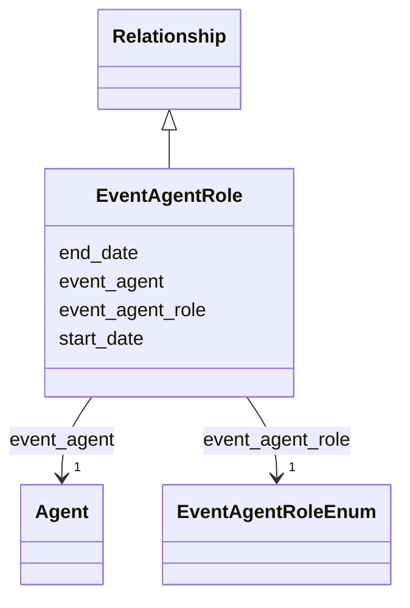

---
search:
  boost: 10.0
---

# Class: EventAgentRole 


_A person or organization involved in the containing Event in a defined capacity, with optional dates when the involvement covers only part of a multi-day event or programme. Use in Event.event_agent_roles for organizers, hosts, speakers, panelists, participants or sponsors; do not use it merely because an agent authored a publication presented at the event._


<div data-search-exclude markdown="1">


URI: [schema:Role](http://schema.org/Role)





## Inheritance
* [Relationship](../classes/Relationship.md)
    * **EventAgentRole**


## Class Properties

| Property | Value |
| --- | --- |
| Class URI | [schema:Role](http://schema.org/Role) |


## Slots

| Name | Cardinality and Range | Description | Inheritance |
| ---  | --- | --- | --- |
| [event_agent](../slots/event_agent.md) | <span title="Required: exactly one value">1</span> <br/> [Agent](../classes/Agent.md) | <span title="The person or organization involved in the containing event (by IDHI URN). Use only in Event.event_agent_roles; do not duplicate the relationship on the Agent.">The person or organization involved in the containing event (by IDHI URN)</span> | direct |
| [event_agent_role](../slots/event_agent_role.md) | <span title="Required: exactly one value">1</span> <br/> [EventAgentRoleEnum](../enums/EventAgentRoleEnum.md) | <span title="The capacity in which the agent is involved in the containing event. Choose the most specific applicable role and create separate relationships when the same agent has multiple roles.">The capacity in which the agent is involved in the containing event</span> | direct |
| [start_date](../slots/start_date.md) | <span title="Optional: at most one value">0..1</span> <br/> [Date](../types/Date.md) | <span title="Start of the event, of the project's runtime, or of a relationship's validity, such as when participation, affiliation, maintenance responsibility or formal containment began.">Start of the event, of the project's runtime, or of a relationship's validity...</span> | [Relationship](../classes/Relationship.md) |
| [end_date](../slots/end_date.md) | <span title="Optional: at most one value">0..1</span> <br/> [Date](../types/Date.md) | <span title="End of the event, project runtime or relationship. Omit for ongoing relationships and open-ended projects.">End of the event, project runtime or relationship</span> | [Relationship](../classes/Relationship.md) |


## Usages

| used by | used in | type | used |
| ---  | --- | --- | --- |
| [Event](../classes/Event.md) | [event_agent_roles](../slots/event_agent_roles.md) | range | [EventAgentRole](../classes/EventAgentRole.md) |


## Identifier and Mapping Information


### Schema Source


* from schema: https://idhi_placeholder/linkml/idhi


## Mappings

| Mapping Type | Mapped Value |
| ---  | ---  |
| self | schema:Role |
| native | idhi:EventAgentRole |


## LinkML Source

### Direct

<details>
```yaml
name: EventAgentRole
description: A person or organization involved in the containing Event in a defined
  capacity, with optional dates when the involvement covers only part of a multi-day
  event or programme. Use in Event.event_agent_roles for organizers, hosts, speakers,
  panelists, participants or sponsors; do not use it merely because an agent authored
  a publication presented at the event.
from_schema: https://idhi_placeholder/linkml/idhi
is_a: Relationship
slots:
- event_agent
- event_agent_role
class_uri: schema:Role

```
</details>

### Induced

<details>
```yaml
name: EventAgentRole
description: A person or organization involved in the containing Event in a defined
  capacity, with optional dates when the involvement covers only part of a multi-day
  event or programme. Use in Event.event_agent_roles for organizers, hosts, speakers,
  panelists, participants or sponsors; do not use it merely because an agent authored
  a publication presented at the event.
from_schema: https://idhi_placeholder/linkml/idhi
is_a: Relationship
attributes:
  event_agent:
    name: event_agent
    description: The person or organization involved in the containing event (by IDHI
      URN). Use only in Event.event_agent_roles; do not duplicate the relationship
      on the Agent.
    from_schema: https://idhi_placeholder/linkml/idhi
    rank: 1000
    slot_uri: schema:agent
    owner: EventAgentRole
    domain_of:
    - EventAgentRole
    range: Agent
    required: true
  event_agent_role:
    name: event_agent_role
    description: The capacity in which the agent is involved in the containing event.
      Choose the most specific applicable role and create separate relationships when
      the same agent has multiple roles.
    from_schema: https://idhi_placeholder/linkml/idhi
    rank: 1000
    slot_uri: schema:roleName
    owner: EventAgentRole
    domain_of:
    - EventAgentRole
    range: EventAgentRoleEnum
    required: true
  start_date:
    name: start_date
    description: Start of the event, of the project's runtime, or of a relationship's
      validity, such as when participation, affiliation, maintenance responsibility
      or formal containment began.
    from_schema: https://idhi_placeholder/linkml/idhi
    rank: 1000
    slot_uri: schema:startDate
    owner: EventAgentRole
    domain_of:
    - Project
    - Event
    - Relationship
    - Funding
    range: date
  end_date:
    name: end_date
    description: End of the event, project runtime or relationship. Omit for ongoing
      relationships and open-ended projects.
    from_schema: https://idhi_placeholder/linkml/idhi
    rank: 1000
    slot_uri: schema:endDate
    owner: EventAgentRole
    domain_of:
    - Project
    - Event
    - Relationship
    - Funding
    range: date
class_uri: schema:Role

```
</details></div>