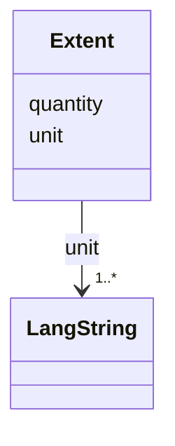

---
search:
  boost: 10.0
---

# Class: Extent 


_A quantitative measure of a dataset's size or scope, expressed as a numeric quantity and one or more localized unit labels. Use one Extent for each independently useful measure, including bytes, records, files, images or duration; do not combine multiple measures or explanatory prose in one instance._


<div data-search-exclude markdown="1">


URI: [schema:QuantitativeValue](http://schema.org/QuantitativeValue)





## Class Properties

| Property | Value |
| --- | --- |
| Class URI | [schema:QuantitativeValue](http://schema.org/QuantitativeValue) |


## Slots

| Name | Cardinality and Range | Description | Inheritance |
| ---  | --- | --- | --- |
| [quantity](../slots/quantity.md) | <span title="Required: exactly one value">1</span> <br/> [Decimal](../types/Decimal.md) | <span title="The numeric magnitude of an Extent measure. Use an integer when the measure is a count or an exact byte total, and a decimal only when the chosen unit requires one; put the unit in the accompanying unit slot.">The numeric magnitude of an Extent measure</span> | direct |
| [unit](../slots/unit.md) | <span title="Required: one or more values">1..*</span> <br/> [LangString](../classes/LangString.md) | <span title="Localized labels for the unit of an Extent quantity, such as byte, record, image, file or hour. Use one LangString per available language, prefer a concise singular unit label rather than a sentence, and keep qualifications in the Dataset description or another extent measure.">Localized labels for the unit of an Extent quantity, such as byte, record, im...</span> | direct |


## Usages

| used by | used in | type | used |
| ---  | --- | --- | --- |
| [Dataset](../classes/Dataset.md) | [extent](../slots/extent.md) | range | [Extent](../classes/Extent.md) |


## Identifier and Mapping Information


### Schema Source


* from schema: https://idhi_placeholder/linkml/idhi


## Mappings

| Mapping Type | Mapped Value |
| ---  | ---  |
| self | schema:QuantitativeValue |
| native | idhi:Extent |


## LinkML Source

### Direct

<details>
```yaml
name: Extent
description: A quantitative measure of a dataset's size or scope, expressed as a numeric
  quantity and one or more localized unit labels. Use one Extent for each independently
  useful measure, including bytes, records, files, images or duration; do not combine
  multiple measures or explanatory prose in one instance.
from_schema: https://idhi_placeholder/linkml/idhi
slots:
- quantity
- unit
class_uri: schema:QuantitativeValue

```
</details>

### Induced

<details>
```yaml
name: Extent
description: A quantitative measure of a dataset's size or scope, expressed as a numeric
  quantity and one or more localized unit labels. Use one Extent for each independently
  useful measure, including bytes, records, files, images or duration; do not combine
  multiple measures or explanatory prose in one instance.
from_schema: https://idhi_placeholder/linkml/idhi
attributes:
  quantity:
    name: quantity
    description: The numeric magnitude of an Extent measure. Use an integer when the
      measure is a count or an exact byte total, and a decimal only when the chosen
      unit requires one; put the unit in the accompanying unit slot.
    from_schema: https://idhi_placeholder/linkml/idhi
    rank: 1000
    slot_uri: schema:value
    owner: Extent
    domain_of:
    - Extent
    range: decimal
    required: true
  unit:
    name: unit
    description: Localized labels for the unit of an Extent quantity, such as byte,
      record, image, file or hour. Use one LangString per available language, prefer
      a concise singular unit label rather than a sentence, and keep qualifications
      in the Dataset description or another extent measure.
    from_schema: https://idhi_placeholder/linkml/idhi
    rank: 1000
    slot_uri: schema:unitText
    owner: Extent
    domain_of:
    - Extent
    range: LangString
    required: true
    multivalued: true
    inlined: true
    inlined_as_list: true
class_uri: schema:QuantitativeValue

```
</details></div>