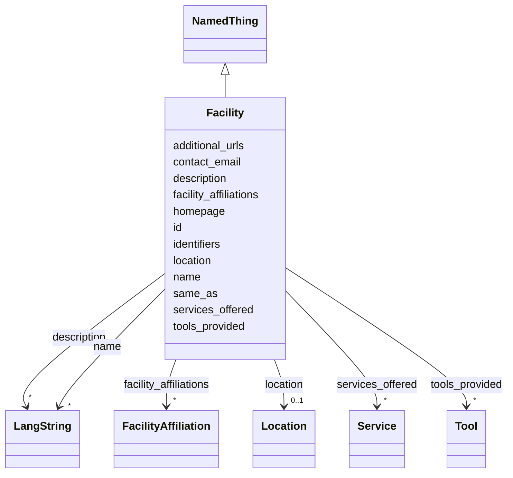

---
search:
  boost: 10.0
---

# Class: Facility 


_A physical or virtual facility such as a DH lab, digitization studio or research infrastructure, affiliated with one or more organizations (CERIF Facility). Use Facility when the unit offers services/tools and has its own identity distinct from its host organization; otherwise just use the Organization._


<div data-search-exclude markdown="1">


URI: [cerif:Facility](https://w3id.org/cerif/model#Facility)





## Inheritance
* [NamedThing](../classes/NamedThing.md)
    * **Facility**


## Class Properties

| Property | Value |
| --- | --- |
| Class URI | [cerif:Facility](https://w3id.org/cerif/model#Facility) |


## Slots

| Name | Cardinality and Range | Description | Inheritance |
| ---  | --- | --- | --- |
| [facility_affiliations](../slots/facility_affiliations.md) | * <br/> [FacilityAffiliation](../classes/FacilityAffiliation.md) | The organization(s) hosting or owning this facility, as reified FacilityAffil... | direct |
| [location](../slots/location.md) | 0..1 <br/> [Location](../classes/Location.md) | Where the organization, facility or event is physically situated | direct |
| [services_offered](../slots/services_offered.md) | * <br/> [Service](../classes/Service.md) | Services this facility offers to researchers | direct |
| [tools_provided](../slots/tools_provided.md) | * <br/> [Tool](../classes/Tool.md) | Tools this facility maintains or gives access to (by id) | direct |
| [additional_urls](../slots/additional_urls.md) | * <br/> [Uri](../types/Uri.md) | Further relevant web pages beyond the homepage (blog, social-media profile, r... | direct |
| [contact_email](../slots/contact_email.md) | 0..1 <br/> [String](../types/String.md) | A published contact address for the entity (office, team or service-desk mail... | direct |
| [id](../slots/id.md) | 1 <br/> [String](../types/String.md) | The entity's primary identifier: an IDHI URN of the form | [NamedThing](../classes/NamedThing.md) |
| [name](../slots/name.md) | * <br/> [LangString](../classes/LangString.md) | Multilingual name/title | [NamedThing](../classes/NamedThing.md) |
| [description](../slots/description.md) | * <br/> [LangString](../classes/LangString.md) | Multilingual free-text description (a few sentences aimed at index visitors, ... | [NamedThing](../classes/NamedThing.md) |
| [homepage](../slots/homepage.md) | 0..1 <br/> [Uri](../types/Uri.md) | Public landing page of the entity, if one exists | [NamedThing](../classes/NamedThing.md) |
| [identifiers](../slots/identifiers.md) | * <br/> [Uriorcurie](../types/Uriorcurie.md) | Additional EXTERNAL identifiers beyond the primary IDHI URN and the dedicated... | [NamedThing](../classes/NamedThing.md) |
| [same_as](../slots/same_as.md) | * <br/> [Uri](../types/Uri.md) | URIs of records in OTHER systems describing the same real-world entity (Wikid... | [NamedThing](../classes/NamedThing.md) |


## Usages

| used by | used in | type | used |
| ---  | --- | --- | --- |
| [FacilityAffiliation](../classes/FacilityAffiliation.md) | [facility](../slots/facility.md) | range | [Facility](../classes/Facility.md) |
| [IndexContainer](../classes/IndexContainer.md) | [facilities](../slots/facilities.md) | range | [Facility](../classes/Facility.md) |


## Identifier and Mapping Information


### Schema Source


* from schema: https://idhi.co.il/linkml/idhi


## Mappings

| Mapping Type | Mapped Value |
| ---  | ---  |
| self | cerif:Facility |
| native | idhi:Facility |


## LinkML Source

<!-- TODO: investigate https://stackoverflow.com/questions/37606292/how-to-create-tabbed-code-blocks-in-mkdocs-or-sphinx -->

### Direct

<details>
```yaml
name: Facility
description: A physical or virtual facility such as a DH lab, digitization studio
  or research infrastructure, affiliated with one or more organizations (CERIF Facility).
  Use Facility when the unit offers services/tools and has its own identity distinct
  from its host organization; otherwise just use the Organization.
from_schema: https://idhi.co.il/linkml/idhi
is_a: NamedThing
slots:
- facility_affiliations
- location
- services_offered
- tools_provided
- additional_urls
- contact_email
slot_usage:
  id:
    name: id
    structured_pattern:
      syntax: ^idhi:facility:{shortid}$
      interpolated: true
class_uri: cerif:Facility

```
</details>

### Induced

<details>
```yaml
name: Facility
description: A physical or virtual facility such as a DH lab, digitization studio
  or research infrastructure, affiliated with one or more organizations (CERIF Facility).
  Use Facility when the unit offers services/tools and has its own identity distinct
  from its host organization; otherwise just use the Organization.
from_schema: https://idhi.co.il/linkml/idhi
is_a: NamedThing
slot_usage:
  id:
    name: id
    structured_pattern:
      syntax: ^idhi:facility:{shortid}$
      interpolated: true
attributes:
  facility_affiliations:
    name: facility_affiliations
    description: The organization(s) hosting or owning this facility, as reified FacilityAffiliation
      objects with dates.
    from_schema: https://idhi.co.il/linkml/idhi
    rank: 1000
    owner: Facility
    domain_of:
    - Facility
    range: FacilityAffiliation
    multivalued: true
    inlined: true
    inlined_as_list: true
  location:
    name: location
    description: Where the organization, facility or event is physically situated.
    from_schema: https://idhi.co.il/linkml/idhi
    rank: 1000
    slot_uri: schema:location
    owner: Facility
    domain_of:
    - Organization
    - Facility
    - Event
    range: Location
  services_offered:
    name: services_offered
    description: Services this facility offers to researchers. Reference Service records
      by id; the Service's own 'provider' may still point at the parent Organization.
    from_schema: https://idhi.co.il/linkml/idhi
    rank: 1000
    owner: Facility
    domain_of:
    - Facility
    range: Service
    multivalued: true
  tools_provided:
    name: tools_provided
    description: Tools this facility maintains or gives access to (by id). Use for
      hosted instances and lab-maintained software, not for every tool staff members
      happen to use.
    from_schema: https://idhi.co.il/linkml/idhi
    rank: 1000
    owner: Facility
    domain_of:
    - Facility
    range: Tool
    multivalued: true
  additional_urls:
    name: additional_urls
    description: Further relevant web pages beyond the homepage (blog, social-media
      profile, registry entry, press coverage...). For records describing the same
      entity in other systems use same_as instead.
    from_schema: https://idhi.co.il/linkml/idhi
    rank: 1000
    slot_uri: foaf:page
    owner: Facility
    domain_of:
    - Organization
    - Facility
    - Project
    - Tool
    - Service
    - Event
    range: uri
    multivalued: true
  contact_email:
    name: contact_email
    description: A published contact address for the entity (office, team or service-desk
      mailbox). For a person's own addresses use 'emails'.
    from_schema: https://idhi.co.il/linkml/idhi
    rank: 1000
    slot_uri: schema:email
    owner: Facility
    domain_of:
    - Organization
    - Facility
    - Project
    - Tool
    - Service
    - Event
    range: string
  id:
    name: id
    description: "The entity's primary identifier: an IDHI URN of the form\n  idhi:<class\
      \ name>:<random short alphanumeric id>\ne.g. idhi:person:x7k2m9 or idhi:project:a83bq1.\
      \ Minted by IDHI at record creation and never reused or changed. The class token\
      \ is the lowercase snake_case class name (Organization subclasses use \"organization\"\
      ); each concrete class enforces its own token via slot_usage. External identifiers\
      \ (ORCID, ROR, DOI...) are supplementary and go in their dedicated slots — never\
      \ here."
    from_schema: https://idhi.co.il/linkml/idhi
    rank: 1000
    slot_uri: dcterms:identifier
    identifier: true
    owner: Facility
    domain_of:
    - NamedThing
    range: string
    required: true
    pattern: ^idhi:[a-z_]+:[0-9a-z]{4,12}$
    structured_pattern:
      syntax: ^idhi:facility:{shortid}$
      interpolated: true
  name:
    name: name
    description: Multilingual name/title. Provide at least one language; English,
      Hebrew and Arabic variants are each a separate LangString. Preferably a sortable
      name (e.g. "Smith, John" rather than "John Smith") for people and organizations;
      for projects, tools and services, use the name the team itself uses.
    from_schema: https://idhi.co.il/linkml/idhi
    rank: 1000
    slot_uri: skos:prefLabel
    owner: Facility
    domain_of:
    - NamedThing
    range: LangString
    multivalued: true
    inlined: true
    inlined_as_list: true
  description:
    name: description
    description: Multilingual free-text description (a few sentences aimed at index
      visitors, not internal notes).
    from_schema: https://idhi.co.il/linkml/idhi
    rank: 1000
    slot_uri: dcterms:description
    owner: Facility
    domain_of:
    - NamedThing
    range: LangString
    multivalued: true
    inlined: true
    inlined_as_list: true
  homepage:
    name: homepage
    description: Public landing page of the entity, if one exists.
    from_schema: https://idhi.co.il/linkml/idhi
    rank: 1000
    slot_uri: foaf:homepage
    owner: Facility
    domain_of:
    - NamedThing
    range: uri
  identifiers:
    name: identifiers
    description: Additional EXTERNAL identifiers beyond the primary IDHI URN and the
      dedicated ORCID/ROR/DOI slots, as CURIEs/URIs (e.g. Wikidata QIDs, VIAF, ISNI).
    from_schema: https://idhi.co.il/linkml/idhi
    rank: 1000
    slot_uri: dcterms:identifier
    owner: Facility
    domain_of:
    - NamedThing
    range: uriorcurie
    multivalued: true
  same_as:
    name: same_as
    description: URIs of records in OTHER systems describing the same real-world entity
      (Wikidata, PeriodO, GeoNames...). Use for linked-data alignment, not for the
      entity's own pages (use homepage).
    from_schema: https://idhi.co.il/linkml/idhi
    rank: 1000
    slot_uri: schema:sameAs
    owner: Facility
    domain_of:
    - NamedThing
    range: uri
    multivalued: true
class_uri: cerif:Facility

```
</details></div>