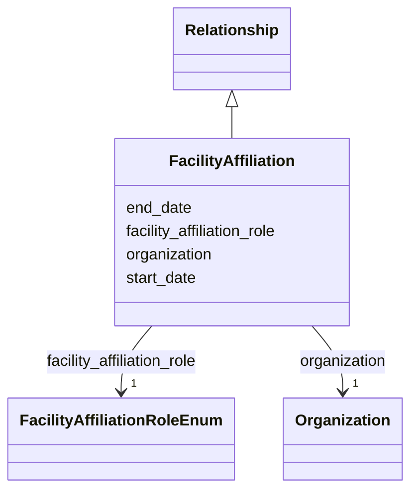

---
search:
  boost: 10.0
---

# Class: FacilityAffiliation 


_A facility's affiliation with an organization, nested in a Facility so the facility is inferred from the containing record. Use one instance per hosting or owning organization in Facility.facility_affiliations and do not provide the containing facility's ID; joint labs get several._


<div data-search-exclude markdown="1">


URI: [cerif:Facility_OrganisationUnit](https://w3id.org/cerif/model#Facility_OrganisationUnit)





## Inheritance
* [Relationship](../classes/Relationship.md)
    * **FacilityAffiliation**


## Class Properties

| Property | Value |
| --- | --- |
| Class URI | [cerif:Facility_OrganisationUnit](https://w3id.org/cerif/model#Facility_OrganisationUnit) |


## Slots

| Name | Cardinality and Range | Description | Inheritance |
| ---  | --- | --- | --- |
| [organization](../slots/organization.md) | <span title="Required: exactly one value">1</span> <br/> [Organization](../classes/Organization.md) | <span title="The organization referenced by a person affiliation, facility affiliation or project role (by IDHI URN). The Person, Facility or Project containing the relationship supplies its other endpoint.">The organization referenced by a person affiliation, facility affiliation or ...</span> | direct |
| [facility_affiliation_role](../slots/facility_affiliation_role.md) | <span title="Required: exactly one value">1</span> <br/> [FacilityAffiliationRoleEnum](../enums/FacilityAffiliationRoleEnum.md) | <span title="The organization's relationship to the containing facility. Use HOST when it provides the facility's institutional or operational home and OWNER when it legally or administratively owns the facility; create two relationships when distinct organizations fill those roles.">The organization's relationship to the containing facility</span> | direct |
| [start_date](../slots/start_date.md) | <span title="Optional: at most one value">0..1</span> <br/> [Date](../types/Date.md) | <span title="Start of the event, of the project's runtime, or of a relationship's validity, such as when participation, affiliation, maintenance responsibility or formal containment began.">Start of the event, of the project's runtime, or of a relationship's validity...</span> | [Relationship](../classes/Relationship.md) |
| [end_date](../slots/end_date.md) | <span title="Optional: at most one value">0..1</span> <br/> [Date](../types/Date.md) | <span title="End of the event, project runtime or relationship. Omit for ongoing relationships and open-ended projects.">End of the event, project runtime or relationship</span> | [Relationship](../classes/Relationship.md) |


## Usages

| used by | used in | type | used |
| ---  | --- | --- | --- |
| [Facility](../classes/Facility.md) | [facility_affiliations](../slots/facility_affiliations.md) | range | [FacilityAffiliation](../classes/FacilityAffiliation.md) |


## Identifier and Mapping Information


### Schema Source


* from schema: https://idhi_placeholder/linkml/idhi


## Mappings

| Mapping Type | Mapped Value |
| ---  | ---  |
| self | cerif:Facility_OrganisationUnit |
| native | idhi:FacilityAffiliation |


## LinkML Source

### Direct

<details>
```yaml
name: FacilityAffiliation
description: A facility's affiliation with an organization, nested in a Facility so
  the facility is inferred from the containing record. Use one instance per hosting
  or owning organization in Facility.facility_affiliations and do not provide the
  containing facility's ID; joint labs get several.
from_schema: https://idhi_placeholder/linkml/idhi
is_a: Relationship
slots:
- organization
- facility_affiliation_role
class_uri: cerif:Facility_OrganisationUnit

```
</details>

### Induced

<details>
```yaml
name: FacilityAffiliation
description: A facility's affiliation with an organization, nested in a Facility so
  the facility is inferred from the containing record. Use one instance per hosting
  or owning organization in Facility.facility_affiliations and do not provide the
  containing facility's ID; joint labs get several.
from_schema: https://idhi_placeholder/linkml/idhi
is_a: Relationship
attributes:
  organization:
    name: organization
    description: The organization referenced by a person affiliation, facility affiliation
      or project role (by IDHI URN). The Person, Facility or Project containing the
      relationship supplies its other endpoint.
    from_schema: https://idhi_placeholder/linkml/idhi
    rank: 1000
    owner: FacilityAffiliation
    domain_of:
    - Affiliation
    - OrganizationProjectRole
    - FacilityAffiliation
    range: Organization
    required: true
  facility_affiliation_role:
    name: facility_affiliation_role
    description: The organization's relationship to the containing facility. Use HOST
      when it provides the facility's institutional or operational home and OWNER
      when it legally or administratively owns the facility; create two relationships
      when distinct organizations fill those roles.
    from_schema: https://idhi_placeholder/linkml/idhi
    rank: 1000
    slot_uri: schema:roleName
    owner: FacilityAffiliation
    domain_of:
    - FacilityAffiliation
    range: FacilityAffiliationRoleEnum
    required: true
  start_date:
    name: start_date
    description: Start of the event, of the project's runtime, or of a relationship's
      validity, such as when participation, affiliation, maintenance responsibility
      or formal containment began.
    from_schema: https://idhi_placeholder/linkml/idhi
    rank: 1000
    slot_uri: schema:startDate
    owner: FacilityAffiliation
    domain_of:
    - Project
    - Event
    - Relationship
    - Funding
    range: date
  end_date:
    name: end_date
    description: End of the event, project runtime or relationship. Omit for ongoing
      relationships and open-ended projects.
    from_schema: https://idhi_placeholder/linkml/idhi
    rank: 1000
    slot_uri: schema:endDate
    owner: FacilityAffiliation
    domain_of:
    - Project
    - Event
    - Relationship
    - Funding
    range: date
class_uri: cerif:Facility_OrganisationUnit

```
</details></div>