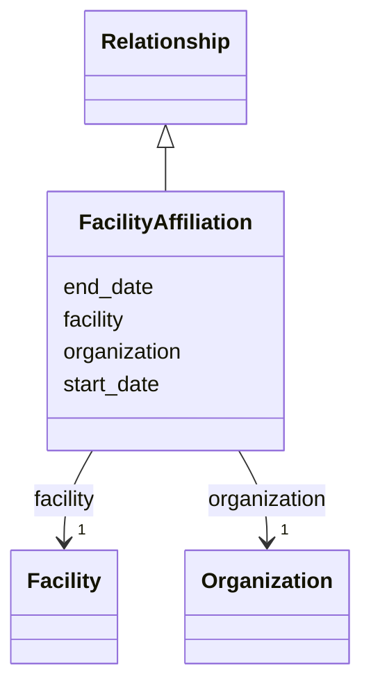

---
search:
  boost: 10.0
---

# Class: FacilityAffiliation 


_A facility's affiliation with an organization. Use one instance per hosting/owning organization; joint labs get several._


<div data-search-exclude markdown="1">


URI: [cerif:Facility_OrganisationUnit](https://w3id.org/cerif/model#Facility_OrganisationUnit)





## Inheritance
* [Relationship](../classes/Relationship.md)
    * **FacilityAffiliation**


## Class Properties

| Property | Value |
| --- | --- |
| Class URI | [cerif:Facility_OrganisationUnit](https://w3id.org/cerif/model#Facility_OrganisationUnit) |


## Slots

| Name | Cardinality and Range | Description | Inheritance |
| ---  | --- | --- | --- |
| [facility](../slots/facility.md) | 1 <br/> [Facility](../classes/Facility.md) | The facility side of the relationship (by IDHI URN) | direct |
| [organization](../slots/organization.md) | 1 <br/> [Organization](../classes/Organization.md) | The organization side of the relationship (by IDHI URN) | direct |
| [start_date](../slots/start_date.md) | 0..1 <br/> [Date](../types/Date.md) | Start of the event or of a relationship's validity (e | [Relationship](../classes/Relationship.md) |
| [end_date](../slots/end_date.md) | 0..1 <br/> [Date](../types/Date.md) | End of the event, relationship or time period | [Relationship](../classes/Relationship.md) |


## Usages

| used by | used in | type | used |
| ---  | --- | --- | --- |
| [Facility](../classes/Facility.md) | [facility_affiliations](../slots/facility_affiliations.md) | range | [FacilityAffiliation](../classes/FacilityAffiliation.md) |


## Identifier and Mapping Information


### Schema Source


* from schema: https://idhi.co.il/linkml/idhi


## Mappings

| Mapping Type | Mapped Value |
| ---  | ---  |
| self | cerif:Facility_OrganisationUnit |
| native | idhi:FacilityAffiliation |


## LinkML Source

<!-- TODO: investigate https://stackoverflow.com/questions/37606292/how-to-create-tabbed-code-blocks-in-mkdocs-or-sphinx -->

### Direct

<details>
```yaml
name: FacilityAffiliation
description: A facility's affiliation with an organization. Use one instance per hosting/owning
  organization; joint labs get several.
from_schema: https://idhi.co.il/linkml/idhi
is_a: Relationship
slots:
- facility
- organization
class_uri: cerif:Facility_OrganisationUnit

```
</details>

### Induced

<details>
```yaml
name: FacilityAffiliation
description: A facility's affiliation with an organization. Use one instance per hosting/owning
  organization; joint labs get several.
from_schema: https://idhi.co.il/linkml/idhi
is_a: Relationship
attributes:
  facility:
    name: facility
    description: The facility side of the relationship (by IDHI URN).
    from_schema: https://idhi.co.il/linkml/idhi
    rank: 1000
    owner: FacilityAffiliation
    domain_of:
    - FacilityAffiliation
    range: Facility
    required: true
  organization:
    name: organization
    description: The organization side of the relationship (by IDHI URN).
    from_schema: https://idhi.co.il/linkml/idhi
    rank: 1000
    owner: FacilityAffiliation
    domain_of:
    - Affiliation
    - OrganizationProjectRole
    - FacilityAffiliation
    range: Organization
    required: true
  start_date:
    name: start_date
    description: Start of the event or of a relationship's validity (e.g. when a person
      joined a project or organization).
    from_schema: https://idhi.co.il/linkml/idhi
    rank: 1000
    slot_uri: schema:startDate
    owner: FacilityAffiliation
    domain_of:
    - Event
    - Relationship
    range: date
  end_date:
    name: end_date
    description: End of the event, relationship or time period. Omit for ongoing relationships
      and open-ended periods.
    from_schema: https://idhi.co.il/linkml/idhi
    rank: 1000
    slot_uri: schema:endDate
    owner: FacilityAffiliation
    domain_of:
    - Event
    - TimePeriod
    - Relationship
    range: date
class_uri: cerif:Facility_OrganisationUnit

```
</details></div>