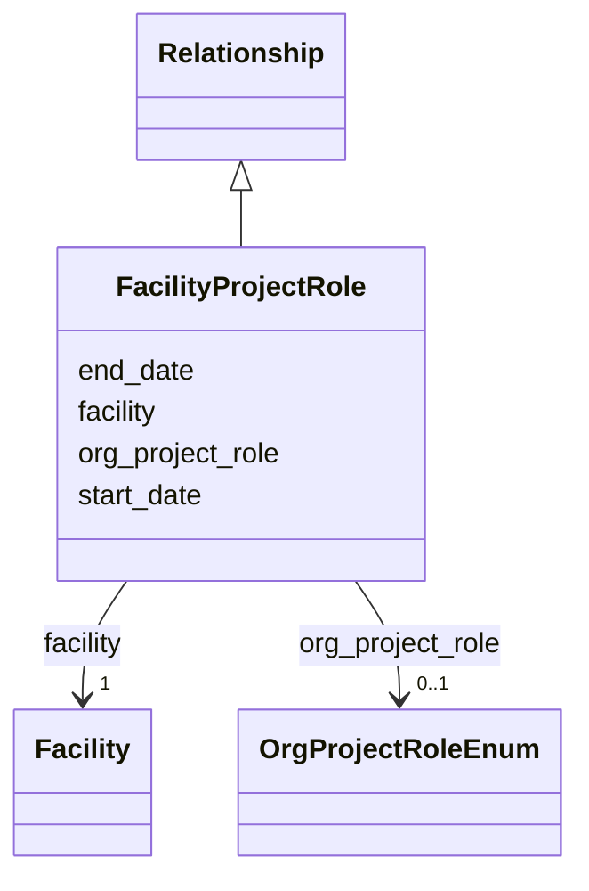

---
search:
  boost: 10.0
---

# Class: FacilityProjectRole 


_A facility's engagement nested in a Project, so the project is inferred from the containing record. Use one instance per role in Project.facility_roles and do not provide the containing project's ID. Record a funder with Project.funding, not with a role here._


<div data-search-exclude markdown="1">


URI: [schema:Role](http://schema.org/Role)





## Inheritance
* [Relationship](../classes/Relationship.md)
    * **FacilityProjectRole**


## Class Properties

| Property | Value |
| --- | --- |
| Class URI | [schema:Role](http://schema.org/Role) |


## Slots

| Name | Cardinality and Range | Description | Inheritance |
| ---  | --- | --- | --- |
| [facility](../slots/facility.md) | <span title="Required: exactly one value">1</span> <br/> [Facility](../classes/Facility.md) | <span title="The facility referenced by a project role (by IDHI URN). Use only in FacilityProjectRole; the containing Project supplies the relationship's other endpoint.">The facility referenced by a project role (by IDHI URN)</span> | direct |
| [org_project_role](../slots/org_project_role.md) | <span title="Optional: at most one value">0..1</span> <br/> [OrgProjectRoleEnum](../enums/OrgProjectRoleEnum.md) | <span title="The organization's or facility's function in the project: COORDINATOR leads the consortium, PARTNER contributes work, DATA_PROVIDER supplies source data, and HOST provides the institutional home. Create one relationship instance per role; record a funder with Project.funding, not with a role here.">The organization's or facility's function in the project: COORDINATOR leads t...</span> | direct |
| [start_date](../slots/start_date.md) | <span title="Optional: at most one value">0..1</span> <br/> [Date](../types/Date.md) | <span title="Start of the event, of the project's runtime, or of a relationship's validity, such as when participation, affiliation, maintenance responsibility or formal containment began.">Start of the event, of the project's runtime, or of a relationship's validity...</span> | [Relationship](../classes/Relationship.md) |
| [end_date](../slots/end_date.md) | <span title="Optional: at most one value">0..1</span> <br/> [Date](../types/Date.md) | <span title="End of the event, project runtime or relationship. Omit for ongoing relationships and open-ended projects.">End of the event, project runtime or relationship</span> | [Relationship](../classes/Relationship.md) |


## Usages

| used by | used in | type | used |
| ---  | --- | --- | --- |
| [Project](../classes/Project.md) | [facility_roles](../slots/facility_roles.md) | range | [FacilityProjectRole](../classes/FacilityProjectRole.md) |


## Identifier and Mapping Information


### Schema Source


* from schema: https://idhi_placeholder/linkml/idhi


## Mappings

| Mapping Type | Mapped Value |
| ---  | ---  |
| self | schema:Role |
| native | idhi:FacilityProjectRole |


## LinkML Source

### Direct

<details>
```yaml
name: FacilityProjectRole
description: A facility's engagement nested in a Project, so the project is inferred
  from the containing record. Use one instance per role in Project.facility_roles
  and do not provide the containing project's ID. Record a funder with Project.funding,
  not with a role here.
from_schema: https://idhi_placeholder/linkml/idhi
is_a: Relationship
slots:
- facility
- org_project_role
class_uri: schema:Role

```
</details>

### Induced

<details>
```yaml
name: FacilityProjectRole
description: A facility's engagement nested in a Project, so the project is inferred
  from the containing record. Use one instance per role in Project.facility_roles
  and do not provide the containing project's ID. Record a funder with Project.funding,
  not with a role here.
from_schema: https://idhi_placeholder/linkml/idhi
is_a: Relationship
attributes:
  facility:
    name: facility
    description: The facility referenced by a project role (by IDHI URN). Use only
      in FacilityProjectRole; the containing Project supplies the relationship's other
      endpoint.
    from_schema: https://idhi_placeholder/linkml/idhi
    rank: 1000
    owner: FacilityProjectRole
    domain_of:
    - FacilityProjectRole
    range: Facility
    required: true
  org_project_role:
    name: org_project_role
    description: 'The organization''s or facility''s function in the project: COORDINATOR
      leads the consortium, PARTNER contributes work, DATA_PROVIDER supplies source
      data, and HOST provides the institutional home. Create one relationship instance
      per role; record a funder with Project.funding, not with a role here.'
    from_schema: https://idhi_placeholder/linkml/idhi
    rank: 1000
    slot_uri: schema:roleName
    owner: FacilityProjectRole
    domain_of:
    - OrganizationProjectRole
    - FacilityProjectRole
    range: OrgProjectRoleEnum
  start_date:
    name: start_date
    description: Start of the event, of the project's runtime, or of a relationship's
      validity, such as when participation, affiliation, maintenance responsibility
      or formal containment began.
    from_schema: https://idhi_placeholder/linkml/idhi
    rank: 1000
    slot_uri: schema:startDate
    owner: FacilityProjectRole
    domain_of:
    - Project
    - Event
    - Relationship
    - Funding
    range: date
  end_date:
    name: end_date
    description: End of the event, project runtime or relationship. Omit for ongoing
      relationships and open-ended projects.
    from_schema: https://idhi_placeholder/linkml/idhi
    rank: 1000
    slot_uri: schema:endDate
    owner: FacilityProjectRole
    domain_of:
    - Project
    - Event
    - Relationship
    - Funding
    range: date
class_uri: schema:Role

```
</details></div>