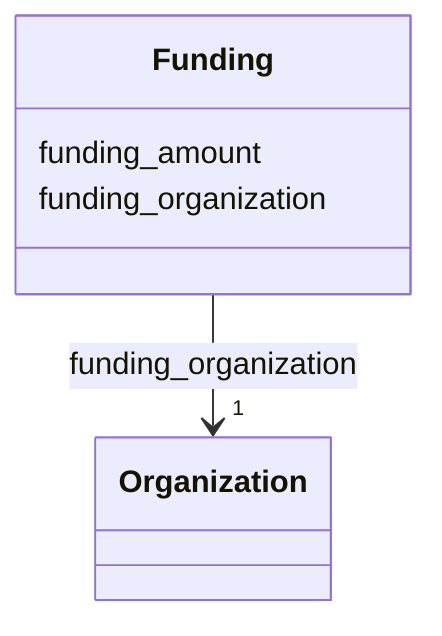

---
search:
  boost: 10.0
---

# Class: Funding 


_A funding award for a project, identifying the organization that provides it and its amount when public. It is inlined within the funded Project and has no independent ID._


<div data-search-exclude markdown="1">


URI: [schema:MonetaryGrant](http://schema.org/MonetaryGrant)





## Class Properties

| Property | Value |
| --- | --- |
| Class URI | [schema:MonetaryGrant](http://schema.org/MonetaryGrant) |


## Slots

| Name | Cardinality and Range | Description | Inheritance |
| ---  | --- | --- | --- |
| [funding_organization](../slots/funding_organization.md) | 1 <br/> [Organization](../classes/Organization.md) | The organization that provides this funding award (by IDHI URN) | direct |
| [funding_amount](../slots/funding_amount.md) | 0..1 <br/> [Float](../types/Float.md) | Amount awarded by the funding organization, if public, in ILS unless noted in... | direct |


## Usages

| used by | used in | type | used |
| ---  | --- | --- | --- |
| [Project](../classes/Project.md) | [funding](../slots/funding.md) | range | [Funding](../classes/Funding.md) |


## Identifier and Mapping Information


### Schema Source


* from schema: https://idhi_placeholder/linkml/idhi


## Mappings

| Mapping Type | Mapped Value |
| ---  | ---  |
| self | schema:MonetaryGrant |
| native | idhi:Funding |


## LinkML Source

### Direct

<details>
```yaml
name: Funding
description: A funding award for a project, identifying the organization that provides
  it and its amount when public. It is inlined within the funded Project and has no
  independent ID.
from_schema: https://idhi_placeholder/linkml/idhi
slots:
- funding_organization
- funding_amount
class_uri: schema:MonetaryGrant

```
</details>

### Induced

<details>
```yaml
name: Funding
description: A funding award for a project, identifying the organization that provides
  it and its amount when public. It is inlined within the funded Project and has no
  independent ID.
from_schema: https://idhi_placeholder/linkml/idhi
attributes:
  funding_organization:
    name: funding_organization
    description: The organization that provides this funding award (by IDHI URN).
    from_schema: https://idhi_placeholder/linkml/idhi
    rank: 1000
    slot_uri: schema:funder
    owner: Funding
    domain_of:
    - Funding
    range: Organization
    required: true
  funding_amount:
    name: funding_amount
    description: Amount awarded by the funding organization, if public, in ILS unless
      noted in the project description. Omit rather than guess.
    from_schema: https://idhi_placeholder/linkml/idhi
    rank: 1000
    slot_uri: frapo:hasMonetaryValue
    owner: Funding
    domain_of:
    - Funding
    range: float
class_uri: schema:MonetaryGrant

```
</details></div>