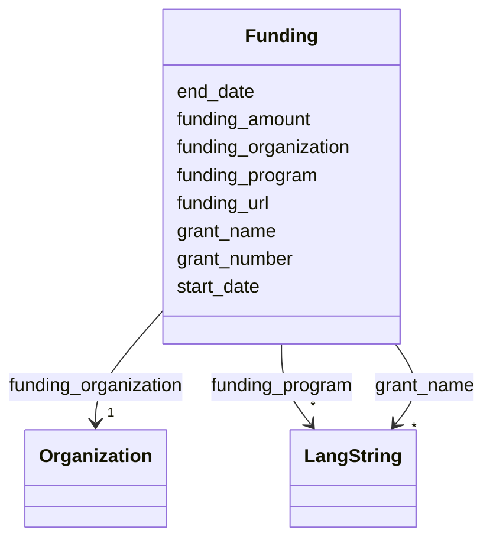

---
search:
  boost: 10.0
---

# Class: Funding 


_A distinct funding award for a project, identifying the organization that provides it and recording available award metadata and its funding period. Use Funding when an award or grant is known; use an OrganizationProjectRole with FUNDER only when the funder's involvement is known but no distinct award can be described, and do not record the same funding fact in both structures. It is inlined within the funded Project and has no independent ID._


<div data-search-exclude markdown="1">


URI: [schema:MonetaryGrant](http://schema.org/MonetaryGrant)





## Class Properties

| Property | Value |
| --- | --- |
| Class URI | [schema:MonetaryGrant](http://schema.org/MonetaryGrant) |


## Slots

| Name | Cardinality and Range | Description | Inheritance |
| ---  | --- | --- | --- |
| [funding_organization](../slots/funding_organization.md) | <span title="Required: exactly one value">1</span> <br/> [Organization](../classes/Organization.md) | <span title="The organization that provides this funding award (by IDHI URN).">The organization that provides this funding award (by IDHI URN)</span> | direct |
| [funding_amount](../slots/funding_amount.md) | <span title="Optional: at most one value">0..1</span> <br/> [Float](../types/Float.md) | <span title="Amount awarded by the funding organization, if public, in ILS unless noted in the project description. Omit rather than guess.">Amount awarded by the funding organization, if public, in ILS unless noted in...</span> | direct |
| [grant_name](../slots/grant_name.md) | <span title="Optional: zero or more values allowed">*</span> <br/> [LangString](../classes/LangString.md) | <span title="Official multilingual title of the individual grant or award. Use this for the award's title, not the broader recurring programme, which belongs in funding_program.">Official multilingual title of the individual grant or award</span> | direct |
| [funding_program](../slots/funding_program.md) | <span title="Optional: zero or more values allowed">*</span> <br/> [LangString](../classes/LangString.md) | <span title="Multilingual name of the broader funding programme or scheme under which the award was made. This uses an IDHI-specific property because FRAPO defines FundingProgramme as a class but has no fitting property for a literal programme label.">Multilingual name of the broader funding programme or scheme under which the ...</span> | direct |
| [grant_number](../slots/grant_number.md) | <span title="Optional: at most one value">0..1</span> <br/> [String](../types/String.md) | <span title="Identifier assigned to the grant by its funding organization. Use the funder's exact value and omit it when none is published.">Identifier assigned to the grant by its funding organization</span> | direct |
| [funding_url](../slots/funding_url.md) | <span title="Optional: at most one value">0..1</span> <br/> [Uri](../types/Uri.md) | <span title="Public landing page for the individual award or its authoritative funding record. Use the funding organization's homepage on the Organization record instead when no award-specific page exists.">Public landing page for the individual award or its authoritative funding rec...</span> | direct |
| [start_date](../slots/start_date.md) | <span title="Optional: at most one value">0..1</span> <br/> [Date](../types/Date.md) | <span title="Start of the event, of the project's runtime, or of a relationship's validity, such as when participation, affiliation, maintenance responsibility or formal containment began.">Start of the event, of the project's runtime, or of a relationship's validity...</span> | direct |
| [end_date](../slots/end_date.md) | <span title="Optional: at most one value">0..1</span> <br/> [Date](../types/Date.md) | <span title="End of the event, project runtime or relationship. Omit for ongoing relationships and open-ended projects.">End of the event, project runtime or relationship</span> | direct |


## Usages

| used by | used in | type | used |
| ---  | --- | --- | --- |
| [Project](../classes/Project.md) | [funding](../slots/funding.md) | range | [Funding](../classes/Funding.md) |


## Identifier and Mapping Information


### Schema Source


* from schema: https://idhi_placeholder/linkml/idhi


## Mappings

| Mapping Type | Mapped Value |
| ---  | ---  |
| self | schema:MonetaryGrant |
| native | idhi:Funding |


## LinkML Source

### Direct

<details>
```yaml
name: Funding
description: A distinct funding award for a project, identifying the organization
  that provides it and recording available award metadata and its funding period.
  Use Funding when an award or grant is known; use an OrganizationProjectRole with
  FUNDER only when the funder's involvement is known but no distinct award can be
  described, and do not record the same funding fact in both structures. It is inlined
  within the funded Project and has no independent ID.
from_schema: https://idhi_placeholder/linkml/idhi
slots:
- funding_organization
- funding_amount
- grant_name
- funding_program
- grant_number
- funding_url
- start_date
- end_date
class_uri: schema:MonetaryGrant

```
</details>

### Induced

<details>
```yaml
name: Funding
description: A distinct funding award for a project, identifying the organization
  that provides it and recording available award metadata and its funding period.
  Use Funding when an award or grant is known; use an OrganizationProjectRole with
  FUNDER only when the funder's involvement is known but no distinct award can be
  described, and do not record the same funding fact in both structures. It is inlined
  within the funded Project and has no independent ID.
from_schema: https://idhi_placeholder/linkml/idhi
attributes:
  funding_organization:
    name: funding_organization
    description: The organization that provides this funding award (by IDHI URN).
    from_schema: https://idhi_placeholder/linkml/idhi
    rank: 1000
    slot_uri: schema:funder
    owner: Funding
    domain_of:
    - Funding
    range: Organization
    required: true
  funding_amount:
    name: funding_amount
    description: Amount awarded by the funding organization, if public, in ILS unless
      noted in the project description. Omit rather than guess.
    from_schema: https://idhi_placeholder/linkml/idhi
    rank: 1000
    slot_uri: frapo:hasMonetaryValue
    owner: Funding
    domain_of:
    - Funding
    range: float
  grant_name:
    name: grant_name
    description: Official multilingual title of the individual grant or award. Use
      this for the award's title, not the broader recurring programme, which belongs
      in funding_program.
    from_schema: https://idhi_placeholder/linkml/idhi
    rank: 1000
    slot_uri: schema:name
    owner: Funding
    domain_of:
    - Funding
    range: LangString
    multivalued: true
    inlined: true
    inlined_as_list: true
  funding_program:
    name: funding_program
    description: Multilingual name of the broader funding programme or scheme under
      which the award was made. This uses an IDHI-specific property because FRAPO
      defines FundingProgramme as a class but has no fitting property for a literal
      programme label.
    from_schema: https://idhi_placeholder/linkml/idhi
    rank: 1000
    slot_uri: idhi:fundingProgram
    owner: Funding
    domain_of:
    - Funding
    range: LangString
    multivalued: true
    inlined: true
    inlined_as_list: true
  grant_number:
    name: grant_number
    description: Identifier assigned to the grant by its funding organization. Use
      the funder's exact value and omit it when none is published.
    from_schema: https://idhi_placeholder/linkml/idhi
    rank: 1000
    slot_uri: frapo:hasGrantNumber
    owner: Funding
    domain_of:
    - Funding
    range: string
  funding_url:
    name: funding_url
    description: Public landing page for the individual award or its authoritative
      funding record. Use the funding organization's homepage on the Organization
      record instead when no award-specific page exists.
    from_schema: https://idhi_placeholder/linkml/idhi
    rank: 1000
    slot_uri: schema:url
    owner: Funding
    domain_of:
    - Funding
    range: uri
  start_date:
    name: start_date
    description: Start of the event, of the project's runtime, or of a relationship's
      validity, such as when participation, affiliation, maintenance responsibility
      or formal containment began.
    from_schema: https://idhi_placeholder/linkml/idhi
    rank: 1000
    slot_uri: schema:startDate
    owner: Funding
    domain_of:
    - Project
    - Event
    - Relationship
    - Funding
    range: date
  end_date:
    name: end_date
    description: End of the event, project runtime or relationship. Omit for ongoing
      relationships and open-ended projects.
    from_schema: https://idhi_placeholder/linkml/idhi
    rank: 1000
    slot_uri: schema:endDate
    owner: Funding
    domain_of:
    - Project
    - Event
    - Relationship
    - Funding
    range: date
class_uri: schema:MonetaryGrant

```
</details></div>