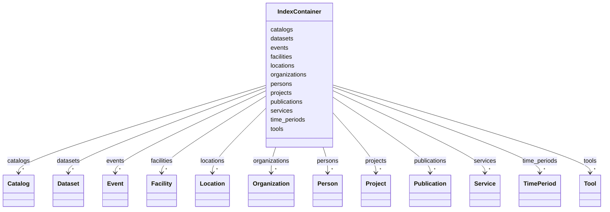

---
search:
  boost: 10.0
---

# Class: IndexContainer 


_Top-level holder for all IDHI records. Big entities live exactly once in these lists; everything else references them by their IDHI URN._


<div data-search-exclude markdown="1">


URI: [idhi:class/IndexContainer](https://idhi.co.il/linkml/class/IndexContainer)





<!-- no inheritance hierarchy -->

## Class Properties

| Property | Value |
| --- | --- |
| Tree Root | Yes |


## Slots

| Name | Cardinality and Range | Description | Inheritance |
| ---  | --- | --- | --- |
| [persons](../slots/persons.md) | * <br/> [Person](../classes/Person.md) | All Person records in the index | direct |
| [organizations](../slots/organizations.md) | * <br/> [Organization](../classes/Organization.md) | All Organization records in the index | direct |
| [projects](../slots/projects.md) | * <br/> [Project](../classes/Project.md) | All Project records in the index | direct |
| [facilities](../slots/facilities.md) | * <br/> [Facility](../classes/Facility.md) | All Facility records in the index | direct |
| [tools](../slots/tools.md) | * <br/> [Tool](../classes/Tool.md) | All Tool records in the index | direct |
| [services](../slots/services.md) | * <br/> [Service](../classes/Service.md) | All Service records in the index | direct |
| [publications](../slots/publications.md) | * <br/> [Publication](../classes/Publication.md) | All Publication records in the index | direct |
| [events](../slots/events.md) | * <br/> [Event](../classes/Event.md) | All Event records in the index | direct |
| [locations](../slots/locations.md) | * <br/> [Location](../classes/Location.md) | All Location records in the index | direct |
| [time_periods](../slots/time_periods.md) | * <br/> [TimePeriod](../classes/TimePeriod.md) | All TimePeriod records in the index | direct |
| [catalogs](../slots/catalogs.md) | * <br/> [Catalog](../classes/Catalog.md) | All Catalog records in the index | direct |
| [datasets](../slots/datasets.md) | * <br/> [Dataset](../classes/Dataset.md) | All Dataset records in the index | direct |


## Identifier and Mapping Information


### Schema Source


* from schema: https://idhi.co.il/linkml/idhi


## Mappings

| Mapping Type | Mapped Value |
| ---  | ---  |
| self | idhi:IndexContainer |
| native | idhi:IndexContainer |


## LinkML Source

<!-- TODO: investigate https://stackoverflow.com/questions/37606292/how-to-create-tabbed-code-blocks-in-mkdocs-or-sphinx -->

### Direct

<details>
```yaml
name: IndexContainer
description: Top-level holder for all IDHI records. Big entities live exactly once
  in these lists; everything else references them by their IDHI URN.
from_schema: https://idhi.co.il/linkml/idhi
attributes:
  persons:
    name: persons
    description: All Person records in the index.
    from_schema: https://idhi.co.il/linkml/idhi
    rank: 1000
    domain_of:
    - IndexContainer
    range: Person
    multivalued: true
    inlined_as_list: true
  organizations:
    name: organizations
    description: All Organization records in the index.
    from_schema: https://idhi.co.il/linkml/idhi
    rank: 1000
    domain_of:
    - IndexContainer
    range: Organization
    multivalued: true
    inlined_as_list: true
  projects:
    name: projects
    description: All Project records in the index.
    from_schema: https://idhi.co.il/linkml/idhi
    rank: 1000
    domain_of:
    - IndexContainer
    range: Project
    multivalued: true
    inlined_as_list: true
  facilities:
    name: facilities
    description: All Facility records in the index.
    from_schema: https://idhi.co.il/linkml/idhi
    rank: 1000
    domain_of:
    - IndexContainer
    range: Facility
    multivalued: true
    inlined_as_list: true
  tools:
    name: tools
    description: All Tool records in the index.
    from_schema: https://idhi.co.il/linkml/idhi
    rank: 1000
    domain_of:
    - IndexContainer
    range: Tool
    multivalued: true
    inlined_as_list: true
  services:
    name: services
    description: All Service records in the index.
    from_schema: https://idhi.co.il/linkml/idhi
    rank: 1000
    domain_of:
    - IndexContainer
    range: Service
    multivalued: true
    inlined_as_list: true
  publications:
    name: publications
    description: All Publication records in the index.
    from_schema: https://idhi.co.il/linkml/idhi
    rank: 1000
    domain_of:
    - IndexContainer
    range: Publication
    multivalued: true
    inlined_as_list: true
  events:
    name: events
    description: All Event records in the index.
    from_schema: https://idhi.co.il/linkml/idhi
    rank: 1000
    domain_of:
    - IndexContainer
    range: Event
    multivalued: true
    inlined_as_list: true
  locations:
    name: locations
    description: All Location records in the index.
    from_schema: https://idhi.co.il/linkml/idhi
    rank: 1000
    domain_of:
    - IndexContainer
    range: Location
    multivalued: true
    inlined_as_list: true
  time_periods:
    name: time_periods
    description: All TimePeriod records in the index.
    from_schema: https://idhi.co.il/linkml/idhi
    rank: 1000
    domain_of:
    - IndexContainer
    range: TimePeriod
    multivalued: true
    inlined_as_list: true
  catalogs:
    name: catalogs
    description: All Catalog records in the index.
    from_schema: https://idhi.co.il/linkml/idhi
    rank: 1000
    domain_of:
    - IndexContainer
    range: Catalog
    multivalued: true
    inlined_as_list: true
  datasets:
    name: datasets
    description: All Dataset records in the index.
    from_schema: https://idhi.co.il/linkml/idhi
    domain_of:
    - Catalog
    - IndexContainer
    range: Dataset
    multivalued: true
    inlined_as_list: true
tree_root: true

```
</details>

### Induced

<details>
```yaml
name: IndexContainer
description: Top-level holder for all IDHI records. Big entities live exactly once
  in these lists; everything else references them by their IDHI URN.
from_schema: https://idhi.co.il/linkml/idhi
attributes:
  persons:
    name: persons
    description: All Person records in the index.
    from_schema: https://idhi.co.il/linkml/idhi
    rank: 1000
    owner: IndexContainer
    domain_of:
    - IndexContainer
    range: Person
    multivalued: true
    inlined: true
    inlined_as_list: true
  organizations:
    name: organizations
    description: All Organization records in the index.
    from_schema: https://idhi.co.il/linkml/idhi
    rank: 1000
    owner: IndexContainer
    domain_of:
    - IndexContainer
    range: Organization
    multivalued: true
    inlined: true
    inlined_as_list: true
  projects:
    name: projects
    description: All Project records in the index.
    from_schema: https://idhi.co.il/linkml/idhi
    rank: 1000
    owner: IndexContainer
    domain_of:
    - IndexContainer
    range: Project
    multivalued: true
    inlined: true
    inlined_as_list: true
  facilities:
    name: facilities
    description: All Facility records in the index.
    from_schema: https://idhi.co.il/linkml/idhi
    rank: 1000
    owner: IndexContainer
    domain_of:
    - IndexContainer
    range: Facility
    multivalued: true
    inlined: true
    inlined_as_list: true
  tools:
    name: tools
    description: All Tool records in the index.
    from_schema: https://idhi.co.il/linkml/idhi
    rank: 1000
    owner: IndexContainer
    domain_of:
    - IndexContainer
    range: Tool
    multivalued: true
    inlined: true
    inlined_as_list: true
  services:
    name: services
    description: All Service records in the index.
    from_schema: https://idhi.co.il/linkml/idhi
    rank: 1000
    owner: IndexContainer
    domain_of:
    - IndexContainer
    range: Service
    multivalued: true
    inlined: true
    inlined_as_list: true
  publications:
    name: publications
    description: All Publication records in the index.
    from_schema: https://idhi.co.il/linkml/idhi
    rank: 1000
    owner: IndexContainer
    domain_of:
    - IndexContainer
    range: Publication
    multivalued: true
    inlined: true
    inlined_as_list: true
  events:
    name: events
    description: All Event records in the index.
    from_schema: https://idhi.co.il/linkml/idhi
    rank: 1000
    owner: IndexContainer
    domain_of:
    - IndexContainer
    range: Event
    multivalued: true
    inlined: true
    inlined_as_list: true
  locations:
    name: locations
    description: All Location records in the index.
    from_schema: https://idhi.co.il/linkml/idhi
    rank: 1000
    owner: IndexContainer
    domain_of:
    - IndexContainer
    range: Location
    multivalued: true
    inlined: true
    inlined_as_list: true
  time_periods:
    name: time_periods
    description: All TimePeriod records in the index.
    from_schema: https://idhi.co.il/linkml/idhi
    rank: 1000
    owner: IndexContainer
    domain_of:
    - IndexContainer
    range: TimePeriod
    multivalued: true
    inlined: true
    inlined_as_list: true
  catalogs:
    name: catalogs
    description: All Catalog records in the index.
    from_schema: https://idhi.co.il/linkml/idhi
    rank: 1000
    owner: IndexContainer
    domain_of:
    - IndexContainer
    range: Catalog
    multivalued: true
    inlined: true
    inlined_as_list: true
  datasets:
    name: datasets
    description: All Dataset records in the index.
    from_schema: https://idhi.co.il/linkml/idhi
    owner: IndexContainer
    domain_of:
    - Catalog
    - IndexContainer
    range: Dataset
    multivalued: true
    inlined: true
    inlined_as_list: true
tree_root: true

```
</details></div>