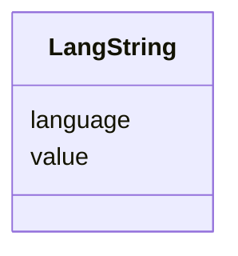

---
search:
  boost: 10.0
---

# Class: LangString 


_A single language-tagged text value. Instances are combined in a multivalued slot to give variants of one field in any language identified by a BCP-47 tag. Use one LangString per language; do not repeat a language within the same field._


<div data-search-exclude markdown="1">


URI: [rdf:langString](http://www.w3.org/1999/02/22-rdf-syntax-ns#langString)





## Class Properties

| Property | Value |
| --- | --- |
| Class URI | [rdf:langString](http://www.w3.org/1999/02/22-rdf-syntax-ns#langString) |


## Slots

| Name | Cardinality and Range | Description | Inheritance |
| ---  | --- | --- | --- |
| [language](../slots/language.md) | <span title="Required: exactly one value">1</span> <br/> [String](../types/String.md) | <span title="BCP-47 language tag of the value, such as en, he, ar, de, yi or lad. Use the shortest registered tag that accurately identifies the text; the deliberately permissive syntax guard accepts private and grandfathered tags and does not verify registration in the IANA language-subtag registry.">BCP-47 language tag of the value, such as en, he, ar, de, yi or lad</span> | direct |
| [value](../slots/value.md) | <span title="Required: exactly one value">1</span> <br/> [String](../types/String.md) | <span title="A localized text, in the language given by 'language'.">A localized text, in the language given by 'language'</span> | direct |


## Usages

| used by | used in | type | used |
| ---  | --- | --- | --- |
| [Entity](../classes/Entity.md) | [description](../slots/description.md) | range | [LangString](../classes/LangString.md) |
| [Agent](../classes/Agent.md) | [description](../slots/description.md) | range | [LangString](../classes/LangString.md) |
| [Person](../classes/Person.md) | [given_name](../slots/given_name.md) | range | [LangString](../classes/LangString.md) |
| [Person](../classes/Person.md) | [family_name](../slots/family_name.md) | range | [LangString](../classes/LangString.md) |
| [Person](../classes/Person.md) | [description](../slots/description.md) | range | [LangString](../classes/LangString.md) |
| [Organization](../classes/Organization.md) | [name](../slots/name.md) | range | [LangString](../classes/LangString.md) |
| [Organization](../classes/Organization.md) | [location](../slots/location.md) | range | [LangString](../classes/LangString.md) |
| [Organization](../classes/Organization.md) | [address](../slots/address.md) | range | [LangString](../classes/LangString.md) |
| [Organization](../classes/Organization.md) | [description](../slots/description.md) | range | [LangString](../classes/LangString.md) |
| [Facility](../classes/Facility.md) | [name](../slots/name.md) | range | [LangString](../classes/LangString.md) |
| [Facility](../classes/Facility.md) | [location](../slots/location.md) | range | [LangString](../classes/LangString.md) |
| [Facility](../classes/Facility.md) | [address](../slots/address.md) | range | [LangString](../classes/LangString.md) |
| [Facility](../classes/Facility.md) | [description](../slots/description.md) | range | [LangString](../classes/LangString.md) |
| [Project](../classes/Project.md) | [name](../slots/name.md) | range | [LangString](../classes/LangString.md) |
| [Project](../classes/Project.md) | [research_disciplines](../slots/research_disciplines.md) | range | [LangString](../classes/LangString.md) |
| [Project](../classes/Project.md) | [studied_periods](../slots/studied_periods.md) | range | [LangString](../classes/LangString.md) |
| [Project](../classes/Project.md) | [studied_places](../slots/studied_places.md) | range | [LangString](../classes/LangString.md) |
| [Project](../classes/Project.md) | [description](../slots/description.md) | range | [LangString](../classes/LangString.md) |
| [Tool](../classes/Tool.md) | [name](../slots/name.md) | range | [LangString](../classes/LangString.md) |
| [Tool](../classes/Tool.md) | [description](../slots/description.md) | range | [LangString](../classes/LangString.md) |
| [Service](../classes/Service.md) | [name](../slots/name.md) | range | [LangString](../classes/LangString.md) |
| [Service](../classes/Service.md) | [description](../slots/description.md) | range | [LangString](../classes/LangString.md) |
| [Publication](../classes/Publication.md) | [name](../slots/name.md) | range | [LangString](../classes/LangString.md) |
| [Publication](../classes/Publication.md) | [published_in](../slots/published_in.md) | range | [LangString](../classes/LangString.md) |
| [Publication](../classes/Publication.md) | [description](../slots/description.md) | range | [LangString](../classes/LangString.md) |
| [Event](../classes/Event.md) | [name](../slots/name.md) | range | [LangString](../classes/LangString.md) |
| [Event](../classes/Event.md) | [location](../slots/location.md) | range | [LangString](../classes/LangString.md) |
| [Event](../classes/Event.md) | [address](../slots/address.md) | range | [LangString](../classes/LangString.md) |
| [Event](../classes/Event.md) | [description](../slots/description.md) | range | [LangString](../classes/LangString.md) |
| [Dataset](../classes/Dataset.md) | [name](../slots/name.md) | range | [LangString](../classes/LangString.md) |
| [Dataset](../classes/Dataset.md) | [themes](../slots/themes.md) | range | [LangString](../classes/LangString.md) |
| [Dataset](../classes/Dataset.md) | [description](../slots/description.md) | range | [LangString](../classes/LangString.md) |
| [TrainingMaterial](../classes/TrainingMaterial.md) | [name](../slots/name.md) | range | [LangString](../classes/LangString.md) |
| [TrainingMaterial](../classes/TrainingMaterial.md) | [learning_outcomes](../slots/learning_outcomes.md) | range | [LangString](../classes/LangString.md) |
| [TrainingMaterial](../classes/TrainingMaterial.md) | [target_audiences](../slots/target_audiences.md) | range | [LangString](../classes/LangString.md) |
| [TrainingMaterial](../classes/TrainingMaterial.md) | [prerequisites](../slots/prerequisites.md) | range | [LangString](../classes/LangString.md) |
| [TrainingMaterial](../classes/TrainingMaterial.md) | [educational_level](../slots/educational_level.md) | range | [LangString](../classes/LangString.md) |
| [TrainingMaterial](../classes/TrainingMaterial.md) | [description](../slots/description.md) | range | [LangString](../classes/LangString.md) |
| [Funding](../classes/Funding.md) | [grant_name](../slots/grant_name.md) | range | [LangString](../classes/LangString.md) |
| [Funding](../classes/Funding.md) | [funding_program](../slots/funding_program.md) | range | [LangString](../classes/LangString.md) |


## Identifier and Mapping Information


### Schema Source


* from schema: https://idhi_placeholder/linkml/idhi


## Mappings

| Mapping Type | Mapped Value |
| ---  | ---  |
| self | rdf:langString |
| native | idhi:LangString |


## LinkML Source

### Direct

<details>
```yaml
name: LangString
description: A single language-tagged text value. Instances are combined in a multivalued
  slot to give variants of one field in any language identified by a BCP-47 tag. Use
  one LangString per language; do not repeat a language within the same field.
from_schema: https://idhi_placeholder/linkml/idhi
slots:
- language
- value
class_uri: rdf:langString

```
</details>

### Induced

<details>
```yaml
name: LangString
description: A single language-tagged text value. Instances are combined in a multivalued
  slot to give variants of one field in any language identified by a BCP-47 tag. Use
  one LangString per language; do not repeat a language within the same field.
from_schema: https://idhi_placeholder/linkml/idhi
attributes:
  language:
    name: language
    description: BCP-47 language tag of the value, such as en, he, ar, de, yi or lad.
      Use the shortest registered tag that accurately identifies the text; the deliberately
      permissive syntax guard accepts private and grandfathered tags and does not
      verify registration in the IANA language-subtag registry.
    from_schema: https://idhi_placeholder/linkml/idhi
    rank: 1000
    slot_uri: dcterms:language
    owner: LangString
    domain_of:
    - LangString
    range: string
    required: true
    pattern: ^[A-Za-z]{1,8}(-[A-Za-z0-9]{1,8})*$
  value:
    name: value
    description: A localized text, in the language given by 'language'.
    from_schema: https://idhi_placeholder/linkml/idhi
    rank: 1000
    slot_uri: rdf:value
    owner: LangString
    domain_of:
    - LangString
    range: string
    required: true
class_uri: rdf:langString

```
</details></div>