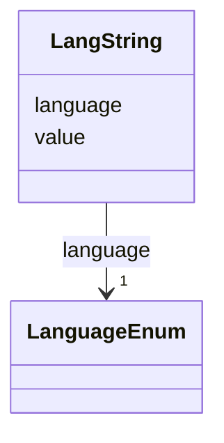

---
search:
  boost: 10.0
---

# Class: LangString 


_A single language-tagged text value. Instances are combined in a multivalued slot to give English/Hebrew/Arabic variants of one field. Follows the LinkML community rdf:langString convention. Use one LangString per language; do not repeat a language within the same field._


<div data-search-exclude markdown="1">


URI: [rdf:langString](http://www.w3.org/1999/02/22-rdf-syntax-ns#langString)





<!-- no inheritance hierarchy -->

## Class Properties

| Property | Value |
| --- | --- |
| Class URI | [rdf:langString](http://www.w3.org/1999/02/22-rdf-syntax-ns#langString) |


## Slots

| Name | Cardinality and Range | Description | Inheritance |
| ---  | --- | --- | --- |
| [language](../slots/language.md) | 1 <br/> [LanguageEnum](../enums/LanguageEnum.md) | BCP-47 language tag of the value (en, he or ar) | direct |
| [value](../slots/value.md) | 1 <br/> [String](../types/String.md) | The text itself, in the language given by 'language' | direct |


## Usages

| used by | used in | type | used |
| ---  | --- | --- | --- |
| [NamedThing](../classes/NamedThing.md) | [name](../slots/name.md) | range | [LangString](../classes/LangString.md) |
| [NamedThing](../classes/NamedThing.md) | [description](../slots/description.md) | range | [LangString](../classes/LangString.md) |
| [Agent](../classes/Agent.md) | [name](../slots/name.md) | range | [LangString](../classes/LangString.md) |
| [Agent](../classes/Agent.md) | [description](../slots/description.md) | range | [LangString](../classes/LangString.md) |
| [Person](../classes/Person.md) | [name](../slots/name.md) | range | [LangString](../classes/LangString.md) |
| [Person](../classes/Person.md) | [description](../slots/description.md) | range | [LangString](../classes/LangString.md) |
| [Organization](../classes/Organization.md) | [name](../slots/name.md) | range | [LangString](../classes/LangString.md) |
| [Organization](../classes/Organization.md) | [description](../slots/description.md) | range | [LangString](../classes/LangString.md) |
| [AcademicInstitution](../classes/AcademicInstitution.md) | [name](../slots/name.md) | range | [LangString](../classes/LangString.md) |
| [AcademicInstitution](../classes/AcademicInstitution.md) | [description](../slots/description.md) | range | [LangString](../classes/LangString.md) |
| [GLAMInstitution](../classes/GLAMInstitution.md) | [name](../slots/name.md) | range | [LangString](../classes/LangString.md) |
| [GLAMInstitution](../classes/GLAMInstitution.md) | [description](../slots/description.md) | range | [LangString](../classes/LangString.md) |
| [ResearchCenter](../classes/ResearchCenter.md) | [name](../slots/name.md) | range | [LangString](../classes/LangString.md) |
| [ResearchCenter](../classes/ResearchCenter.md) | [description](../slots/description.md) | range | [LangString](../classes/LangString.md) |
| [Funder](../classes/Funder.md) | [name](../slots/name.md) | range | [LangString](../classes/LangString.md) |
| [Funder](../classes/Funder.md) | [description](../slots/description.md) | range | [LangString](../classes/LangString.md) |
| [Company](../classes/Company.md) | [name](../slots/name.md) | range | [LangString](../classes/LangString.md) |
| [Company](../classes/Company.md) | [description](../slots/description.md) | range | [LangString](../classes/LangString.md) |
| [NonProfit](../classes/NonProfit.md) | [name](../slots/name.md) | range | [LangString](../classes/LangString.md) |
| [NonProfit](../classes/NonProfit.md) | [description](../slots/description.md) | range | [LangString](../classes/LangString.md) |
| [Facility](../classes/Facility.md) | [name](../slots/name.md) | range | [LangString](../classes/LangString.md) |
| [Facility](../classes/Facility.md) | [description](../slots/description.md) | range | [LangString](../classes/LangString.md) |
| [Project](../classes/Project.md) | [research_disciplines](../slots/research_disciplines.md) | range | [LangString](../classes/LangString.md) |
| [Project](../classes/Project.md) | [name](../slots/name.md) | range | [LangString](../classes/LangString.md) |
| [Project](../classes/Project.md) | [description](../slots/description.md) | range | [LangString](../classes/LangString.md) |
| [Tool](../classes/Tool.md) | [name](../slots/name.md) | range | [LangString](../classes/LangString.md) |
| [Tool](../classes/Tool.md) | [description](../slots/description.md) | range | [LangString](../classes/LangString.md) |
| [Service](../classes/Service.md) | [name](../slots/name.md) | range | [LangString](../classes/LangString.md) |
| [Service](../classes/Service.md) | [description](../slots/description.md) | range | [LangString](../classes/LangString.md) |
| [Publication](../classes/Publication.md) | [published_in](../slots/published_in.md) | range | [LangString](../classes/LangString.md) |
| [Publication](../classes/Publication.md) | [name](../slots/name.md) | range | [LangString](../classes/LangString.md) |
| [Publication](../classes/Publication.md) | [description](../slots/description.md) | range | [LangString](../classes/LangString.md) |
| [Event](../classes/Event.md) | [name](../slots/name.md) | range | [LangString](../classes/LangString.md) |
| [Event](../classes/Event.md) | [description](../slots/description.md) | range | [LangString](../classes/LangString.md) |
| [Location](../classes/Location.md) | [address](../slots/address.md) | range | [LangString](../classes/LangString.md) |
| [Location](../classes/Location.md) | [name](../slots/name.md) | range | [LangString](../classes/LangString.md) |
| [Location](../classes/Location.md) | [description](../slots/description.md) | range | [LangString](../classes/LangString.md) |
| [TimePeriod](../classes/TimePeriod.md) | [name](../slots/name.md) | range | [LangString](../classes/LangString.md) |
| [TimePeriod](../classes/TimePeriod.md) | [description](../slots/description.md) | range | [LangString](../classes/LangString.md) |
| [Catalog](../classes/Catalog.md) | [themes](../slots/themes.md) | range | [LangString](../classes/LangString.md) |
| [Catalog](../classes/Catalog.md) | [name](../slots/name.md) | range | [LangString](../classes/LangString.md) |
| [Catalog](../classes/Catalog.md) | [description](../slots/description.md) | range | [LangString](../classes/LangString.md) |
| [Dataset](../classes/Dataset.md) | [themes](../slots/themes.md) | range | [LangString](../classes/LangString.md) |
| [Dataset](../classes/Dataset.md) | [name](../slots/name.md) | range | [LangString](../classes/LangString.md) |
| [Dataset](../classes/Dataset.md) | [description](../slots/description.md) | range | [LangString](../classes/LangString.md) |


## Identifier and Mapping Information


### Schema Source


* from schema: https://idhi.co.il/linkml/idhi


## Mappings

| Mapping Type | Mapped Value |
| ---  | ---  |
| self | rdf:langString |
| native | idhi:LangString |


## LinkML Source

<!-- TODO: investigate https://stackoverflow.com/questions/37606292/how-to-create-tabbed-code-blocks-in-mkdocs-or-sphinx -->

### Direct

<details>
```yaml
name: LangString
description: A single language-tagged text value. Instances are combined in a multivalued
  slot to give English/Hebrew/Arabic variants of one field. Follows the LinkML community
  rdf:langString convention. Use one LangString per language; do not repeat a language
  within the same field.
from_schema: https://idhi.co.il/linkml/idhi
slots:
- language
- value
class_uri: rdf:langString

```
</details>

### Induced

<details>
```yaml
name: LangString
description: A single language-tagged text value. Instances are combined in a multivalued
  slot to give English/Hebrew/Arabic variants of one field. Follows the LinkML community
  rdf:langString convention. Use one LangString per language; do not repeat a language
  within the same field.
from_schema: https://idhi.co.il/linkml/idhi
attributes:
  language:
    name: language
    description: BCP-47 language tag of the value (en, he or ar).
    from_schema: https://idhi.co.il/linkml/idhi
    rank: 1000
    slot_uri: dcterms:language
    owner: LangString
    domain_of:
    - LangString
    range: LanguageEnum
    required: true
  value:
    name: value
    description: The text itself, in the language given by 'language'.
    from_schema: https://idhi.co.il/linkml/idhi
    rank: 1000
    slot_uri: rdf:value
    owner: LangString
    domain_of:
    - LangString
    range: string
    required: true
class_uri: rdf:langString

```
</details></div>