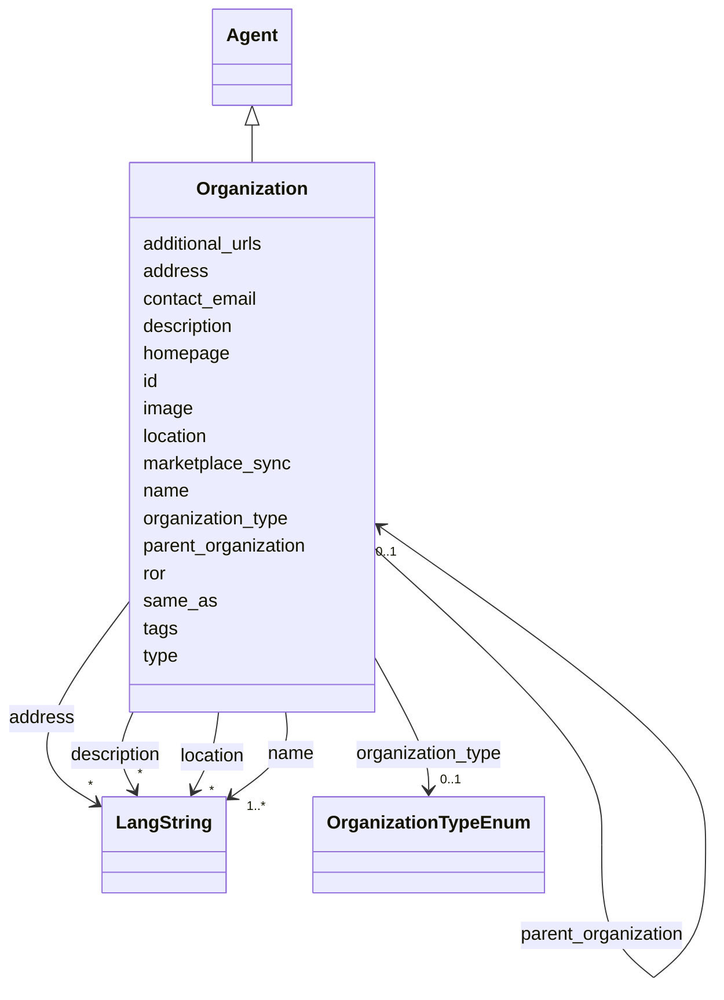

---
search:
  boost: 10.0
---

# Class: Organization 


_An organization of any kind. Its kind (academic institution, GLAM, research center, funder, company, non-profit) is given by organization_type. All organizations use the idhi:organization:<shortid> URN form._


<div data-search-exclude markdown="1">


URI: [foaf:Organization](https://xmlns.com/foaf/spec/#term_Organization)





## Inheritance
* [Entity](../classes/Entity.md)
    * [Agent](../classes/Agent.md)
        * **Organization**


## Class Properties

| Property | Value |
| --- | --- |
| Class URI | [foaf:Organization](https://xmlns.com/foaf/spec/#term_Organization) |


## Slots

| Name | Cardinality and Range | Description | Inheritance |
| ---  | --- | --- | --- |
| [name](../slots/name.md) | <span title="Required: one or more values">1..*</span> <br/> [LangString](../classes/LangString.md) | <span title="The multilingual name or title used to identify the entity. Use one LangString per available language and do not repeat a language. Prefer the official localized name for organizations; for projects, tools and services, use localized names supplied by the team rather than translating branded names without authority.">The multilingual name or title used to identify the entity</span> | direct |
| [ror](../slots/ror.md) | <span title="Optional: at most one value">0..1</span> <br/> [Uri](../types/Uri.md) | <span title="The organization's persistent registry identifier. It supplements the IDHI record id. Record it whenever the organization is registered in ROR — most universities and research institutes are.">The organization's persistent registry identifier</span> | direct |
| [organization_type](../slots/organization_type.md) | <span title="Optional: at most one value">0..1</span> <br/> [OrganizationTypeEnum](../enums/OrganizationTypeEnum.md) | <span title="The kind of organization. Always set it.">The kind of organization</span> | direct |
| [parent_organization](../slots/parent_organization.md) | <span title="Optional: at most one value">0..1</span> <br/> [Organization](../classes/Organization.md) | <span title="The larger organization this one is part of (e.g. a department's university). Use for formal containment only; looser partnerships belong in relationship classes.">The larger organization this one is part of (e</span> | direct |
| [location](../slots/location.md) | <span title="Optional: zero or more values allowed">*</span> <br/> [LangString](../classes/LangString.md) | <span title="Place name where the organization, facility or event is physically situated (e.g. a city), as free multilingual text.">Place name where the organization, facility or event is physically situated (...</span> | direct |
| [address](../slots/address.md) | <span title="Optional: zero or more values allowed">*</span> <br/> [LangString](../classes/LangString.md) | <span title="Postal address, multilingual.">Postal address, multilingual</span> | direct |
| [marketplace_sync](../slots/marketplace_sync.md) | <span title="Optional: at most one value">0..1</span> <br/> [Boolean](../types/Boolean.md) | <span title="Opt-in flag for synchronization with the DARIAH SSH Open Marketplace. Set true to allow the organization and entities related to it through IDHI references, such as services and tools, to be synchronized; false or omission means they must not be synchronized on this organization's authority. This operational flag does not assert ownership of related entities. It uses an IDHI-specific property because established descriptive vocabularies do not provide a term for this synchronization policy.">Opt-in flag for synchronization with the DARIAH SSH Open Marketplace</span> | direct |
| [additional_urls](../slots/additional_urls.md) | <span title="Optional: zero or more values allowed">*</span> <br/> [Uri](../types/Uri.md) | <span title="Further relevant web pages beyond the homepage (blog, social-media profile, registry entry, press coverage...). For records describing the same entity in other systems use same_as instead.">Further relevant web pages beyond the homepage (blog, social-media profile, r...</span> | direct |
| [contact_email](../slots/contact_email.md) | <span title="Optional: at most one value">0..1</span> <br/> [String](../types/String.md) | <span title="A published contact address for the entity (office, team or service-desk mailbox). For a person's own addresses use 'emails'.">A published contact address for the entity (office, team or service-desk mail...</span> | direct |
| [type](../slots/type.md) | <span title="Required: exactly one value">1</span> <br/> [Curie](../types/Curie.md) | <span title="Discriminator identifying the record's class; used for polymorphic serialization and deserialization.">Discriminator identifying the record's class; used for polymorphic serializat...</span> | [Entity](../classes/Entity.md) |
| [id](../slots/id.md) | <span title="Required: exactly one value">1</span> <br/> [String](../types/String.md) | <span title="The entity's primary identifier: an IDHI URN of the form&#10;  idhi:&lt;class name>:&lt;random short alphanumeric id>&#10;e.g. idhi:person:x7k2m9 or idhi:project:a83bq1. Minted by IDHI at record creation and never reused or changed. The class token is the lowercase snake_case class name; each concrete class enforces its own token via slot_usage. External identifiers (ORCID, ROR, DOI...) are supplementary and go in their dedicated slots — never here.">The entity's primary identifier: an IDHI URN of the form</span> | [Entity](../classes/Entity.md) |
| [description](../slots/description.md) | <span title="Optional: zero or more values allowed">*</span> <br/> [LangString](../classes/LangString.md) | <span title="Multilingual free-text description (a few sentences aimed at index visitors, not internal notes).">Multilingual free-text description (a few sentences aimed at index visitors, ...</span> | [Entity](../classes/Entity.md) |
| [image](../slots/image.md) | <span title="Optional: at most one value">0..1</span> <br/> [Base64binary](../types/Base64binary.md) | <span title="A representative image embedded as Base64-encoded binary content. Use for a single image that must travel with the entity record; omit it when no image is available, and use homepage or additional_urls for externally hosted pages rather than encoding a URL here.">A representative image embedded as Base64-encoded binary content</span> | [Entity](../classes/Entity.md) |
| [homepage](../slots/homepage.md) | <span title="Optional: at most one value">0..1</span> <br/> [Uri](../types/Uri.md) | <span title="Public landing page of the entity, if one exists.">Public landing page of the entity, if one exists</span> | [Entity](../classes/Entity.md) |
| [same_as](../slots/same_as.md) | <span title="Optional: zero or more values allowed">*</span> <br/> [Uri](../types/Uri.md) | <span title="URIs of records in OTHER systems describing the same real-world entity (Wikidata, PeriodO, GeoNames...). Use for linked-data alignment, not for the entity's own pages (use homepage).">URIs of records in OTHER systems describing the same real-world entity (Wikid...</span> | [Entity](../classes/Entity.md) |
| [tags](../slots/tags.md) | <span title="Optional: zero or more values allowed">*</span> <br/> [String](../types/String.md) | <span title="Free-text tags for discovery, filtering and grouping; usable on any top-level entity. Deliberately NOT a controlled enum, but prefer wording that matches a concept in an established ontology or thesaurus (e.g. Wikidata, Getty AAT, TaDiRAH) so tags can later be reconciled against it.">Free-text tags for discovery, filtering and grouping; usable on any top-level...</span> | [Entity](../classes/Entity.md) |


## Usages

| used by | used in | type | used |
| ---  | --- | --- | --- |
| [Organization](../classes/Organization.md) | [parent_organization](../slots/parent_organization.md) | range | [Organization](../classes/Organization.md) |
| [Service](../classes/Service.md) | [provider](../slots/provider.md) | range | [Organization](../classes/Organization.md) |
| [Publication](../classes/Publication.md) | [publisher](../slots/publisher.md) | range | [Organization](../classes/Organization.md) |
| [Dataset](../classes/Dataset.md) | [publisher](../slots/publisher.md) | range | [Organization](../classes/Organization.md) |
| [TrainingMaterial](../classes/TrainingMaterial.md) | [publisher](../slots/publisher.md) | range | [Organization](../classes/Organization.md) |
| [Affiliation](../classes/Affiliation.md) | [organization](../slots/organization.md) | range | [Organization](../classes/Organization.md) |
| [OrganizationProjectRole](../classes/OrganizationProjectRole.md) | [organization](../slots/organization.md) | range | [Organization](../classes/Organization.md) |
| [Funding](../classes/Funding.md) | [funding_organization](../slots/funding_organization.md) | range | [Organization](../classes/Organization.md) |
| [FacilityAffiliation](../classes/FacilityAffiliation.md) | [organization](../slots/organization.md) | range | [Organization](../classes/Organization.md) |
| [IndexContainer](../classes/IndexContainer.md) | [organizations](../slots/organizations.md) | range | [Organization](../classes/Organization.md) |


## In Subsets


* [ToplevelEntity](../subsets/ToplevelEntity.md)


## Identifier and Mapping Information


### Schema Source


* from schema: https://idhi_placeholder/linkml/idhi


## Mappings

| Mapping Type | Mapped Value |
| ---  | ---  |
| self | foaf:Organization |
| native | idhi:Organization |


## LinkML Source

### Direct

<details>
```yaml
name: Organization
description: An organization of any kind. Its kind (academic institution, GLAM, research
  center, funder, company, non-profit) is given by organization_type. All organizations
  use the idhi:organization:<shortid> URN form.
in_subset:
- toplevel_entity
from_schema: https://idhi_placeholder/linkml/idhi
is_a: Agent
slots:
- name
- ror
- organization_type
- parent_organization
- location
- address
- marketplace_sync
- additional_urls
- contact_email
slot_usage:
  type:
    name: type
    equals_string: idhi:Organization
  id:
    name: id
    structured_pattern:
      syntax: ^idhi:organization:{shortid}$
      interpolated: true
class_uri: foaf:Organization

```
</details>

### Induced

<details>
```yaml
name: Organization
description: An organization of any kind. Its kind (academic institution, GLAM, research
  center, funder, company, non-profit) is given by organization_type. All organizations
  use the idhi:organization:<shortid> URN form.
in_subset:
- toplevel_entity
from_schema: https://idhi_placeholder/linkml/idhi
is_a: Agent
slot_usage:
  type:
    name: type
    equals_string: idhi:Organization
  id:
    name: id
    structured_pattern:
      syntax: ^idhi:organization:{shortid}$
      interpolated: true
attributes:
  name:
    name: name
    description: The multilingual name or title used to identify the entity. Use one
      LangString per available language and do not repeat a language. Prefer the official
      localized name for organizations; for projects, tools and services, use localized
      names supplied by the team rather than translating branded names without authority.
    from_schema: https://idhi_placeholder/linkml/idhi
    rank: 1000
    slot_uri: skos:prefLabel
    owner: Organization
    domain_of:
    - Organization
    - Facility
    - Project
    - Tool
    - Service
    - Publication
    - Event
    - Dataset
    - TrainingMaterial
    range: LangString
    required: true
    multivalued: true
    inlined: true
    inlined_as_list: true
  ror:
    name: ror
    description: The organization's persistent registry identifier. It supplements
      the IDHI record id. Record it whenever the organization is registered in ROR
      — most universities and research institutes are.
    from_schema: https://idhi_placeholder/linkml/idhi
    rank: 1000
    slot_uri: schema:identifier
    owner: Organization
    domain_of:
    - Organization
    range: uri
    structured_pattern:
      syntax: https://ror.org/{ror}
      interpolated: true
  organization_type:
    name: organization_type
    description: The kind of organization. Always set it.
    from_schema: https://idhi_placeholder/linkml/idhi
    rank: 1000
    slot_uri: dcterms:type
    owner: Organization
    domain_of:
    - Organization
    range: OrganizationTypeEnum
  parent_organization:
    name: parent_organization
    description: The larger organization this one is part of (e.g. a department's
      university). Use for formal containment only; looser partnerships belong in
      relationship classes.
    from_schema: https://idhi_placeholder/linkml/idhi
    rank: 1000
    slot_uri: schema:parentOrganization
    owner: Organization
    domain_of:
    - Organization
    range: Organization
  location:
    name: location
    description: Place name where the organization, facility or event is physically
      situated (e.g. a city), as free multilingual text.
    from_schema: https://idhi_placeholder/linkml/idhi
    rank: 1000
    slot_uri: schema:location
    owner: Organization
    domain_of:
    - Organization
    - Facility
    - Event
    range: LangString
    multivalued: true
    inlined: true
    inlined_as_list: true
  address:
    name: address
    description: Postal address, multilingual.
    from_schema: https://idhi_placeholder/linkml/idhi
    rank: 1000
    slot_uri: schema:address
    owner: Organization
    domain_of:
    - Organization
    - Facility
    - Event
    range: LangString
    multivalued: true
    inlined: true
    inlined_as_list: true
  marketplace_sync:
    name: marketplace_sync
    description: Opt-in flag for synchronization with the DARIAH SSH Open Marketplace.
      Set true to allow the organization and entities related to it through IDHI references,
      such as services and tools, to be synchronized; false or omission means they
      must not be synchronized on this organization's authority. This operational
      flag does not assert ownership of related entities. It uses an IDHI-specific
      property because established descriptive vocabularies do not provide a term
      for this synchronization policy.
    from_schema: https://idhi_placeholder/linkml/idhi
    rank: 1000
    slot_uri: idhi:marketplaceSync
    owner: Organization
    domain_of:
    - Organization
    range: boolean
  additional_urls:
    name: additional_urls
    description: Further relevant web pages beyond the homepage (blog, social-media
      profile, registry entry, press coverage...). For records describing the same
      entity in other systems use same_as instead.
    from_schema: https://idhi_placeholder/linkml/idhi
    rank: 1000
    slot_uri: foaf:page
    owner: Organization
    domain_of:
    - Organization
    - Facility
    - Project
    - Tool
    - Service
    - Event
    - TrainingMaterial
    range: uri
    multivalued: true
  contact_email:
    name: contact_email
    description: A published contact address for the entity (office, team or service-desk
      mailbox). For a person's own addresses use 'emails'.
    from_schema: https://idhi_placeholder/linkml/idhi
    rank: 1000
    slot_uri: schema:email
    owner: Organization
    domain_of:
    - Organization
    - Facility
    - Project
    - Tool
    - Service
    - Event
    - TrainingMaterial
    range: string
  type:
    name: type
    description: Discriminator identifying the record's class; used for polymorphic
      serialization and deserialization.
    from_schema: https://idhi_placeholder/linkml/idhi
    rank: 1000
    slot_uri: rdf:type
    owner: Organization
    domain_of:
    - Entity
    range: curie
    required: true
    equals_string: idhi:Organization
  id:
    name: id
    description: "The entity's primary identifier: an IDHI URN of the form\n  idhi:<class\
      \ name>:<random short alphanumeric id>\ne.g. idhi:person:x7k2m9 or idhi:project:a83bq1.\
      \ Minted by IDHI at record creation and never reused or changed. The class token\
      \ is the lowercase snake_case class name; each concrete class enforces its own\
      \ token via slot_usage. External identifiers (ORCID, ROR, DOI...) are supplementary\
      \ and go in their dedicated slots — never here."
    from_schema: https://idhi_placeholder/linkml/idhi
    rank: 1000
    slot_uri: dcterms:identifier
    identifier: true
    owner: Organization
    domain_of:
    - Entity
    range: string
    required: true
    pattern: ^idhi:[a-z_]+:[0-9a-z]{4,12}$
    structured_pattern:
      syntax: ^idhi:organization:{shortid}$
      interpolated: true
  description:
    name: description
    description: Multilingual free-text description (a few sentences aimed at index
      visitors, not internal notes).
    from_schema: https://idhi_placeholder/linkml/idhi
    rank: 1000
    slot_uri: dcterms:description
    owner: Organization
    domain_of:
    - Entity
    range: LangString
    multivalued: true
    inlined: true
    inlined_as_list: true
  image:
    name: image
    description: A representative image embedded as Base64-encoded binary content.
      Use for a single image that must travel with the entity record; omit it when
      no image is available, and use homepage or additional_urls for externally hosted
      pages rather than encoding a URL here.
    from_schema: https://idhi_placeholder/linkml/idhi
    rank: 1000
    slot_uri: schema:image
    owner: Organization
    domain_of:
    - Entity
    range: base64binary
  homepage:
    name: homepage
    description: Public landing page of the entity, if one exists.
    from_schema: https://idhi_placeholder/linkml/idhi
    rank: 1000
    slot_uri: foaf:homepage
    owner: Organization
    domain_of:
    - Entity
    range: uri
  same_as:
    name: same_as
    description: URIs of records in OTHER systems describing the same real-world entity
      (Wikidata, PeriodO, GeoNames...). Use for linked-data alignment, not for the
      entity's own pages (use homepage).
    from_schema: https://idhi_placeholder/linkml/idhi
    rank: 1000
    slot_uri: schema:sameAs
    owner: Organization
    domain_of:
    - Entity
    range: uri
    multivalued: true
  tags:
    name: tags
    description: Free-text tags for discovery, filtering and grouping; usable on any
      top-level entity. Deliberately NOT a controlled enum, but prefer wording that
      matches a concept in an established ontology or thesaurus (e.g. Wikidata, Getty
      AAT, TaDiRAH) so tags can later be reconciled against it.
    from_schema: https://idhi_placeholder/linkml/idhi
    rank: 1000
    slot_uri: dcat:keyword
    owner: Organization
    domain_of:
    - Entity
    range: string
    multivalued: true
class_uri: foaf:Organization

```
</details></div>