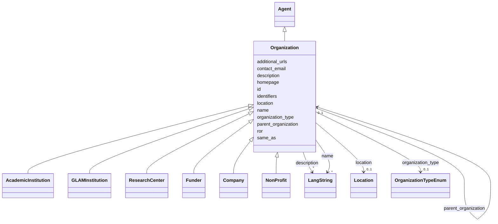

---
search:
  boost: 10.0
---

# Class: Organization 


_An organization of any kind. Its kind (academic institution, GLAM, research center, funder, company, non-profit) is given by organization_type, which is the canonical machine-readable discriminator. Use the subclasses below only as optional sugar when a single, unambiguous type applies. All organizations — including instances of the subclasses — use the idhi:organization:<shortid> URN form._


<div data-search-exclude markdown="1">


URI: [foaf:Organization](http://xmlns.com/foaf/0.1/Organization)





## Inheritance
* [NamedThing](../classes/NamedThing.md)
    * [Agent](../classes/Agent.md)
        * **Organization**
            * [AcademicInstitution](../classes/AcademicInstitution.md)
            * [GLAMInstitution](../classes/GLAMInstitution.md)
            * [ResearchCenter](../classes/ResearchCenter.md)
            * [Funder](../classes/Funder.md)
            * [Company](../classes/Company.md)
            * [NonProfit](../classes/NonProfit.md)


## Class Properties

| Property | Value |
| --- | --- |
| Class URI | [foaf:Organization](http://xmlns.com/foaf/0.1/Organization) |


## Slots

| Name | Cardinality and Range | Description | Inheritance |
| ---  | --- | --- | --- |
| [ror](../slots/ror.md) | 0..1 <br/> [Uriorcurie](../types/Uriorcurie.md) | The organization's ROR ID, as CURIE (ROR:04aj4c181) or full URL | direct |
| [organization_type](../slots/organization_type.md) | 0..1 <br/> [OrganizationTypeEnum](../enums/OrganizationTypeEnum.md) | The kind of organization | direct |
| [parent_organization](../slots/parent_organization.md) | 0..1 <br/> [Organization](../classes/Organization.md) | The larger organization this one is part of (e | direct |
| [location](../slots/location.md) | 0..1 <br/> [Location](../classes/Location.md) | Where the organization, facility or event is physically situated | direct |
| [additional_urls](../slots/additional_urls.md) | * <br/> [Uri](../types/Uri.md) | Further relevant web pages beyond the homepage (blog, social-media profile, r... | direct |
| [contact_email](../slots/contact_email.md) | 0..1 <br/> [String](../types/String.md) | A published contact address for the entity (office, team or service-desk mail... | direct |
| [id](../slots/id.md) | 1 <br/> [String](../types/String.md) | The entity's primary identifier: an IDHI URN of the form | [NamedThing](../classes/NamedThing.md) |
| [name](../slots/name.md) | * <br/> [LangString](../classes/LangString.md) | Multilingual name/title | [NamedThing](../classes/NamedThing.md) |
| [description](../slots/description.md) | * <br/> [LangString](../classes/LangString.md) | Multilingual free-text description (a few sentences aimed at index visitors, ... | [NamedThing](../classes/NamedThing.md) |
| [homepage](../slots/homepage.md) | 0..1 <br/> [Uri](../types/Uri.md) | Public landing page of the entity, if one exists | [NamedThing](../classes/NamedThing.md) |
| [identifiers](../slots/identifiers.md) | * <br/> [Uriorcurie](../types/Uriorcurie.md) | Additional EXTERNAL identifiers beyond the primary IDHI URN and the dedicated... | [NamedThing](../classes/NamedThing.md) |
| [same_as](../slots/same_as.md) | * <br/> [Uri](../types/Uri.md) | URIs of records in OTHER systems describing the same real-world entity (Wikid... | [NamedThing](../classes/NamedThing.md) |


## Usages

| used by | used in | type | used |
| ---  | --- | --- | --- |
| [Organization](../classes/Organization.md) | [parent_organization](../slots/parent_organization.md) | range | [Organization](../classes/Organization.md) |
| [AcademicInstitution](../classes/AcademicInstitution.md) | [parent_organization](../slots/parent_organization.md) | range | [Organization](../classes/Organization.md) |
| [GLAMInstitution](../classes/GLAMInstitution.md) | [parent_organization](../slots/parent_organization.md) | range | [Organization](../classes/Organization.md) |
| [ResearchCenter](../classes/ResearchCenter.md) | [parent_organization](../slots/parent_organization.md) | range | [Organization](../classes/Organization.md) |
| [Funder](../classes/Funder.md) | [parent_organization](../slots/parent_organization.md) | range | [Organization](../classes/Organization.md) |
| [Company](../classes/Company.md) | [parent_organization](../slots/parent_organization.md) | range | [Organization](../classes/Organization.md) |
| [NonProfit](../classes/NonProfit.md) | [parent_organization](../slots/parent_organization.md) | range | [Organization](../classes/Organization.md) |
| [Service](../classes/Service.md) | [provider](../slots/provider.md) | range | [Organization](../classes/Organization.md) |
| [Publication](../classes/Publication.md) | [publisher](../slots/publisher.md) | range | [Organization](../classes/Organization.md) |
| [Catalog](../classes/Catalog.md) | [publisher](../slots/publisher.md) | range | [Organization](../classes/Organization.md) |
| [Dataset](../classes/Dataset.md) | [publisher](../slots/publisher.md) | range | [Organization](../classes/Organization.md) |
| [Affiliation](../classes/Affiliation.md) | [organization](../slots/organization.md) | range | [Organization](../classes/Organization.md) |
| [OrganizationProjectRole](../classes/OrganizationProjectRole.md) | [organization](../slots/organization.md) | range | [Organization](../classes/Organization.md) |
| [FacilityAffiliation](../classes/FacilityAffiliation.md) | [organization](../slots/organization.md) | range | [Organization](../classes/Organization.md) |
| [IndexContainer](../classes/IndexContainer.md) | [organizations](../slots/organizations.md) | range | [Organization](../classes/Organization.md) |


## In Subsets


* [ToplevelEntity](../subsets/ToplevelEntity.md)


## Identifier and Mapping Information


### Schema Source


* from schema: https://idhi.co.il/linkml/idhi


## Mappings

| Mapping Type | Mapped Value |
| ---  | ---  |
| self | foaf:Organization |
| native | idhi:Organization |


## LinkML Source

<!-- TODO: investigate https://stackoverflow.com/questions/37606292/how-to-create-tabbed-code-blocks-in-mkdocs-or-sphinx -->

### Direct

<details>
```yaml
name: Organization
description: An organization of any kind. Its kind (academic institution, GLAM, research
  center, funder, company, non-profit) is given by organization_type, which is the
  canonical machine-readable discriminator. Use the subclasses below only as optional
  sugar when a single, unambiguous type applies. All organizations — including instances
  of the subclasses — use the idhi:organization:<shortid> URN form.
in_subset:
- toplevel_entity
from_schema: https://idhi.co.il/linkml/idhi
is_a: Agent
slots:
- ror
- organization_type
- parent_organization
- location
- additional_urls
- contact_email
slot_usage:
  id:
    name: id
    structured_pattern:
      syntax: ^idhi:organization:{shortid}$
      interpolated: true
class_uri: foaf:Organization

```
</details>

### Induced

<details>
```yaml
name: Organization
description: An organization of any kind. Its kind (academic institution, GLAM, research
  center, funder, company, non-profit) is given by organization_type, which is the
  canonical machine-readable discriminator. Use the subclasses below only as optional
  sugar when a single, unambiguous type applies. All organizations — including instances
  of the subclasses — use the idhi:organization:<shortid> URN form.
in_subset:
- toplevel_entity
from_schema: https://idhi.co.il/linkml/idhi
is_a: Agent
slot_usage:
  id:
    name: id
    structured_pattern:
      syntax: ^idhi:organization:{shortid}$
      interpolated: true
attributes:
  ror:
    name: ror
    description: The organization's ROR ID, as CURIE (ROR:04aj4c181) or full URL.
      A supplementary external identifier — the record's primary id is always the
      IDHI URN. Record it whenever the organization is registered in ROR — most universities
      and research institutes are.
    from_schema: https://idhi.co.il/linkml/idhi
    rank: 1000
    slot_uri: schema:identifier
    owner: Organization
    domain_of:
    - Organization
    range: uriorcurie
  organization_type:
    name: organization_type
    description: The kind of organization. This enum value — not the optional subclasses
      — is the canonical discriminator; always set it.
    from_schema: https://idhi.co.il/linkml/idhi
    rank: 1000
    slot_uri: dcterms:type
    owner: Organization
    domain_of:
    - Organization
    range: OrganizationTypeEnum
  parent_organization:
    name: parent_organization
    description: The larger organization this one is part of (e.g. a department's
      university). Use for formal containment only; looser partnerships belong in
      relationship classes.
    from_schema: https://idhi.co.il/linkml/idhi
    rank: 1000
    slot_uri: schema:parentOrganization
    owner: Organization
    domain_of:
    - Organization
    range: Organization
  location:
    name: location
    description: Where the organization, facility or event is physically situated.
    from_schema: https://idhi.co.il/linkml/idhi
    rank: 1000
    slot_uri: schema:location
    owner: Organization
    domain_of:
    - Organization
    - Facility
    - Event
    range: Location
  additional_urls:
    name: additional_urls
    description: Further relevant web pages beyond the homepage (blog, social-media
      profile, registry entry, press coverage...). For records describing the same
      entity in other systems use same_as instead.
    from_schema: https://idhi.co.il/linkml/idhi
    rank: 1000
    slot_uri: foaf:page
    owner: Organization
    domain_of:
    - Organization
    - Facility
    - Project
    - Tool
    - Service
    - Event
    range: uri
    multivalued: true
  contact_email:
    name: contact_email
    description: A published contact address for the entity (office, team or service-desk
      mailbox). For a person's own addresses use 'emails'.
    from_schema: https://idhi.co.il/linkml/idhi
    rank: 1000
    slot_uri: schema:email
    owner: Organization
    domain_of:
    - Organization
    - Facility
    - Project
    - Tool
    - Service
    - Event
    range: string
  id:
    name: id
    description: "The entity's primary identifier: an IDHI URN of the form\n  idhi:<class\
      \ name>:<random short alphanumeric id>\ne.g. idhi:person:x7k2m9 or idhi:project:a83bq1.\
      \ Minted by IDHI at record creation and never reused or changed. The class token\
      \ is the lowercase snake_case class name (Organization subclasses use \"organization\"\
      ); each concrete class enforces its own token via slot_usage. External identifiers\
      \ (ORCID, ROR, DOI...) are supplementary and go in their dedicated slots — never\
      \ here."
    from_schema: https://idhi.co.il/linkml/idhi
    rank: 1000
    slot_uri: dcterms:identifier
    identifier: true
    owner: Organization
    domain_of:
    - NamedThing
    range: string
    required: true
    pattern: ^idhi:[a-z_]+:[0-9a-z]{4,12}$
    structured_pattern:
      syntax: ^idhi:organization:{shortid}$
      interpolated: true
  name:
    name: name
    description: Multilingual name/title. Provide at least one language; English,
      Hebrew and Arabic variants are each a separate LangString. Preferably a sortable
      name (e.g. "Smith, John" rather than "John Smith") for people and organizations;
      for projects, tools and services, use the name the team itself uses.
    from_schema: https://idhi.co.il/linkml/idhi
    rank: 1000
    slot_uri: skos:prefLabel
    owner: Organization
    domain_of:
    - NamedThing
    range: LangString
    multivalued: true
    inlined: true
    inlined_as_list: true
  description:
    name: description
    description: Multilingual free-text description (a few sentences aimed at index
      visitors, not internal notes).
    from_schema: https://idhi.co.il/linkml/idhi
    rank: 1000
    slot_uri: dcterms:description
    owner: Organization
    domain_of:
    - NamedThing
    range: LangString
    multivalued: true
    inlined: true
    inlined_as_list: true
  homepage:
    name: homepage
    description: Public landing page of the entity, if one exists.
    from_schema: https://idhi.co.il/linkml/idhi
    rank: 1000
    slot_uri: foaf:homepage
    owner: Organization
    domain_of:
    - NamedThing
    range: uri
  identifiers:
    name: identifiers
    description: Additional EXTERNAL identifiers beyond the primary IDHI URN and the
      dedicated ORCID/ROR/DOI slots, as CURIEs/URIs (e.g. Wikidata QIDs, VIAF, ISNI).
    from_schema: https://idhi.co.il/linkml/idhi
    rank: 1000
    slot_uri: dcterms:identifier
    owner: Organization
    domain_of:
    - NamedThing
    range: uriorcurie
    multivalued: true
  same_as:
    name: same_as
    description: URIs of records in OTHER systems describing the same real-world entity
      (Wikidata, PeriodO, GeoNames...). Use for linked-data alignment, not for the
      entity's own pages (use homepage).
    from_schema: https://idhi.co.il/linkml/idhi
    rank: 1000
    slot_uri: schema:sameAs
    owner: Organization
    domain_of:
    - NamedThing
    range: uri
    multivalued: true
class_uri: foaf:Organization

```
</details></div>