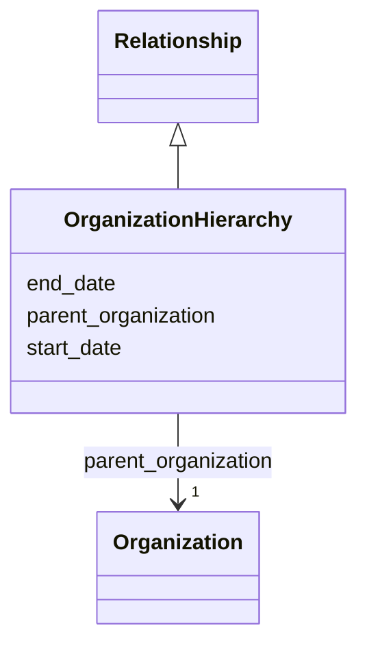

---
search:
  boost: 10.0
---

# Class: OrganizationHierarchy 


_Formal containment of the containing Organization within a larger parent organization, with optional validity dates. Use in Organization.organization_hierarchy for departments, laboratories, centers or subsidiaries that are structurally part of another organization; do not use it for partnerships, project participation or informal association._


<div data-search-exclude markdown="1">


URI: [schema:Role](http://schema.org/Role)





## Inheritance
* [Relationship](../classes/Relationship.md)
    * **OrganizationHierarchy**


## Class Properties

| Property | Value |
| --- | --- |
| Class URI | [schema:Role](http://schema.org/Role) |


## Slots

| Name | Cardinality and Range | Description | Inheritance |
| ---  | --- | --- | --- |
| [parent_organization](../slots/parent_organization.md) | <span title="Required: exactly one value">1</span> <br/> [Organization](../classes/Organization.md) | <span title="The larger organization containing the current child organization (by IDHI URN). Use only in Organization.organization_hierarchy; define the relationship on the child rather than the parent.">The larger organization containing the current child organization (by IDHI UR...</span> | direct |
| [start_date](../slots/start_date.md) | <span title="Optional: at most one value">0..1</span> <br/> [Date](../types/Date.md) | <span title="Start of the event, of the project's runtime, or of a relationship's validity, such as when participation, affiliation, maintenance responsibility or formal containment began.">Start of the event, of the project's runtime, or of a relationship's validity...</span> | [Relationship](../classes/Relationship.md) |
| [end_date](../slots/end_date.md) | <span title="Optional: at most one value">0..1</span> <br/> [Date](../types/Date.md) | <span title="End of the event, project runtime or relationship. Omit for ongoing relationships and open-ended projects.">End of the event, project runtime or relationship</span> | [Relationship](../classes/Relationship.md) |


## Usages

| used by | used in | type | used |
| ---  | --- | --- | --- |
| [Organization](../classes/Organization.md) | [organization_hierarchy](../slots/organization_hierarchy.md) | range | [OrganizationHierarchy](../classes/OrganizationHierarchy.md) |


## Identifier and Mapping Information


### Schema Source


* from schema: https://idhi_placeholder/linkml/idhi


## Mappings

| Mapping Type | Mapped Value |
| ---  | ---  |
| self | schema:Role |
| native | idhi:OrganizationHierarchy |


## LinkML Source

### Direct

<details>
```yaml
name: OrganizationHierarchy
description: Formal containment of the containing Organization within a larger parent
  organization, with optional validity dates. Use in Organization.organization_hierarchy
  for departments, laboratories, centers or subsidiaries that are structurally part
  of another organization; do not use it for partnerships, project participation or
  informal association.
from_schema: https://idhi_placeholder/linkml/idhi
is_a: Relationship
slots:
- parent_organization
class_uri: schema:Role

```
</details>

### Induced

<details>
```yaml
name: OrganizationHierarchy
description: Formal containment of the containing Organization within a larger parent
  organization, with optional validity dates. Use in Organization.organization_hierarchy
  for departments, laboratories, centers or subsidiaries that are structurally part
  of another organization; do not use it for partnerships, project participation or
  informal association.
from_schema: https://idhi_placeholder/linkml/idhi
is_a: Relationship
attributes:
  parent_organization:
    name: parent_organization
    description: The larger organization containing the current child organization
      (by IDHI URN). Use only in Organization.organization_hierarchy; define the relationship
      on the child rather than the parent.
    from_schema: https://idhi_placeholder/linkml/idhi
    rank: 1000
    slot_uri: schema:parentOrganization
    owner: OrganizationHierarchy
    domain_of:
    - OrganizationHierarchy
    range: Organization
    required: true
  start_date:
    name: start_date
    description: Start of the event, of the project's runtime, or of a relationship's
      validity, such as when participation, affiliation, maintenance responsibility
      or formal containment began.
    from_schema: https://idhi_placeholder/linkml/idhi
    rank: 1000
    slot_uri: schema:startDate
    owner: OrganizationHierarchy
    domain_of:
    - Project
    - Event
    - Relationship
    - Funding
    range: date
  end_date:
    name: end_date
    description: End of the event, project runtime or relationship. Omit for ongoing
      relationships and open-ended projects.
    from_schema: https://idhi_placeholder/linkml/idhi
    rank: 1000
    slot_uri: schema:endDate
    owner: OrganizationHierarchy
    domain_of:
    - Project
    - Event
    - Relationship
    - Funding
    range: date
class_uri: schema:Role

```
</details></div>