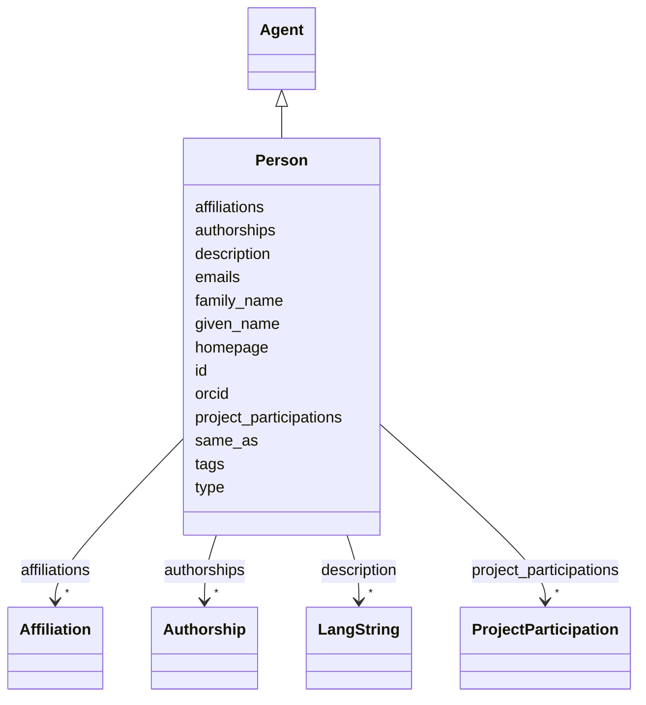

---
search:
  boost: 10.0
---

# Class: Person 


_A human agent in the DH index: researcher, developer, librarian, student, etc._


<div data-search-exclude markdown="1">


URI: [foaf:Person](https://xmlns.com/foaf/spec/#term_Person)





## Inheritance
* [Entity](../classes/Entity.md)
    * [Agent](../classes/Agent.md)
        * **Person**


## Class Properties

| Property | Value |
| --- | --- |
| Class URI | [foaf:Person](https://xmlns.com/foaf/spec/#term_Person) |


## Slots

| Name | Cardinality and Range | Description | Inheritance |
| ---  | --- | --- | --- |
| [given_name](../slots/given_name.md) | 0..1 <br/> [String](../types/String.md) | Given (first) name, in the person's preferred romanization | direct |
| [family_name](../slots/family_name.md) | 0..1 <br/> [String](../types/String.md) | Family (last) name, in the person's preferred romanization | direct |
| [orcid](../slots/orcid.md) | 0..1 <br/> [Uri](../types/Uri.md) | The person's persistent researcher identifier | direct |
| [emails](../slots/emails.md) | * <br/> [String](../types/String.md) | Contact email addresses (zero or more) | direct |
| [affiliations](../slots/affiliations.md) | * <br/> [Affiliation](../classes/Affiliation.md) | The person's institutional affiliations, as reified Affiliation objects (orga... | direct |
| [project_participations](../slots/project_participations.md) | * <br/> [ProjectParticipation](../classes/ProjectParticipation.md) | The person's project involvements, as reified ProjectParticipation objects ca... | direct |
| [authorships](../slots/authorships.md) | * <br/> [Authorship](../classes/Authorship.md) | The person's publication contributions, as reified Authorship objects carryin... | direct |
| [type](../slots/type.md) | 1 <br/> [Curie](../types/Curie.md) | Discriminator identifying the record's class; used for polymorphic serializat... | [Entity](../classes/Entity.md) |
| [id](../slots/id.md) | 1 <br/> [String](../types/String.md) | The entity's primary identifier: an IDHI URN of the form | [Entity](../classes/Entity.md) |
| [description](../slots/description.md) | * <br/> [LangString](../classes/LangString.md) | Multilingual free-text description (a few sentences aimed at index visitors, ... | [Entity](../classes/Entity.md) |
| [homepage](../slots/homepage.md) | 0..1 <br/> [Uri](../types/Uri.md) | Public landing page of the entity, if one exists | [Entity](../classes/Entity.md) |
| [same_as](../slots/same_as.md) | * <br/> [Uri](../types/Uri.md) | URIs of records in OTHER systems describing the same real-world entity (Wikid... | [Entity](../classes/Entity.md) |
| [tags](../slots/tags.md) | * <br/> [String](../types/String.md) | Free-text tags for discovery, filtering and grouping; usable on any top-level... | [Entity](../classes/Entity.md) |


## Usages

| used by | used in | type | used |
| ---  | --- | --- | --- |
| [ProjectParticipation](../classes/ProjectParticipation.md) | [participant](../slots/participant.md) | range | [Person](../classes/Person.md) |
| [Affiliation](../classes/Affiliation.md) | [member](../slots/member.md) | range | [Person](../classes/Person.md) |
| [Authorship](../classes/Authorship.md) | [author](../slots/author.md) | range | [Person](../classes/Person.md) |
| [IndexContainer](../classes/IndexContainer.md) | [persons](../slots/persons.md) | range | [Person](../classes/Person.md) |


## In Subsets


* [ToplevelEntity](../subsets/ToplevelEntity.md)


## Identifier and Mapping Information


### Schema Source


* from schema: https://idhi_placeholder/linkml/idhi


## Mappings

| Mapping Type | Mapped Value |
| ---  | ---  |
| self | foaf:Person |
| native | idhi:Person |


## LinkML Source

### Direct

<details>
```yaml
name: Person
description: 'A human agent in the DH index: researcher, developer, librarian, student,
  etc.'
in_subset:
- toplevel_entity
from_schema: https://idhi_placeholder/linkml/idhi
is_a: Agent
slots:
- given_name
- family_name
- orcid
- emails
- affiliations
- project_participations
- authorships
slot_usage:
  type:
    name: type
    equals_string: idhi:Person
  id:
    name: id
    structured_pattern:
      syntax: ^idhi:person:{shortid}$
      interpolated: true
class_uri: foaf:Person

```
</details>

### Induced

<details>
```yaml
name: Person
description: 'A human agent in the DH index: researcher, developer, librarian, student,
  etc.'
in_subset:
- toplevel_entity
from_schema: https://idhi_placeholder/linkml/idhi
is_a: Agent
slot_usage:
  type:
    name: type
    equals_string: idhi:Person
  id:
    name: id
    structured_pattern:
      syntax: ^idhi:person:{shortid}$
      interpolated: true
attributes:
  given_name:
    name: given_name
    description: Given (first) name, in the person's preferred romanization. Use with
      family_name when the person's name is conventionally expressed in that form.
    from_schema: https://idhi_placeholder/linkml/idhi
    rank: 1000
    slot_uri: foaf:givenName
    owner: Person
    domain_of:
    - Person
    range: string
    required: false
  family_name:
    name: family_name
    description: Family (last) name, in the person's preferred romanization. Use with
      given_name when the person's name is conventionally expressed in that form.
    from_schema: https://idhi_placeholder/linkml/idhi
    rank: 1000
    slot_uri: foaf:familyName
    owner: Person
    domain_of:
    - Person
    range: string
    required: false
  orcid:
    name: orcid
    description: The person's persistent researcher identifier. It supplements the
      IDHI record id. Strongly recommended for every researcher; enables deduplication
      and linking to the scholarly record.
    from_schema: https://idhi_placeholder/linkml/idhi
    rank: 1000
    slot_uri: schema:identifier
    owner: Person
    domain_of:
    - Person
    range: uri
    structured_pattern:
      syntax: https://orcid.org/{orcid}
      interpolated: true
  emails:
    name: emails
    description: Contact email addresses (zero or more). Only record addresses the
      person has agreed to publish in the index.
    from_schema: https://idhi_placeholder/linkml/idhi
    rank: 1000
    slot_uri: foaf:mbox
    owner: Person
    domain_of:
    - Person
    range: string
    multivalued: true
  affiliations:
    name: affiliations
    description: The person's institutional affiliations, as reified Affiliation objects
      (organization + position + dates). Use for employment or formal membership,
      NOT for project involvement — that goes in project_participations.
    from_schema: https://idhi_placeholder/linkml/idhi
    rank: 1000
    owner: Person
    domain_of:
    - Person
    range: Affiliation
    multivalued: true
    inlined: true
    inlined_as_list: true
  project_participations:
    name: project_participations
    description: The person's project involvements, as reified ProjectParticipation
      objects carrying the role (PI, developer...) and dates.
    from_schema: https://idhi_placeholder/linkml/idhi
    rank: 1000
    owner: Person
    domain_of:
    - Person
    - Project
    range: ProjectParticipation
    multivalued: true
    inlined: true
    inlined_as_list: true
  authorships:
    name: authorships
    description: The person's publication contributions, as reified Authorship objects
      carrying byline order and role.
    from_schema: https://idhi_placeholder/linkml/idhi
    rank: 1000
    owner: Person
    domain_of:
    - Person
    - Publication
    range: Authorship
    multivalued: true
    inlined: true
    inlined_as_list: true
  type:
    name: type
    description: Discriminator identifying the record's class; used for polymorphic
      serialization and deserialization.
    from_schema: https://idhi_placeholder/linkml/idhi
    rank: 1000
    slot_uri: rdf:type
    owner: Person
    domain_of:
    - Entity
    range: curie
    required: true
    equals_string: idhi:Person
  id:
    name: id
    description: "The entity's primary identifier: an IDHI URN of the form\n  idhi:<class\
      \ name>:<random short alphanumeric id>\ne.g. idhi:person:x7k2m9 or idhi:project:a83bq1.\
      \ Minted by IDHI at record creation and never reused or changed. The class token\
      \ is the lowercase snake_case class name; each concrete class enforces its own\
      \ token via slot_usage. External identifiers (ORCID, ROR, DOI...) are supplementary\
      \ and go in their dedicated slots — never here."
    from_schema: https://idhi_placeholder/linkml/idhi
    rank: 1000
    slot_uri: dcterms:identifier
    identifier: true
    owner: Person
    domain_of:
    - Entity
    range: string
    required: true
    pattern: ^idhi:[a-z_]+:[0-9a-z]{4,12}$
    structured_pattern:
      syntax: ^idhi:person:{shortid}$
      interpolated: true
  description:
    name: description
    description: Multilingual free-text description (a few sentences aimed at index
      visitors, not internal notes).
    from_schema: https://idhi_placeholder/linkml/idhi
    rank: 1000
    slot_uri: dcterms:description
    owner: Person
    domain_of:
    - Entity
    range: LangString
    multivalued: true
    inlined: true
    inlined_as_list: true
  homepage:
    name: homepage
    description: Public landing page of the entity, if one exists.
    from_schema: https://idhi_placeholder/linkml/idhi
    rank: 1000
    slot_uri: foaf:homepage
    owner: Person
    domain_of:
    - Entity
    range: uri
  same_as:
    name: same_as
    description: URIs of records in OTHER systems describing the same real-world entity
      (Wikidata, PeriodO, GeoNames...). Use for linked-data alignment, not for the
      entity's own pages (use homepage).
    from_schema: https://idhi_placeholder/linkml/idhi
    rank: 1000
    slot_uri: schema:sameAs
    owner: Person
    domain_of:
    - Entity
    range: uri
    multivalued: true
  tags:
    name: tags
    description: Free-text tags for discovery, filtering and grouping; usable on any
      top-level entity. Deliberately NOT a controlled enum, but prefer wording that
      matches a concept in an established ontology or thesaurus (e.g. Wikidata, Getty
      AAT, TaDiRAH) so tags can later be reconciled against it.
    from_schema: https://idhi_placeholder/linkml/idhi
    rank: 1000
    slot_uri: dcat:keyword
    owner: Person
    domain_of:
    - Entity
    range: string
    multivalued: true
class_uri: foaf:Person

```
</details></div>