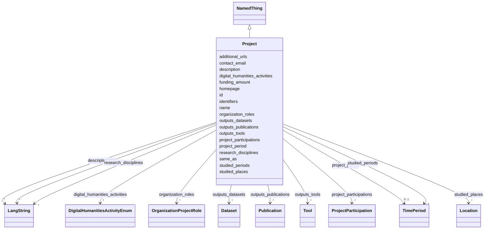

---
search:
  boost: 10.0
---

# Class: Project 


_A Digital Humanities research project, classified by TaDiRAH research activities and by research discipline. This is the central entity of the index; people, organizations, outputs and studied periods/places all hang off it._


<div data-search-exclude markdown="1">


URI: [foaf:Project](http://xmlns.com/foaf/0.1/Project)





## Inheritance
* [NamedThing](../classes/NamedThing.md)
    * **Project**


## Class Properties

| Property | Value |
| --- | --- |
| Class URI | [foaf:Project](http://xmlns.com/foaf/0.1/Project) |


## Slots

| Name | Cardinality and Range | Description | Inheritance |
| ---  | --- | --- | --- |
| [digital_humanities_activities](../slots/digital_humanities_activities.md) | * <br/> [DigitalHumanitiesActivityEnum](../enums/DigitalHumanitiesActivityEnum.md) | Digital-humanities research activities practiced in this project, tool or ser... | direct |
| [research_disciplines](../slots/research_disciplines.md) | * <br/> [LangString](../classes/LangString.md) | Humanities discipline(s) of the project (history, linguistics, archaeology | direct |
| [project_period](../slots/project_period.md) | 0..1 <br/> [TimePeriod](../classes/TimePeriod.md) | The project's OWN runtime (when the research is/was conducted) | direct |
| [studied_periods](../slots/studied_periods.md) | * <br/> [TimePeriod](../classes/TimePeriod.md) | Historical period(s) the project studies (e | direct |
| [studied_places](../slots/studied_places.md) | * <br/> [Location](../classes/Location.md) | Geographic focus of the research (places studied), as Location records — dist... | direct |
| [project_participations](../slots/project_participations.md) | * <br/> [ProjectParticipation](../classes/ProjectParticipation.md) | The person's project involvements, as reified ProjectParticipation objects ca... | direct |
| [organization_roles](../slots/organization_roles.md) | * <br/> [OrganizationProjectRole](../classes/OrganizationProjectRole.md) | Organizations engaged in the project, as reified OrganizationProjectRole obje... | direct |
| [outputs_tools](../slots/outputs_tools.md) | * <br/> [Tool](../classes/Tool.md) | Tools produced by this project (by id) | direct |
| [outputs_datasets](../slots/outputs_datasets.md) | * <br/> [Dataset](../classes/Dataset.md) | Datasets produced or curated by this project (by id) | direct |
| [outputs_publications](../slots/outputs_publications.md) | * <br/> [Publication](../classes/Publication.md) | Publications resulting from this project (by id) | direct |
| [funding_amount](../slots/funding_amount.md) | 0..1 <br/> [Float](../types/Float.md) | Total awarded funding, if public, in ILS unless noted in the project descript... | direct |
| [additional_urls](../slots/additional_urls.md) | * <br/> [Uri](../types/Uri.md) | Further relevant web pages beyond the homepage (blog, social-media profile, r... | direct |
| [contact_email](../slots/contact_email.md) | 0..1 <br/> [String](../types/String.md) | A published contact address for the entity (office, team or service-desk mail... | direct |
| [id](../slots/id.md) | 1 <br/> [String](../types/String.md) | The entity's primary identifier: an IDHI URN of the form | [NamedThing](../classes/NamedThing.md) |
| [name](../slots/name.md) | * <br/> [LangString](../classes/LangString.md) | Multilingual name/title | [NamedThing](../classes/NamedThing.md) |
| [description](../slots/description.md) | * <br/> [LangString](../classes/LangString.md) | Multilingual free-text description (a few sentences aimed at index visitors, ... | [NamedThing](../classes/NamedThing.md) |
| [homepage](../slots/homepage.md) | 0..1 <br/> [Uri](../types/Uri.md) | Public landing page of the entity, if one exists | [NamedThing](../classes/NamedThing.md) |
| [identifiers](../slots/identifiers.md) | * <br/> [Uriorcurie](../types/Uriorcurie.md) | Additional EXTERNAL identifiers beyond the primary IDHI URN and the dedicated... | [NamedThing](../classes/NamedThing.md) |
| [same_as](../slots/same_as.md) | * <br/> [Uri](../types/Uri.md) | URIs of records in OTHER systems describing the same real-world entity (Wikid... | [NamedThing](../classes/NamedThing.md) |


## Usages

| used by | used in | type | used |
| ---  | --- | --- | --- |
| [ProjectParticipation](../classes/ProjectParticipation.md) | [project](../slots/project.md) | range | [Project](../classes/Project.md) |
| [OrganizationProjectRole](../classes/OrganizationProjectRole.md) | [project](../slots/project.md) | range | [Project](../classes/Project.md) |
| [IndexContainer](../classes/IndexContainer.md) | [projects](../slots/projects.md) | range | [Project](../classes/Project.md) |


## Identifier and Mapping Information


### Schema Source


* from schema: https://idhi.co.il/linkml/idhi


## Mappings

| Mapping Type | Mapped Value |
| ---  | ---  |
| self | foaf:Project |
| native | idhi:Project |


## LinkML Source

<!-- TODO: investigate https://stackoverflow.com/questions/37606292/how-to-create-tabbed-code-blocks-in-mkdocs-or-sphinx -->

### Direct

<details>
```yaml
name: Project
description: A Digital Humanities research project, classified by TaDiRAH research
  activities and by research discipline. This is the central entity of the index;
  people, organizations, outputs and studied periods/places all hang off it.
from_schema: https://idhi.co.il/linkml/idhi
is_a: NamedThing
slots:
- digital_humanities_activities
- research_disciplines
- project_period
- studied_periods
- studied_places
- project_participations
- organization_roles
- outputs_tools
- outputs_datasets
- outputs_publications
- funding_amount
- additional_urls
- contact_email
slot_usage:
  id:
    name: id
    structured_pattern:
      syntax: ^idhi:project:{shortid}$
      interpolated: true
class_uri: foaf:Project

```
</details>

### Induced

<details>
```yaml
name: Project
description: A Digital Humanities research project, classified by TaDiRAH research
  activities and by research discipline. This is the central entity of the index;
  people, organizations, outputs and studied periods/places all hang off it.
from_schema: https://idhi.co.il/linkml/idhi
is_a: NamedThing
slot_usage:
  id:
    name: id
    structured_pattern:
      syntax: ^idhi:project:{shortid}$
      interpolated: true
attributes:
  digital_humanities_activities:
    name: digital_humanities_activities
    description: Digital-humanities research activities practiced in this project,
      tool or service, as TaDiRAH 2.0 concepts. Prefer the most specific applicable
      concept (e.g. tadirah:topicModeling rather than tadirah:analyzing); multiple
      values are expected. This is the primary DH-facet for discovery.
    from_schema: https://idhi.co.il/linkml/idhi
    rank: 1000
    slot_uri: dcterms:subject
    owner: Project
    domain_of:
    - Project
    - Tool
    - Service
    range: DigitalHumanitiesActivityEnum
    multivalued: true
  research_disciplines:
    name: research_disciplines
    description: Humanities discipline(s) of the project (history, linguistics, archaeology...).
      Free multilingual text for now; a controlled SKOS scheme is a planned upgrade.
    from_schema: https://idhi.co.il/linkml/idhi
    rank: 1000
    slot_uri: dcterms:subject
    owner: Project
    domain_of:
    - Project
    range: LangString
    multivalued: true
    inlined: true
    inlined_as_list: true
  project_period:
    name: project_period
    description: The project's OWN runtime (when the research is/was conducted). Do
      not confuse with studied_periods.
    from_schema: https://idhi.co.il/linkml/idhi
    rank: 1000
    slot_uri: dcterms:temporal
    owner: Project
    domain_of:
    - Project
    range: TimePeriod
  studied_periods:
    name: studied_periods
    description: Historical period(s) the project studies (e.g. Ottoman period), as
      TimePeriod records — distinct from project_period.
    from_schema: https://idhi.co.il/linkml/idhi
    rank: 1000
    slot_uri: dcterms:temporal
    owner: Project
    domain_of:
    - Project
    range: TimePeriod
    multivalued: true
  studied_places:
    name: studied_places
    description: Geographic focus of the research (places studied), as Location records
      — distinct from where the project team sits.
    from_schema: https://idhi.co.il/linkml/idhi
    rank: 1000
    slot_uri: dcterms:spatial
    owner: Project
    domain_of:
    - Project
    range: Location
    multivalued: true
  project_participations:
    name: project_participations
    description: The person's project involvements, as reified ProjectParticipation
      objects carrying the role (PI, developer...) and dates.
    from_schema: https://idhi.co.il/linkml/idhi
    rank: 1000
    owner: Project
    domain_of:
    - Person
    - Project
    range: ProjectParticipation
    multivalued: true
    inlined: true
    inlined_as_list: true
  organization_roles:
    name: organization_roles
    description: Organizations engaged in the project, as reified OrganizationProjectRole
      objects (coordinator, partner, funder, host).
    from_schema: https://idhi.co.il/linkml/idhi
    rank: 1000
    owner: Project
    domain_of:
    - Project
    range: OrganizationProjectRole
    multivalued: true
    inlined: true
    inlined_as_list: true
  outputs_tools:
    name: outputs_tools
    description: Tools produced by this project (by id).
    from_schema: https://idhi.co.il/linkml/idhi
    rank: 1000
    slot_uri: schema:producer
    owner: Project
    domain_of:
    - Project
    range: Tool
    multivalued: true
  outputs_datasets:
    name: outputs_datasets
    description: Datasets produced or curated by this project (by id).
    from_schema: https://idhi.co.il/linkml/idhi
    rank: 1000
    owner: Project
    domain_of:
    - Project
    range: Dataset
    multivalued: true
  outputs_publications:
    name: outputs_publications
    description: Publications resulting from this project (by id).
    from_schema: https://idhi.co.il/linkml/idhi
    rank: 1000
    owner: Project
    domain_of:
    - Project
    range: Publication
    multivalued: true
  funding_amount:
    name: funding_amount
    description: Total awarded funding, if public, in ILS unless noted in the project
      description. Omit rather than guess.
    from_schema: https://idhi.co.il/linkml/idhi
    rank: 1000
    slot_uri: frapo:hasMonetaryValue
    owner: Project
    domain_of:
    - Project
    range: float
  additional_urls:
    name: additional_urls
    description: Further relevant web pages beyond the homepage (blog, social-media
      profile, registry entry, press coverage...). For records describing the same
      entity in other systems use same_as instead.
    from_schema: https://idhi.co.il/linkml/idhi
    rank: 1000
    slot_uri: foaf:page
    owner: Project
    domain_of:
    - Organization
    - Facility
    - Project
    - Tool
    - Service
    - Event
    range: uri
    multivalued: true
  contact_email:
    name: contact_email
    description: A published contact address for the entity (office, team or service-desk
      mailbox). For a person's own addresses use 'emails'.
    from_schema: https://idhi.co.il/linkml/idhi
    rank: 1000
    slot_uri: schema:email
    owner: Project
    domain_of:
    - Organization
    - Facility
    - Project
    - Tool
    - Service
    - Event
    range: string
  id:
    name: id
    description: "The entity's primary identifier: an IDHI URN of the form\n  idhi:<class\
      \ name>:<random short alphanumeric id>\ne.g. idhi:person:x7k2m9 or idhi:project:a83bq1.\
      \ Minted by IDHI at record creation and never reused or changed. The class token\
      \ is the lowercase snake_case class name (Organization subclasses use \"organization\"\
      ); each concrete class enforces its own token via slot_usage. External identifiers\
      \ (ORCID, ROR, DOI...) are supplementary and go in their dedicated slots — never\
      \ here."
    from_schema: https://idhi.co.il/linkml/idhi
    rank: 1000
    slot_uri: dcterms:identifier
    identifier: true
    owner: Project
    domain_of:
    - NamedThing
    range: string
    required: true
    pattern: ^idhi:[a-z_]+:[0-9a-z]{4,12}$
    structured_pattern:
      syntax: ^idhi:project:{shortid}$
      interpolated: true
  name:
    name: name
    description: Multilingual name/title. Provide at least one language; English,
      Hebrew and Arabic variants are each a separate LangString. Preferably a sortable
      name (e.g. "Smith, John" rather than "John Smith") for people and organizations;
      for projects, tools and services, use the name the team itself uses.
    from_schema: https://idhi.co.il/linkml/idhi
    rank: 1000
    slot_uri: skos:prefLabel
    owner: Project
    domain_of:
    - NamedThing
    range: LangString
    multivalued: true
    inlined: true
    inlined_as_list: true
  description:
    name: description
    description: Multilingual free-text description (a few sentences aimed at index
      visitors, not internal notes).
    from_schema: https://idhi.co.il/linkml/idhi
    rank: 1000
    slot_uri: dcterms:description
    owner: Project
    domain_of:
    - NamedThing
    range: LangString
    multivalued: true
    inlined: true
    inlined_as_list: true
  homepage:
    name: homepage
    description: Public landing page of the entity, if one exists.
    from_schema: https://idhi.co.il/linkml/idhi
    rank: 1000
    slot_uri: foaf:homepage
    owner: Project
    domain_of:
    - NamedThing
    range: uri
  identifiers:
    name: identifiers
    description: Additional EXTERNAL identifiers beyond the primary IDHI URN and the
      dedicated ORCID/ROR/DOI slots, as CURIEs/URIs (e.g. Wikidata QIDs, VIAF, ISNI).
    from_schema: https://idhi.co.il/linkml/idhi
    rank: 1000
    slot_uri: dcterms:identifier
    owner: Project
    domain_of:
    - NamedThing
    range: uriorcurie
    multivalued: true
  same_as:
    name: same_as
    description: URIs of records in OTHER systems describing the same real-world entity
      (Wikidata, PeriodO, GeoNames...). Use for linked-data alignment, not for the
      entity's own pages (use homepage).
    from_schema: https://idhi.co.il/linkml/idhi
    rank: 1000
    slot_uri: schema:sameAs
    owner: Project
    domain_of:
    - NamedThing
    range: uri
    multivalued: true
class_uri: foaf:Project

```
</details></div>