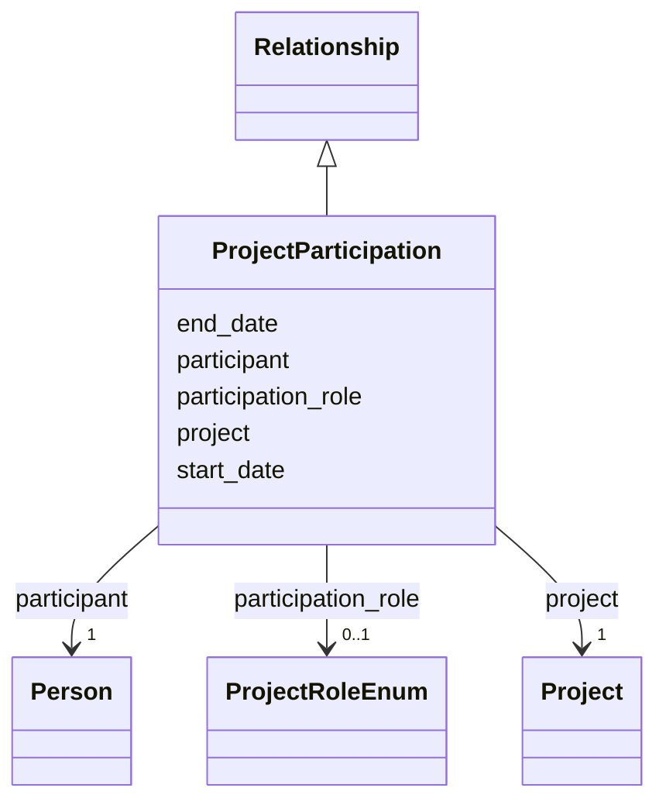

---
search:
  boost: 10.0
---

# Class: ProjectParticipation 


_A person's participation in a project. Create one instance per (person, project, role) combination; if a person changed roles over time, create one instance per role with start/end dates._


<div data-search-exclude markdown="1">


URI: [cerif:Project_Person](https://w3id.org/cerif/model#Project_Person)





## Inheritance
* [Relationship](../classes/Relationship.md)
    * **ProjectParticipation**


## Class Properties

| Property | Value |
| --- | --- |
| Class URI | [cerif:Project_Person](https://w3id.org/cerif/model#Project_Person) |


## Slots

| Name | Cardinality and Range | Description | Inheritance |
| ---  | --- | --- | --- |
| [participant](../slots/participant.md) | 1 <br/> [Person](../classes/Person.md) | The person taking part in the project (by IDHI URN) | direct |
| [project](../slots/project.md) | 1 <br/> [Project](../classes/Project.md) | The project side of the relationship (by IDHI URN) | direct |
| [participation_role](../slots/participation_role.md) | 0..1 <br/> [ProjectRoleEnum](../enums/ProjectRoleEnum.md) | The person's function within the project team | direct |
| [start_date](../slots/start_date.md) | 0..1 <br/> [Date](../types/Date.md) | Start of the event, of the project's runtime, or of a relationship's validity... | [Relationship](../classes/Relationship.md) |
| [end_date](../slots/end_date.md) | 0..1 <br/> [Date](../types/Date.md) | End of the event, project runtime or relationship | [Relationship](../classes/Relationship.md) |


## Usages

| used by | used in | type | used |
| ---  | --- | --- | --- |
| [Person](../classes/Person.md) | [project_participations](../slots/project_participations.md) | range | [ProjectParticipation](../classes/ProjectParticipation.md) |
| [Project](../classes/Project.md) | [project_participations](../slots/project_participations.md) | range | [ProjectParticipation](../classes/ProjectParticipation.md) |


## Identifier and Mapping Information


### Schema Source


* from schema: https://idhi.co.il/linkml/idhi


## Mappings

| Mapping Type | Mapped Value |
| ---  | ---  |
| self | cerif:Project_Person |
| native | idhi:ProjectParticipation |


## LinkML Source

<!-- TODO: investigate https://stackoverflow.com/questions/37606292/how-to-create-tabbed-code-blocks-in-mkdocs-or-sphinx -->

### Direct

<details>
```yaml
name: ProjectParticipation
description: A person's participation in a project. Create one instance per (person,
  project, role) combination; if a person changed roles over time, create one instance
  per role with start/end dates.
from_schema: https://idhi.co.il/linkml/idhi
is_a: Relationship
slots:
- participant
- project
- participation_role
class_uri: cerif:Project_Person

```
</details>

### Induced

<details>
```yaml
name: ProjectParticipation
description: A person's participation in a project. Create one instance per (person,
  project, role) combination; if a person changed roles over time, create one instance
  per role with start/end dates.
from_schema: https://idhi.co.il/linkml/idhi
is_a: Relationship
attributes:
  participant:
    name: participant
    description: The person taking part in the project (by IDHI URN).
    from_schema: https://idhi.co.il/linkml/idhi
    rank: 1000
    owner: ProjectParticipation
    domain_of:
    - ProjectParticipation
    range: Person
    required: true
  project:
    name: project
    description: The project side of the relationship (by IDHI URN).
    from_schema: https://idhi.co.il/linkml/idhi
    rank: 1000
    owner: ProjectParticipation
    domain_of:
    - ProjectParticipation
    - OrganizationProjectRole
    range: Project
    required: true
  participation_role:
    name: participation_role
    description: The person's function within the project team. Use PRINCIPAL_INVESTIGATOR
      only for the formally designated PI(s); day-to-day scholarly work is RESEARCHER,
      software work is DEVELOPER, enrolled students are STUDENT regardless of their
      task, external mentors are ADVISOR, and CONTRIBUTOR is the fallback for anything
      else.
    from_schema: https://idhi.co.il/linkml/idhi
    rank: 1000
    slot_uri: schema:roleName
    owner: ProjectParticipation
    domain_of:
    - ProjectParticipation
    range: ProjectRoleEnum
  start_date:
    name: start_date
    description: Start of the event, of the project's runtime, or of a relationship's
      validity (e.g. when a person joined a project or organization).
    from_schema: https://idhi.co.il/linkml/idhi
    rank: 1000
    slot_uri: schema:startDate
    owner: ProjectParticipation
    domain_of:
    - Project
    - Event
    - Relationship
    range: date
  end_date:
    name: end_date
    description: End of the event, project runtime or relationship. Omit for ongoing
      relationships and open-ended projects.
    from_schema: https://idhi.co.il/linkml/idhi
    rank: 1000
    slot_uri: schema:endDate
    owner: ProjectParticipation
    domain_of:
    - Project
    - Event
    - Relationship
    range: date
class_uri: cerif:Project_Person

```
</details></div>