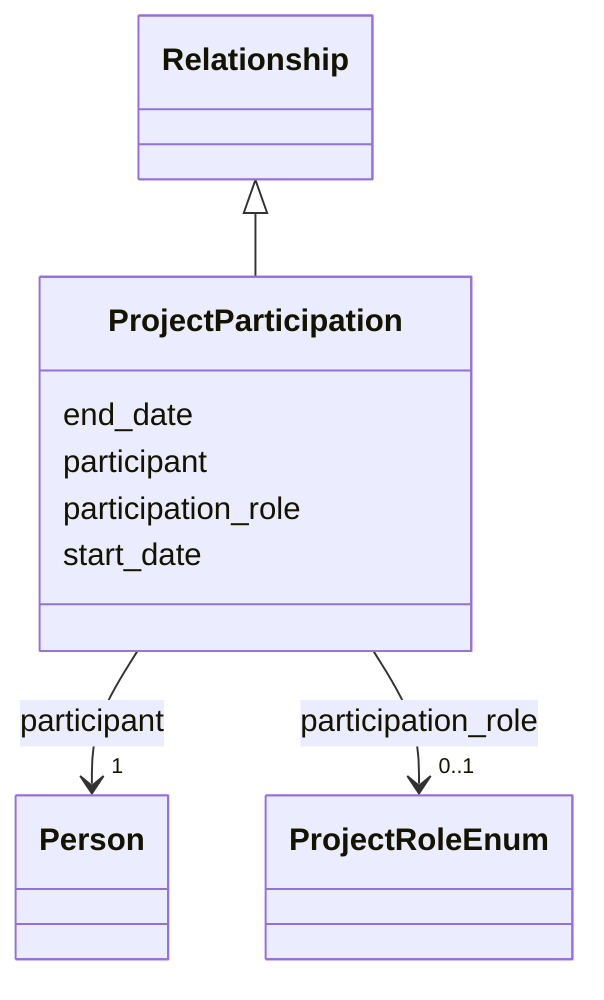

---
search:
  boost: 10.0
---

# Class: ProjectParticipation 


_A person's participation nested in a Project, so the project is inferred from the containing record. Use one instance per participant and role in Project.project_participations and do not define project participation in Person; if a person changed roles over time, create one instance per role with start and end dates._


<div data-search-exclude markdown="1">


URI: [cerif:Project_Person](https://w3id.org/cerif/model#Project_Person)





## Inheritance
* [Relationship](../classes/Relationship.md)
    * **ProjectParticipation**


## Class Properties

| Property | Value |
| --- | --- |
| Class URI | [cerif:Project_Person](https://w3id.org/cerif/model#Project_Person) |


## Slots

| Name | Cardinality and Range | Description | Inheritance |
| ---  | --- | --- | --- |
| [participant](../slots/participant.md) | <span title="Required: exactly one value">1</span> <br/> [Person](../classes/Person.md) | <span title="The person taking part in the containing project (by IDHI URN). Use in Project.project_participations; do not define the relationship on the Person.">The person taking part in the containing project (by IDHI URN)</span> | direct |
| [participation_role](../slots/participation_role.md) | <span title="Optional: at most one value">0..1</span> <br/> [ProjectRoleEnum](../enums/ProjectRoleEnum.md) | <span title="The person's function within the project team. Use PRINCIPAL_INVESTIGATOR only for the formally designated PI(s); DH_LEAD for digital method and architecture, TECHNICAL_LEAD for ownership of software engineering, DEVELOPER for implementation, CONSULTANT for bounded external professional work, RESEARCHER for scholarly research, STUDENT for enrolled students, ADVISOR for mentorship, and CONTRIBUTOR only when none of the specific values fits.">The person's function within the project team</span> | direct |
| [start_date](../slots/start_date.md) | <span title="Optional: at most one value">0..1</span> <br/> [Date](../types/Date.md) | <span title="Start of the event, of the project's runtime, or of a relationship's validity, such as when participation, affiliation, maintenance responsibility or formal containment began.">Start of the event, of the project's runtime, or of a relationship's validity...</span> | [Relationship](../classes/Relationship.md) |
| [end_date](../slots/end_date.md) | <span title="Optional: at most one value">0..1</span> <br/> [Date](../types/Date.md) | <span title="End of the event, project runtime or relationship. Omit for ongoing relationships and open-ended projects.">End of the event, project runtime or relationship</span> | [Relationship](../classes/Relationship.md) |


## Usages

| used by | used in | type | used |
| ---  | --- | --- | --- |
| [Project](../classes/Project.md) | [project_participations](../slots/project_participations.md) | range | [ProjectParticipation](../classes/ProjectParticipation.md) |


## Identifier and Mapping Information


### Schema Source


* from schema: https://idhi_placeholder/linkml/idhi


## Mappings

| Mapping Type | Mapped Value |
| ---  | ---  |
| self | cerif:Project_Person |
| native | idhi:ProjectParticipation |


## LinkML Source

### Direct

<details>
```yaml
name: ProjectParticipation
description: A person's participation nested in a Project, so the project is inferred
  from the containing record. Use one instance per participant and role in Project.project_participations
  and do not define project participation in Person; if a person changed roles over
  time, create one instance per role with start and end dates.
from_schema: https://idhi_placeholder/linkml/idhi
is_a: Relationship
slots:
- participant
- participation_role
class_uri: cerif:Project_Person

```
</details>

### Induced

<details>
```yaml
name: ProjectParticipation
description: A person's participation nested in a Project, so the project is inferred
  from the containing record. Use one instance per participant and role in Project.project_participations
  and do not define project participation in Person; if a person changed roles over
  time, create one instance per role with start and end dates.
from_schema: https://idhi_placeholder/linkml/idhi
is_a: Relationship
attributes:
  participant:
    name: participant
    description: The person taking part in the containing project (by IDHI URN). Use
      in Project.project_participations; do not define the relationship on the Person.
    from_schema: https://idhi_placeholder/linkml/idhi
    rank: 1000
    owner: ProjectParticipation
    domain_of:
    - ProjectParticipation
    range: Person
    required: true
  participation_role:
    name: participation_role
    description: The person's function within the project team. Use PRINCIPAL_INVESTIGATOR
      only for the formally designated PI(s); DH_LEAD for digital method and architecture,
      TECHNICAL_LEAD for ownership of software engineering, DEVELOPER for implementation,
      CONSULTANT for bounded external professional work, RESEARCHER for scholarly
      research, STUDENT for enrolled students, ADVISOR for mentorship, and CONTRIBUTOR
      only when none of the specific values fits.
    from_schema: https://idhi_placeholder/linkml/idhi
    rank: 1000
    slot_uri: schema:roleName
    owner: ProjectParticipation
    domain_of:
    - ProjectParticipation
    range: ProjectRoleEnum
  start_date:
    name: start_date
    description: Start of the event, of the project's runtime, or of a relationship's
      validity, such as when participation, affiliation, maintenance responsibility
      or formal containment began.
    from_schema: https://idhi_placeholder/linkml/idhi
    rank: 1000
    slot_uri: schema:startDate
    owner: ProjectParticipation
    domain_of:
    - Project
    - Event
    - Relationship
    - Funding
    range: date
  end_date:
    name: end_date
    description: End of the event, project runtime or relationship. Omit for ongoing
      relationships and open-ended projects.
    from_schema: https://idhi_placeholder/linkml/idhi
    rank: 1000
    slot_uri: schema:endDate
    owner: ProjectParticipation
    domain_of:
    - Project
    - Event
    - Relationship
    - Funding
    range: date
class_uri: cerif:Project_Person

```
</details></div>