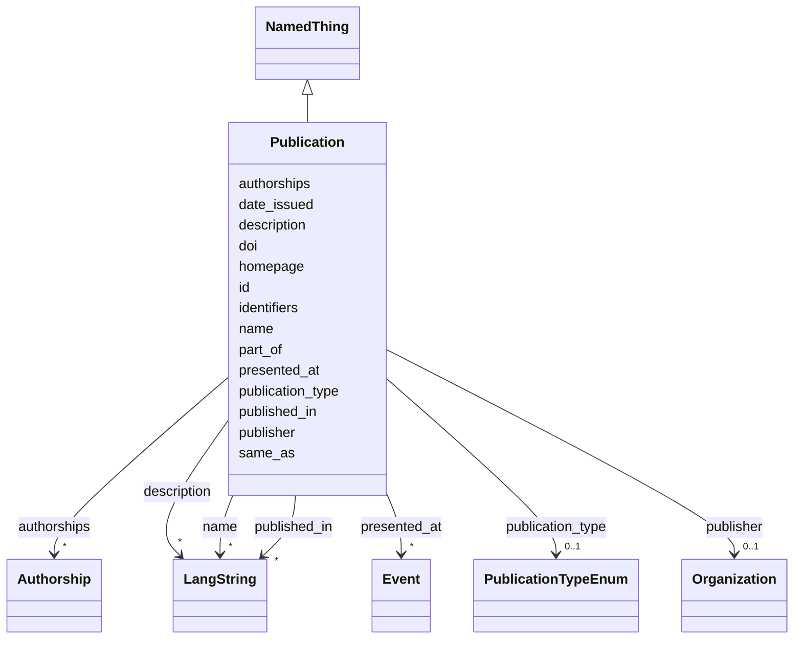

---
search:
  boost: 10.0
---

# Class: Publication 


_An academic publication (BIBO document): journal article, book, chapter, conference paper, thesis, report, etc. The precise kind is given by publication_type (COAR resource type)._


<div data-search-exclude markdown="1">


URI: [bibo:Document](http://purl.org/ontology/bibo/Document)





## Inheritance
* [NamedThing](../classes/NamedThing.md)
    * **Publication**


## Class Properties

| Property | Value |
| --- | --- |
| Class URI | [bibo:Document](http://purl.org/ontology/bibo/Document) |


## Slots

| Name | Cardinality and Range | Description | Inheritance |
| ---  | --- | --- | --- |
| [doi](../slots/doi.md) | 0..1 <br/> [Uriorcurie](../types/Uriorcurie.md) | The publication's DOI, as CURIE (DOI:10 | direct |
| [publication_type](../slots/publication_type.md) | 0..1 <br/> [PublicationTypeEnum](../enums/PublicationTypeEnum.md) | The kind of publication, as a COAR resource-type concept (journal article, bo... | direct |
| [authorships](../slots/authorships.md) | * <br/> [Authorship](../classes/Authorship.md) | The person's publication contributions, as reified Authorship objects carryin... | direct |
| [date_issued](../slots/date_issued.md) | 0..1 <br/> [Date](../types/Date.md) | Formal publication date (or year-01-01 if only the year is known) | direct |
| [published_in](../slots/published_in.md) | * <br/> [LangString](../classes/LangString.md) | Name of the journal, book or proceedings the publication appeared in, as free... | direct |
| [publisher](../slots/publisher.md) | 0..1 <br/> [Organization](../classes/Organization.md) | The organization publishing the catalog, dataset or publication (by IDHI URN) | direct |
| [part_of](../slots/part_of.md) | 0..1 <br/> [Uriorcurie](../types/Uriorcurie.md) | The containing work (book for a chapter, proceedings for a paper), by IDHI UR... | direct |
| [presented_at](../slots/presented_at.md) | * <br/> [Event](../classes/Event.md) | Event(s) in the index where this publication was presented (by IDHI URN), e | direct |
| [id](../slots/id.md) | 1 <br/> [String](../types/String.md) | The entity's primary identifier: an IDHI URN of the form | [NamedThing](../classes/NamedThing.md) |
| [name](../slots/name.md) | * <br/> [LangString](../classes/LangString.md) | Multilingual name/title | [NamedThing](../classes/NamedThing.md) |
| [description](../slots/description.md) | * <br/> [LangString](../classes/LangString.md) | Multilingual free-text description (a few sentences aimed at index visitors, ... | [NamedThing](../classes/NamedThing.md) |
| [homepage](../slots/homepage.md) | 0..1 <br/> [Uri](../types/Uri.md) | Public landing page of the entity, if one exists | [NamedThing](../classes/NamedThing.md) |
| [identifiers](../slots/identifiers.md) | * <br/> [Uriorcurie](../types/Uriorcurie.md) | Additional EXTERNAL identifiers beyond the primary IDHI URN and the dedicated... | [NamedThing](../classes/NamedThing.md) |
| [same_as](../slots/same_as.md) | * <br/> [Uri](../types/Uri.md) | URIs of records in OTHER systems describing the same real-world entity (Wikid... | [NamedThing](../classes/NamedThing.md) |


## Usages

| used by | used in | type | used |
| ---  | --- | --- | --- |
| [Project](../classes/Project.md) | [outputs_publications](../slots/outputs_publications.md) | range | [Publication](../classes/Publication.md) |
| [Authorship](../classes/Authorship.md) | [publication](../slots/publication.md) | range | [Publication](../classes/Publication.md) |
| [IndexContainer](../classes/IndexContainer.md) | [publications](../slots/publications.md) | range | [Publication](../classes/Publication.md) |


## In Subsets


* [ToplevelEntity](../subsets/ToplevelEntity.md)


## Identifier and Mapping Information


### Schema Source


* from schema: https://idhi.co.il/linkml/idhi


## Mappings

| Mapping Type | Mapped Value |
| ---  | ---  |
| self | bibo:Document |
| native | idhi:Publication |


## LinkML Source

<!-- TODO: investigate https://stackoverflow.com/questions/37606292/how-to-create-tabbed-code-blocks-in-mkdocs-or-sphinx -->

### Direct

<details>
```yaml
name: Publication
description: 'An academic publication (BIBO document): journal article, book, chapter,
  conference paper, thesis, report, etc. The precise kind is given by publication_type
  (COAR resource type).'
in_subset:
- toplevel_entity
from_schema: https://idhi.co.il/linkml/idhi
is_a: NamedThing
slots:
- doi
- publication_type
- authorships
- date_issued
- published_in
- publisher
- part_of
- presented_at
slot_usage:
  id:
    name: id
    structured_pattern:
      syntax: ^idhi:publication:{shortid}$
      interpolated: true
class_uri: bibo:Document

```
</details>

### Induced

<details>
```yaml
name: Publication
description: 'An academic publication (BIBO document): journal article, book, chapter,
  conference paper, thesis, report, etc. The precise kind is given by publication_type
  (COAR resource type).'
in_subset:
- toplevel_entity
from_schema: https://idhi.co.il/linkml/idhi
is_a: NamedThing
slot_usage:
  id:
    name: id
    structured_pattern:
      syntax: ^idhi:publication:{shortid}$
      interpolated: true
attributes:
  doi:
    name: doi
    description: The publication's DOI, as CURIE (DOI:10.1234/abcd) or full URL. A
      supplementary external identifier — the record's primary id is always the IDHI
      URN. Record whenever one exists; it is the preferred dedup key.
    from_schema: https://idhi.co.il/linkml/idhi
    rank: 1000
    slot_uri: bibo:doi
    owner: Publication
    domain_of:
    - Publication
    range: uriorcurie
  publication_type:
    name: publication_type
    description: The kind of publication, as a COAR resource-type concept (journal
      article, book part, conference paper, thesis...). Pick the most specific applicable
      concept.
    from_schema: https://idhi.co.il/linkml/idhi
    rank: 1000
    slot_uri: dcterms:type
    owner: Publication
    domain_of:
    - Publication
    range: PublicationTypeEnum
  authorships:
    name: authorships
    description: The person's publication contributions, as reified Authorship objects
      carrying byline order and role.
    from_schema: https://idhi.co.il/linkml/idhi
    rank: 1000
    owner: Publication
    domain_of:
    - Person
    - Publication
    range: Authorship
    multivalued: true
    inlined: true
    inlined_as_list: true
  date_issued:
    name: date_issued
    description: Formal publication date (or year-01-01 if only the year is known).
    from_schema: https://idhi.co.il/linkml/idhi
    rank: 1000
    slot_uri: dcterms:issued
    owner: Publication
    domain_of:
    - Publication
    - Dataset
    range: date
  published_in:
    name: published_in
    description: Name of the journal, book or proceedings the publication appeared
      in, as free multilingual text. If the container work has its own IDHI record
      or external URI, also link it via part_of.
    from_schema: https://idhi.co.il/linkml/idhi
    rank: 1000
    slot_uri: schema:isPartOf
    owner: Publication
    domain_of:
    - Publication
    range: LangString
    multivalued: true
    inlined: true
    inlined_as_list: true
  publisher:
    name: publisher
    description: The organization publishing the catalog, dataset or publication (by
      IDHI URN).
    from_schema: https://idhi.co.il/linkml/idhi
    rank: 1000
    slot_uri: dcterms:publisher
    owner: Publication
    domain_of:
    - Publication
    - Catalog
    - Dataset
    range: Organization
  part_of:
    name: part_of
    description: The containing work (book for a chapter, proceedings for a paper),
      by IDHI URN or external URI.
    from_schema: https://idhi.co.il/linkml/idhi
    rank: 1000
    slot_uri: dcterms:isPartOf
    owner: Publication
    domain_of:
    - Publication
    range: uriorcurie
  presented_at:
    name: presented_at
    description: Event(s) in the index where this publication was presented (by IDHI
      URN), e.g. the conference where the paper was given. Distinct from published_in,
      the container it appeared in.
    from_schema: https://idhi.co.il/linkml/idhi
    rank: 1000
    slot_uri: bibo:presentedAt
    owner: Publication
    domain_of:
    - Publication
    range: Event
    multivalued: true
  id:
    name: id
    description: "The entity's primary identifier: an IDHI URN of the form\n  idhi:<class\
      \ name>:<random short alphanumeric id>\ne.g. idhi:person:x7k2m9 or idhi:project:a83bq1.\
      \ Minted by IDHI at record creation and never reused or changed. The class token\
      \ is the lowercase snake_case class name (Organization subclasses use \"organization\"\
      ); each concrete class enforces its own token via slot_usage. External identifiers\
      \ (ORCID, ROR, DOI...) are supplementary and go in their dedicated slots — never\
      \ here."
    from_schema: https://idhi.co.il/linkml/idhi
    rank: 1000
    slot_uri: dcterms:identifier
    identifier: true
    owner: Publication
    domain_of:
    - NamedThing
    range: string
    required: true
    pattern: ^idhi:[a-z_]+:[0-9a-z]{4,12}$
    structured_pattern:
      syntax: ^idhi:publication:{shortid}$
      interpolated: true
  name:
    name: name
    description: Multilingual name/title. Provide at least one language; English,
      Hebrew and Arabic variants are each a separate LangString. Preferably a sortable
      name (e.g. "Smith, John" rather than "John Smith") for people and organizations;
      for projects, tools and services, use the name the team itself uses.
    from_schema: https://idhi.co.il/linkml/idhi
    rank: 1000
    slot_uri: skos:prefLabel
    owner: Publication
    domain_of:
    - NamedThing
    range: LangString
    multivalued: true
    inlined: true
    inlined_as_list: true
  description:
    name: description
    description: Multilingual free-text description (a few sentences aimed at index
      visitors, not internal notes).
    from_schema: https://idhi.co.il/linkml/idhi
    rank: 1000
    slot_uri: dcterms:description
    owner: Publication
    domain_of:
    - NamedThing
    range: LangString
    multivalued: true
    inlined: true
    inlined_as_list: true
  homepage:
    name: homepage
    description: Public landing page of the entity, if one exists.
    from_schema: https://idhi.co.il/linkml/idhi
    rank: 1000
    slot_uri: foaf:homepage
    owner: Publication
    domain_of:
    - NamedThing
    range: uri
  identifiers:
    name: identifiers
    description: Additional EXTERNAL identifiers beyond the primary IDHI URN and the
      dedicated ORCID/ROR/DOI slots, as CURIEs/URIs (e.g. Wikidata QIDs, VIAF, ISNI).
    from_schema: https://idhi.co.il/linkml/idhi
    rank: 1000
    slot_uri: dcterms:identifier
    owner: Publication
    domain_of:
    - NamedThing
    range: uriorcurie
    multivalued: true
  same_as:
    name: same_as
    description: URIs of records in OTHER systems describing the same real-world entity
      (Wikidata, PeriodO, GeoNames...). Use for linked-data alignment, not for the
      entity's own pages (use homepage).
    from_schema: https://idhi.co.il/linkml/idhi
    rank: 1000
    slot_uri: schema:sameAs
    owner: Publication
    domain_of:
    - NamedThing
    range: uri
    multivalued: true
class_uri: bibo:Document

```
</details></div>