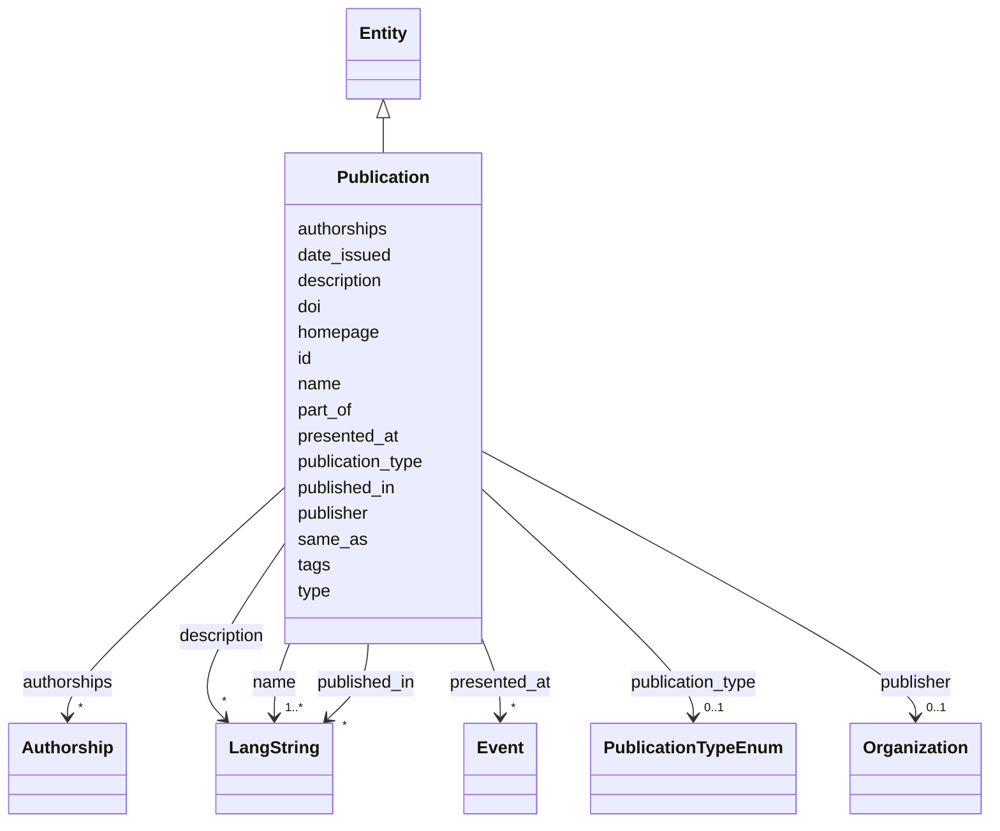

---
search:
  boost: 10.0
---

# Class: Publication 


_An academic publication: journal article, book, chapter, conference paper, thesis, report, etc. The precise kind is given by publication_type._


<div data-search-exclude markdown="1">


URI: [bibo:Document](http://purl.org/ontology/bibo/Document)





## Inheritance
* [Entity](../classes/Entity.md)
    * **Publication**


## Class Properties

| Property | Value |
| --- | --- |
| Class URI | [bibo:Document](http://purl.org/ontology/bibo/Document) |


## Slots

| Name | Cardinality and Range | Description | Inheritance |
| ---  | --- | --- | --- |
| [name](../slots/name.md) | <span title="Required: one or more values">1..*</span> <br/> [LangString](../classes/LangString.md) | <span title="Multilingual name/title. Provide at least one language; English, Hebrew and Arabic variants are each a separate LangString. Preferably a sortable name for organizations; for projects, tools and services, use the name the team itself uses.">Multilingual name/title</span> | direct |
| [doi](../slots/doi.md) | <span title="Optional: at most one value">0..1</span> <br/> [Uri](../types/Uri.md) | <span title="The publication's persistent identifier. Record it whenever one exists; it is the preferred deduplication key.">The publication's persistent identifier</span> | direct |
| [publication_type](../slots/publication_type.md) | <span title="Optional: at most one value">0..1</span> <br/> [PublicationTypeEnum](../enums/PublicationTypeEnum.md) | <span title="The kind of publication (journal article, book part, conference paper, thesis...). Pick the most specific applicable value.">The kind of publication (journal article, book part, conference paper, thesis</span> | direct |
| [authorships](../slots/authorships.md) | <span title="Optional: zero or more values allowed">*</span> <br/> [Authorship](../classes/Authorship.md) | <span title="The person's publication contributions, as reified Authorship objects carrying byline order and role.">The person's publication contributions, as reified Authorship objects carryin...</span> | direct |
| [date_issued](../slots/date_issued.md) | <span title="Optional: at most one value">0..1</span> <br/> [Date](../types/Date.md) | <span title="Formal publication date (or year-01-01 if only the year is known).">Formal publication date (or year-01-01 if only the year is known)</span> | direct |
| [published_in](../slots/published_in.md) | <span title="Optional: zero or more values allowed">*</span> <br/> [LangString](../classes/LangString.md) | <span title="Name of the journal, book or proceedings the publication appeared in, as free multilingual text. If the container work has its own IDHI record or external URI, also link it via part_of.">Name of the journal, book or proceedings the publication appeared in, as free...</span> | direct |
| [publisher](../slots/publisher.md) | <span title="Optional: at most one value">0..1</span> <br/> [Organization](../classes/Organization.md) | <span title="The organization publishing the dataset or publication (by IDHI URN).">The organization publishing the dataset or publication (by IDHI URN)</span> | direct |
| [part_of](../slots/part_of.md) | <span title="Optional: at most one value">0..1</span> <br/> [Uriorcurie](../types/Uriorcurie.md) | <span title="The containing work (book for a chapter, proceedings for a paper), by IDHI URN or external URI.">The containing work (book for a chapter, proceedings for a paper), by IDHI UR...</span> | direct |
| [presented_at](../slots/presented_at.md) | <span title="Optional: zero or more values allowed">*</span> <br/> [Event](../classes/Event.md) | <span title="Event(s) in the index where this publication was presented (by IDHI URN), e.g. the conference where the paper was given. Distinct from published_in, the container it appeared in.">Event(s) in the index where this publication was presented (by IDHI URN), e</span> | direct |
| [type](../slots/type.md) | <span title="Required: exactly one value">1</span> <br/> [Curie](../types/Curie.md) | <span title="Discriminator identifying the record's class; used for polymorphic serialization and deserialization.">Discriminator identifying the record's class; used for polymorphic serializat...</span> | [Entity](../classes/Entity.md) |
| [id](../slots/id.md) | <span title="Required: exactly one value">1</span> <br/> [String](../types/String.md) | <span title="The entity's primary identifier: an IDHI URN of the form&#10;  idhi:&lt;class name>:&lt;random short alphanumeric id>&#10;e.g. idhi:person:x7k2m9 or idhi:project:a83bq1. Minted by IDHI at record creation and never reused or changed. The class token is the lowercase snake_case class name; each concrete class enforces its own token via slot_usage. External identifiers (ORCID, ROR, DOI...) are supplementary and go in their dedicated slots — never here.">The entity's primary identifier: an IDHI URN of the form</span> | [Entity](../classes/Entity.md) |
| [description](../slots/description.md) | <span title="Optional: zero or more values allowed">*</span> <br/> [LangString](../classes/LangString.md) | <span title="Multilingual free-text description (a few sentences aimed at index visitors, not internal notes).">Multilingual free-text description (a few sentences aimed at index visitors, ...</span> | [Entity](../classes/Entity.md) |
| [homepage](../slots/homepage.md) | <span title="Optional: at most one value">0..1</span> <br/> [Uri](../types/Uri.md) | <span title="Public landing page of the entity, if one exists.">Public landing page of the entity, if one exists</span> | [Entity](../classes/Entity.md) |
| [same_as](../slots/same_as.md) | <span title="Optional: zero or more values allowed">*</span> <br/> [Uri](../types/Uri.md) | <span title="URIs of records in OTHER systems describing the same real-world entity (Wikidata, PeriodO, GeoNames...). Use for linked-data alignment, not for the entity's own pages (use homepage).">URIs of records in OTHER systems describing the same real-world entity (Wikid...</span> | [Entity](../classes/Entity.md) |
| [tags](../slots/tags.md) | <span title="Optional: zero or more values allowed">*</span> <br/> [String](../types/String.md) | <span title="Free-text tags for discovery, filtering and grouping; usable on any top-level entity. Deliberately NOT a controlled enum, but prefer wording that matches a concept in an established ontology or thesaurus (e.g. Wikidata, Getty AAT, TaDiRAH) so tags can later be reconciled against it.">Free-text tags for discovery, filtering and grouping; usable on any top-level...</span> | [Entity](../classes/Entity.md) |


## Usages

| used by | used in | type | used |
| ---  | --- | --- | --- |
| [Project](../classes/Project.md) | [outputs_publications](../slots/outputs_publications.md) | range | [Publication](../classes/Publication.md) |
| [Authorship](../classes/Authorship.md) | [publication](../slots/publication.md) | range | [Publication](../classes/Publication.md) |
| [IndexContainer](../classes/IndexContainer.md) | [publications](../slots/publications.md) | range | [Publication](../classes/Publication.md) |


## In Subsets


* [ToplevelEntity](../subsets/ToplevelEntity.md)


## Identifier and Mapping Information


### Schema Source


* from schema: https://idhi_placeholder/linkml/idhi


## Mappings

| Mapping Type | Mapped Value |
| ---  | ---  |
| self | bibo:Document |
| native | idhi:Publication |


## LinkML Source

### Direct

<details>
```yaml
name: Publication
description: 'An academic publication: journal article, book, chapter, conference
  paper, thesis, report, etc. The precise kind is given by publication_type.'
in_subset:
- toplevel_entity
from_schema: https://idhi_placeholder/linkml/idhi
is_a: Entity
slots:
- name
- doi
- publication_type
- authorships
- date_issued
- published_in
- publisher
- part_of
- presented_at
slot_usage:
  type:
    name: type
    equals_string: idhi:Publication
  id:
    name: id
    structured_pattern:
      syntax: ^idhi:publication:{shortid}$
      interpolated: true
class_uri: bibo:Document

```
</details>

### Induced

<details>
```yaml
name: Publication
description: 'An academic publication: journal article, book, chapter, conference
  paper, thesis, report, etc. The precise kind is given by publication_type.'
in_subset:
- toplevel_entity
from_schema: https://idhi_placeholder/linkml/idhi
is_a: Entity
slot_usage:
  type:
    name: type
    equals_string: idhi:Publication
  id:
    name: id
    structured_pattern:
      syntax: ^idhi:publication:{shortid}$
      interpolated: true
attributes:
  name:
    name: name
    description: Multilingual name/title. Provide at least one language; English,
      Hebrew and Arabic variants are each a separate LangString. Preferably a sortable
      name for organizations; for projects, tools and services, use the name the team
      itself uses.
    from_schema: https://idhi_placeholder/linkml/idhi
    rank: 1000
    slot_uri: skos:prefLabel
    owner: Publication
    domain_of:
    - Organization
    - Facility
    - Project
    - Tool
    - Service
    - Publication
    - Event
    - Dataset
    range: LangString
    multivalued: true
    inlined: true
    inlined_as_list: true
    minimum_cardinality: 1
  doi:
    name: doi
    description: The publication's persistent identifier. Record it whenever one exists;
      it is the preferred deduplication key.
    from_schema: https://idhi_placeholder/linkml/idhi
    rank: 1000
    slot_uri: bibo:doi
    owner: Publication
    domain_of:
    - Publication
    range: uri
    structured_pattern:
      syntax: https://doi.org/{doi}
      interpolated: true
  publication_type:
    name: publication_type
    description: The kind of publication (journal article, book part, conference paper,
      thesis...). Pick the most specific applicable value.
    from_schema: https://idhi_placeholder/linkml/idhi
    rank: 1000
    slot_uri: dcterms:type
    owner: Publication
    domain_of:
    - Publication
    range: PublicationTypeEnum
  authorships:
    name: authorships
    description: The person's publication contributions, as reified Authorship objects
      carrying byline order and role.
    from_schema: https://idhi_placeholder/linkml/idhi
    rank: 1000
    owner: Publication
    domain_of:
    - Person
    - Publication
    range: Authorship
    multivalued: true
    inlined: true
    inlined_as_list: true
  date_issued:
    name: date_issued
    description: Formal publication date (or year-01-01 if only the year is known).
    from_schema: https://idhi_placeholder/linkml/idhi
    rank: 1000
    slot_uri: dcterms:issued
    owner: Publication
    domain_of:
    - Publication
    - Dataset
    range: date
  published_in:
    name: published_in
    description: Name of the journal, book or proceedings the publication appeared
      in, as free multilingual text. If the container work has its own IDHI record
      or external URI, also link it via part_of.
    from_schema: https://idhi_placeholder/linkml/idhi
    rank: 1000
    slot_uri: schema:isPartOf
    owner: Publication
    domain_of:
    - Publication
    range: LangString
    multivalued: true
    inlined: true
    inlined_as_list: true
  publisher:
    name: publisher
    description: The organization publishing the dataset or publication (by IDHI URN).
    from_schema: https://idhi_placeholder/linkml/idhi
    rank: 1000
    slot_uri: dcterms:publisher
    owner: Publication
    domain_of:
    - Publication
    - Dataset
    range: Organization
  part_of:
    name: part_of
    description: The containing work (book for a chapter, proceedings for a paper),
      by IDHI URN or external URI.
    from_schema: https://idhi_placeholder/linkml/idhi
    rank: 1000
    slot_uri: dcterms:isPartOf
    owner: Publication
    domain_of:
    - Publication
    range: uriorcurie
  presented_at:
    name: presented_at
    description: Event(s) in the index where this publication was presented (by IDHI
      URN), e.g. the conference where the paper was given. Distinct from published_in,
      the container it appeared in.
    from_schema: https://idhi_placeholder/linkml/idhi
    rank: 1000
    slot_uri: bibo:presentedAt
    owner: Publication
    domain_of:
    - Publication
    range: Event
    multivalued: true
  type:
    name: type
    description: Discriminator identifying the record's class; used for polymorphic
      serialization and deserialization.
    from_schema: https://idhi_placeholder/linkml/idhi
    rank: 1000
    slot_uri: rdf:type
    owner: Publication
    domain_of:
    - Entity
    range: curie
    required: true
    equals_string: idhi:Publication
  id:
    name: id
    description: "The entity's primary identifier: an IDHI URN of the form\n  idhi:<class\
      \ name>:<random short alphanumeric id>\ne.g. idhi:person:x7k2m9 or idhi:project:a83bq1.\
      \ Minted by IDHI at record creation and never reused or changed. The class token\
      \ is the lowercase snake_case class name; each concrete class enforces its own\
      \ token via slot_usage. External identifiers (ORCID, ROR, DOI...) are supplementary\
      \ and go in their dedicated slots — never here."
    from_schema: https://idhi_placeholder/linkml/idhi
    rank: 1000
    slot_uri: dcterms:identifier
    identifier: true
    owner: Publication
    domain_of:
    - Entity
    range: string
    required: true
    pattern: ^idhi:[a-z_]+:[0-9a-z]{4,12}$
    structured_pattern:
      syntax: ^idhi:publication:{shortid}$
      interpolated: true
  description:
    name: description
    description: Multilingual free-text description (a few sentences aimed at index
      visitors, not internal notes).
    from_schema: https://idhi_placeholder/linkml/idhi
    rank: 1000
    slot_uri: dcterms:description
    owner: Publication
    domain_of:
    - Entity
    range: LangString
    multivalued: true
    inlined: true
    inlined_as_list: true
  homepage:
    name: homepage
    description: Public landing page of the entity, if one exists.
    from_schema: https://idhi_placeholder/linkml/idhi
    rank: 1000
    slot_uri: foaf:homepage
    owner: Publication
    domain_of:
    - Entity
    range: uri
  same_as:
    name: same_as
    description: URIs of records in OTHER systems describing the same real-world entity
      (Wikidata, PeriodO, GeoNames...). Use for linked-data alignment, not for the
      entity's own pages (use homepage).
    from_schema: https://idhi_placeholder/linkml/idhi
    rank: 1000
    slot_uri: schema:sameAs
    owner: Publication
    domain_of:
    - Entity
    range: uri
    multivalued: true
  tags:
    name: tags
    description: Free-text tags for discovery, filtering and grouping; usable on any
      top-level entity. Deliberately NOT a controlled enum, but prefer wording that
      matches a concept in an established ontology or thesaurus (e.g. Wikidata, Getty
      AAT, TaDiRAH) so tags can later be reconciled against it.
    from_schema: https://idhi_placeholder/linkml/idhi
    rank: 1000
    slot_uri: dcat:keyword
    owner: Publication
    domain_of:
    - Entity
    range: string
    multivalued: true
class_uri: bibo:Document

```
</details></div>