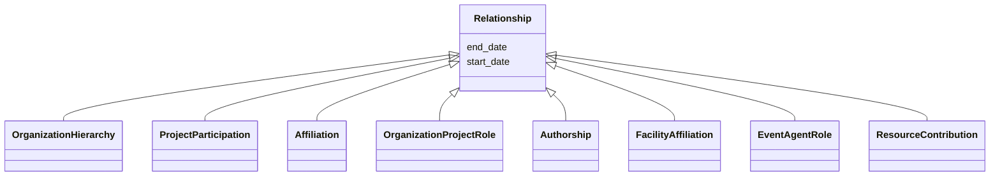

---
search:
  boost: 10.0
---

# Class: Relationship 


_Abstract base for reified relationships that carry their own role or validity metadata. A Relationship is used instead of a direct edge whenever the connection between two entities needs its own metadata: a role and/or a validity interval. Never instantiated directly._


<div data-search-exclude markdown="1">


* __NOTE__: this is an abstract class and should not be instantiated directly


URI: [schema:Role](http://schema.org/Role)





## Inheritance
* **Relationship**
    * [OrganizationHierarchy](../classes/OrganizationHierarchy.md)
    * [ProjectParticipation](../classes/ProjectParticipation.md)
    * [Affiliation](../classes/Affiliation.md)
    * [OrganizationProjectRole](../classes/OrganizationProjectRole.md)
    * [Authorship](../classes/Authorship.md)
    * [FacilityAffiliation](../classes/FacilityAffiliation.md)
    * [EventAgentRole](../classes/EventAgentRole.md)
    * [ResourceContribution](../classes/ResourceContribution.md)


## Class Properties

| Property | Value |
| --- | --- |
| Class URI | [schema:Role](http://schema.org/Role) |


## Slots

| Name | Cardinality and Range | Description | Inheritance |
| ---  | --- | --- | --- |
| [start_date](../slots/start_date.md) | <span title="Optional: at most one value">0..1</span> <br/> [Date](../types/Date.md) | <span title="Start of the event, of the project's runtime, or of a relationship's validity, such as when participation, affiliation, maintenance responsibility or formal containment began.">Start of the event, of the project's runtime, or of a relationship's validity...</span> | direct |
| [end_date](../slots/end_date.md) | <span title="Optional: at most one value">0..1</span> <br/> [Date](../types/Date.md) | <span title="End of the event, project runtime or relationship. Omit for ongoing relationships and open-ended projects.">End of the event, project runtime or relationship</span> | direct |


## Identifier and Mapping Information


### Schema Source


* from schema: https://idhi_placeholder/linkml/idhi


## Mappings

| Mapping Type | Mapped Value |
| ---  | ---  |
| self | schema:Role |
| native | idhi:Relationship |


## LinkML Source

### Direct

<details>
```yaml
name: Relationship
description: 'Abstract base for reified relationships that carry their own role or
  validity metadata. A Relationship is used instead of a direct edge whenever the
  connection between two entities needs its own metadata: a role and/or a validity
  interval. Never instantiated directly.'
from_schema: https://idhi_placeholder/linkml/idhi
abstract: true
slots:
- start_date
- end_date
class_uri: schema:Role

```
</details>

### Induced

<details>
```yaml
name: Relationship
description: 'Abstract base for reified relationships that carry their own role or
  validity metadata. A Relationship is used instead of a direct edge whenever the
  connection between two entities needs its own metadata: a role and/or a validity
  interval. Never instantiated directly.'
from_schema: https://idhi_placeholder/linkml/idhi
abstract: true
attributes:
  start_date:
    name: start_date
    description: Start of the event, of the project's runtime, or of a relationship's
      validity, such as when participation, affiliation, maintenance responsibility
      or formal containment began.
    from_schema: https://idhi_placeholder/linkml/idhi
    rank: 1000
    slot_uri: schema:startDate
    owner: Relationship
    domain_of:
    - Project
    - Event
    - Relationship
    - Funding
    range: date
  end_date:
    name: end_date
    description: End of the event, project runtime or relationship. Omit for ongoing
      relationships and open-ended projects.
    from_schema: https://idhi_placeholder/linkml/idhi
    rank: 1000
    slot_uri: schema:endDate
    owner: Relationship
    domain_of:
    - Project
    - Event
    - Relationship
    - Funding
    range: date
class_uri: schema:Role

```
</details></div>