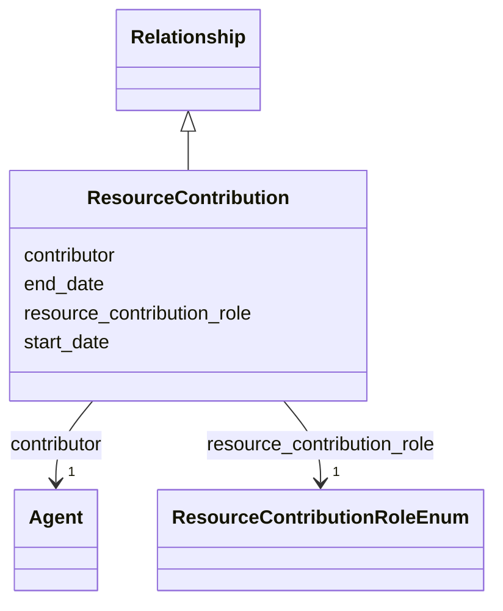

---
search:
  boost: 10.0
---

# Class: ResourceContribution 


_A person or organization contributing to the containing Tool or Dataset in a defined capacity, with optional dates for time-bounded responsibility. Use in Tool.resource_contributions or Dataset.resource_contributions for creation, software development, maintenance, data curation or other named contributions; use publisher where supported for formal publication responsibility and Project.project_participations for project-level work._


<div data-search-exclude markdown="1">


URI: [schema:Role](http://schema.org/Role)





## Inheritance
* [Relationship](../classes/Relationship.md)
    * **ResourceContribution**


## Class Properties

| Property | Value |
| --- | --- |
| Class URI | [schema:Role](http://schema.org/Role) |


## Slots

| Name | Cardinality and Range | Description | Inheritance |
| ---  | --- | --- | --- |
| [contributor](../slots/contributor.md) | <span title="Required: exactly one value">1</span> <br/> [Agent](../classes/Agent.md) | <span title="The person or organization contributing to the containing Tool or Dataset (by IDHI URN). Use only in resource_contributions; do not duplicate the relationship on the Agent.">The person or organization contributing to the containing Tool or Dataset (by...</span> | direct |
| [resource_contribution_role](../slots/resource_contribution_role.md) | <span title="Required: exactly one value">1</span> <br/> [ResourceContributionRoleEnum](../enums/ResourceContributionRoleEnum.md) | <span title="The contributor's responsibility for the containing Tool or Dataset. Choose the most specific applicable role and create separate relationships when one contributor has materially distinct responsibilities.">The contributor's responsibility for the containing Tool or Dataset</span> | direct |
| [start_date](../slots/start_date.md) | <span title="Optional: at most one value">0..1</span> <br/> [Date](../types/Date.md) | <span title="Start of the event, of the project's runtime, or of a relationship's validity, such as when participation, affiliation, maintenance responsibility or formal containment began.">Start of the event, of the project's runtime, or of a relationship's validity...</span> | [Relationship](../classes/Relationship.md) |
| [end_date](../slots/end_date.md) | <span title="Optional: at most one value">0..1</span> <br/> [Date](../types/Date.md) | <span title="End of the event, project runtime or relationship. Omit for ongoing relationships and open-ended projects.">End of the event, project runtime or relationship</span> | [Relationship](../classes/Relationship.md) |


## Usages

| used by | used in | type | used |
| ---  | --- | --- | --- |
| [Tool](../classes/Tool.md) | [resource_contributions](../slots/resource_contributions.md) | range | [ResourceContribution](../classes/ResourceContribution.md) |
| [Dataset](../classes/Dataset.md) | [resource_contributions](../slots/resource_contributions.md) | range | [ResourceContribution](../classes/ResourceContribution.md) |


## Identifier and Mapping Information


### Schema Source


* from schema: https://idhi_placeholder/linkml/idhi


## Mappings

| Mapping Type | Mapped Value |
| ---  | ---  |
| self | schema:Role |
| native | idhi:ResourceContribution |


## LinkML Source

### Direct

<details>
```yaml
name: ResourceContribution
description: A person or organization contributing to the containing Tool or Dataset
  in a defined capacity, with optional dates for time-bounded responsibility. Use
  in Tool.resource_contributions or Dataset.resource_contributions for creation, software
  development, maintenance, data curation or other named contributions; use publisher
  where supported for formal publication responsibility and Project.project_participations
  for project-level work.
from_schema: https://idhi_placeholder/linkml/idhi
is_a: Relationship
slots:
- contributor
- resource_contribution_role
class_uri: schema:Role

```
</details>

### Induced

<details>
```yaml
name: ResourceContribution
description: A person or organization contributing to the containing Tool or Dataset
  in a defined capacity, with optional dates for time-bounded responsibility. Use
  in Tool.resource_contributions or Dataset.resource_contributions for creation, software
  development, maintenance, data curation or other named contributions; use publisher
  where supported for formal publication responsibility and Project.project_participations
  for project-level work.
from_schema: https://idhi_placeholder/linkml/idhi
is_a: Relationship
attributes:
  contributor:
    name: contributor
    description: The person or organization contributing to the containing Tool or
      Dataset (by IDHI URN). Use only in resource_contributions; do not duplicate
      the relationship on the Agent.
    from_schema: https://idhi_placeholder/linkml/idhi
    rank: 1000
    slot_uri: dcterms:contributor
    owner: ResourceContribution
    domain_of:
    - ResourceContribution
    range: Agent
    required: true
  resource_contribution_role:
    name: resource_contribution_role
    description: The contributor's responsibility for the containing Tool or Dataset.
      Choose the most specific applicable role and create separate relationships when
      one contributor has materially distinct responsibilities.
    from_schema: https://idhi_placeholder/linkml/idhi
    rank: 1000
    slot_uri: schema:roleName
    owner: ResourceContribution
    domain_of:
    - ResourceContribution
    range: ResourceContributionRoleEnum
    required: true
  start_date:
    name: start_date
    description: Start of the event, of the project's runtime, or of a relationship's
      validity, such as when participation, affiliation, maintenance responsibility
      or formal containment began.
    from_schema: https://idhi_placeholder/linkml/idhi
    rank: 1000
    slot_uri: schema:startDate
    owner: ResourceContribution
    domain_of:
    - Project
    - Event
    - Relationship
    - Funding
    range: date
  end_date:
    name: end_date
    description: End of the event, project runtime or relationship. Omit for ongoing
      relationships and open-ended projects.
    from_schema: https://idhi_placeholder/linkml/idhi
    rank: 1000
    slot_uri: schema:endDate
    owner: ResourceContribution
    domain_of:
    - Project
    - Event
    - Relationship
    - Funding
    range: date
class_uri: schema:Role

```
</details></div>