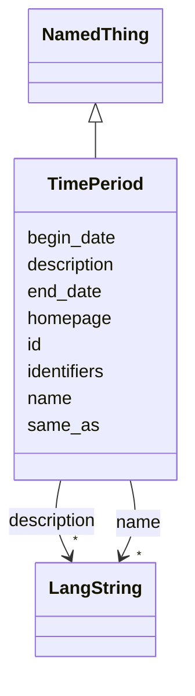

---
search:
  boost: 10.0
---

# Class: TimePeriod 


_A time span (EDM TimeSpan). Deliberately reused for two purposes: a project's runtime (project_period) and historical periods studied by a project (studied_periods), e.g. "Second Temple period". For historical periods, prefer linking same_as to a PeriodO or Wikidata URI._


<div data-search-exclude markdown="1">


URI: [edm:TimeSpan](http://www.europeana.eu/schemas/edm/TimeSpan)





## Inheritance
* [NamedThing](../classes/NamedThing.md)
    * **TimePeriod**


## Class Properties

| Property | Value |
| --- | --- |
| Class URI | [edm:TimeSpan](http://www.europeana.eu/schemas/edm/TimeSpan) |


## Slots

| Name | Cardinality and Range | Description | Inheritance |
| ---  | --- | --- | --- |
| [begin_date](../slots/begin_date.md) | 0..1 <br/> [String](../types/String.md) | Start of the time span | direct |
| [end_date](../slots/end_date.md) | 0..1 <br/> [Date](../types/Date.md) | End of the event, relationship or time period | direct |
| [id](../slots/id.md) | 1 <br/> [String](../types/String.md) | The entity's primary identifier: an IDHI URN of the form | [NamedThing](../classes/NamedThing.md) |
| [name](../slots/name.md) | * <br/> [LangString](../classes/LangString.md) | Multilingual name/title | [NamedThing](../classes/NamedThing.md) |
| [description](../slots/description.md) | * <br/> [LangString](../classes/LangString.md) | Multilingual free-text description (a few sentences aimed at index visitors, ... | [NamedThing](../classes/NamedThing.md) |
| [homepage](../slots/homepage.md) | 0..1 <br/> [Uri](../types/Uri.md) | Public landing page of the entity, if one exists | [NamedThing](../classes/NamedThing.md) |
| [identifiers](../slots/identifiers.md) | * <br/> [Uriorcurie](../types/Uriorcurie.md) | Additional EXTERNAL identifiers beyond the primary IDHI URN and the dedicated... | [NamedThing](../classes/NamedThing.md) |
| [same_as](../slots/same_as.md) | * <br/> [Uri](../types/Uri.md) | URIs of records in OTHER systems describing the same real-world entity (Wikid... | [NamedThing](../classes/NamedThing.md) |


## Usages

| used by | used in | type | used |
| ---  | --- | --- | --- |
| [Project](../classes/Project.md) | [project_period](../slots/project_period.md) | range | [TimePeriod](../classes/TimePeriod.md) |
| [Project](../classes/Project.md) | [studied_periods](../slots/studied_periods.md) | range | [TimePeriod](../classes/TimePeriod.md) |
| [IndexContainer](../classes/IndexContainer.md) | [time_periods](../slots/time_periods.md) | range | [TimePeriod](../classes/TimePeriod.md) |


## Identifier and Mapping Information


### Schema Source


* from schema: https://idhi.co.il/linkml/idhi


## Mappings

| Mapping Type | Mapped Value |
| ---  | ---  |
| self | edm:TimeSpan |
| native | idhi:TimePeriod |


## LinkML Source

<!-- TODO: investigate https://stackoverflow.com/questions/37606292/how-to-create-tabbed-code-blocks-in-mkdocs-or-sphinx -->

### Direct

<details>
```yaml
name: TimePeriod
description: 'A time span (EDM TimeSpan). Deliberately reused for two purposes: a
  project''s runtime (project_period) and historical periods studied by a project
  (studied_periods), e.g. "Second Temple period". For historical periods, prefer linking
  same_as to a PeriodO or Wikidata URI.'
from_schema: https://idhi.co.il/linkml/idhi
is_a: NamedThing
slots:
- begin_date
- end_date
slot_usage:
  id:
    name: id
    structured_pattern:
      syntax: ^idhi:time_period:{shortid}$
      interpolated: true
class_uri: edm:TimeSpan

```
</details>

### Induced

<details>
```yaml
name: TimePeriod
description: 'A time span (EDM TimeSpan). Deliberately reused for two purposes: a
  project''s runtime (project_period) and historical periods studied by a project
  (studied_periods), e.g. "Second Temple period". For historical periods, prefer linking
  same_as to a PeriodO or Wikidata URI.'
from_schema: https://idhi.co.il/linkml/idhi
is_a: NamedThing
slot_usage:
  id:
    name: id
    structured_pattern:
      syntax: ^idhi:time_period:{shortid}$
      interpolated: true
attributes:
  begin_date:
    name: begin_date
    description: 'Start of the time span. A string (not date) on purpose: historical
      periods need values like "-0100" or "circa 1500". Prefer ISO 8601 / EDTF where
      possible.'
    from_schema: https://idhi.co.il/linkml/idhi
    rank: 1000
    slot_uri: edm:begin
    owner: TimePeriod
    domain_of:
    - TimePeriod
    range: string
  end_date:
    name: end_date
    description: End of the event, relationship or time period. Omit for ongoing relationships
      and open-ended periods.
    from_schema: https://idhi.co.il/linkml/idhi
    rank: 1000
    slot_uri: schema:endDate
    owner: TimePeriod
    domain_of:
    - Event
    - TimePeriod
    - Relationship
    range: date
  id:
    name: id
    description: "The entity's primary identifier: an IDHI URN of the form\n  idhi:<class\
      \ name>:<random short alphanumeric id>\ne.g. idhi:person:x7k2m9 or idhi:project:a83bq1.\
      \ Minted by IDHI at record creation and never reused or changed. The class token\
      \ is the lowercase snake_case class name (Organization subclasses use \"organization\"\
      ); each concrete class enforces its own token via slot_usage. External identifiers\
      \ (ORCID, ROR, DOI...) are supplementary and go in their dedicated slots — never\
      \ here."
    from_schema: https://idhi.co.il/linkml/idhi
    rank: 1000
    slot_uri: dcterms:identifier
    identifier: true
    owner: TimePeriod
    domain_of:
    - NamedThing
    range: string
    required: true
    pattern: ^idhi:[a-z_]+:[0-9a-z]{4,12}$
    structured_pattern:
      syntax: ^idhi:time_period:{shortid}$
      interpolated: true
  name:
    name: name
    description: Multilingual name/title. Provide at least one language; English,
      Hebrew and Arabic variants are each a separate LangString. Preferably a sortable
      name (e.g. "Smith, John" rather than "John Smith") for people and organizations;
      for projects, tools and services, use the name the team itself uses.
    from_schema: https://idhi.co.il/linkml/idhi
    rank: 1000
    slot_uri: skos:prefLabel
    owner: TimePeriod
    domain_of:
    - NamedThing
    range: LangString
    multivalued: true
    inlined: true
    inlined_as_list: true
  description:
    name: description
    description: Multilingual free-text description (a few sentences aimed at index
      visitors, not internal notes).
    from_schema: https://idhi.co.il/linkml/idhi
    rank: 1000
    slot_uri: dcterms:description
    owner: TimePeriod
    domain_of:
    - NamedThing
    range: LangString
    multivalued: true
    inlined: true
    inlined_as_list: true
  homepage:
    name: homepage
    description: Public landing page of the entity, if one exists.
    from_schema: https://idhi.co.il/linkml/idhi
    rank: 1000
    slot_uri: foaf:homepage
    owner: TimePeriod
    domain_of:
    - NamedThing
    range: uri
  identifiers:
    name: identifiers
    description: Additional EXTERNAL identifiers beyond the primary IDHI URN and the
      dedicated ORCID/ROR/DOI slots, as CURIEs/URIs (e.g. Wikidata QIDs, VIAF, ISNI).
    from_schema: https://idhi.co.il/linkml/idhi
    rank: 1000
    slot_uri: dcterms:identifier
    owner: TimePeriod
    domain_of:
    - NamedThing
    range: uriorcurie
    multivalued: true
  same_as:
    name: same_as
    description: URIs of records in OTHER systems describing the same real-world entity
      (Wikidata, PeriodO, GeoNames...). Use for linked-data alignment, not for the
      entity's own pages (use homepage).
    from_schema: https://idhi.co.il/linkml/idhi
    rank: 1000
    slot_uri: schema:sameAs
    owner: TimePeriod
    domain_of:
    - NamedThing
    range: uri
    multivalued: true
class_uri: edm:TimeSpan

```
</details></div>