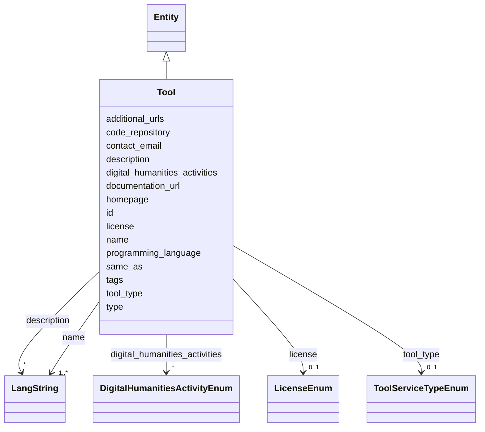

---
search:
  boost: 10.0
---

# Class: Tool 


_A reusable software tool, typically produced by a project. Use Tool for software that others can install, run or call; for a human-mediated offering use Service instead._


<div data-search-exclude markdown="1">


URI: [schema:SoftwareApplication](http://schema.org/SoftwareApplication)





## Inheritance
* [Entity](../classes/Entity.md)
    * **Tool**


## Class Properties

| Property | Value |
| --- | --- |
| Class URI | [schema:SoftwareApplication](http://schema.org/SoftwareApplication) |


## Slots

| Name | Cardinality and Range | Description | Inheritance |
| ---  | --- | --- | --- |
| [name](../slots/name.md) | <span title="Required: one or more values">1..*</span> <br/> [LangString](../classes/LangString.md) | <span title="Multilingual name/title. Provide at least one language; English, Hebrew and Arabic variants are each a separate LangString. Preferably a sortable name for organizations; for projects, tools and services, use the name the team itself uses.">Multilingual name/title</span> | direct |
| [tool_type](../slots/tool_type.md) | <span title="Optional: at most one value">0..1</span> <br/> [ToolServiceTypeEnum](../enums/ToolServiceTypeEnum.md) | <span title="The delivery form of the tool (web app, library, CLI...). Pick the single value describing how users primarily consume it.">The delivery form of the tool (web app, library, CLI</span> | direct |
| [code_repository](../slots/code_repository.md) | <span title="Optional: at most one value">0..1</span> <br/> [Uri](../types/Uri.md) | <span title="Source-code repository URL (GitHub, GitLab...), if open.">Source-code repository URL (GitHub, GitLab</span> | direct |
| [programming_language](../slots/programming_language.md) | <span title="Optional: at most one value">0..1</span> <br/> [String](../types/String.md) | <span title="Main implementation language(s), comma-free single value preferred.">Main implementation language(s), comma-free single value preferred</span> | direct |
| [license](../slots/license.md) | <span title="Optional: at most one value">0..1</span> <br/> [LicenseEnum](../enums/LicenseEnum.md) | <span title="The license under which the tool or dataset is released. Required for anything advertised as reusable; omit only if genuinely unknown.">The license under which the tool or dataset is released</span> | direct |
| [documentation_url](../slots/documentation_url.md) | <span title="Optional: at most one value">0..1</span> <br/> [Uri](../types/Uri.md) | <span title="User or developer documentation for the tool or service (manual, wiki, API reference).">User or developer documentation for the tool or service (manual, wiki, API re...</span> | direct |
| [additional_urls](../slots/additional_urls.md) | <span title="Optional: zero or more values allowed">*</span> <br/> [Uri](../types/Uri.md) | <span title="Further relevant web pages beyond the homepage (blog, social-media profile, registry entry, press coverage...). For records describing the same entity in other systems use same_as instead.">Further relevant web pages beyond the homepage (blog, social-media profile, r...</span> | direct |
| [contact_email](../slots/contact_email.md) | <span title="Optional: at most one value">0..1</span> <br/> [String](../types/String.md) | <span title="A published contact address for the entity (office, team or service-desk mailbox). For a person's own addresses use 'emails'.">A published contact address for the entity (office, team or service-desk mail...</span> | direct |
| [digital_humanities_activities](../slots/digital_humanities_activities.md) | <span title="Optional: zero or more values allowed">*</span> <br/> [DigitalHumanitiesActivityEnum](../enums/DigitalHumanitiesActivityEnum.md) | <span title="Digital-humanities research activities practiced in this project, tool or service. Prefer the most specific applicable activity; multiple values are expected. This is the primary DH-facet for discovery.">Digital-humanities research activities practiced in this project, tool or ser...</span> | direct |
| [type](../slots/type.md) | <span title="Required: exactly one value">1</span> <br/> [Curie](../types/Curie.md) | <span title="Discriminator identifying the record's class; used for polymorphic serialization and deserialization.">Discriminator identifying the record's class; used for polymorphic serializat...</span> | [Entity](../classes/Entity.md) |
| [id](../slots/id.md) | <span title="Required: exactly one value">1</span> <br/> [String](../types/String.md) | <span title="The entity's primary identifier: an IDHI URN of the form&#10;  idhi:&lt;class name>:&lt;random short alphanumeric id>&#10;e.g. idhi:person:x7k2m9 or idhi:project:a83bq1. Minted by IDHI at record creation and never reused or changed. The class token is the lowercase snake_case class name; each concrete class enforces its own token via slot_usage. External identifiers (ORCID, ROR, DOI...) are supplementary and go in their dedicated slots — never here.">The entity's primary identifier: an IDHI URN of the form</span> | [Entity](../classes/Entity.md) |
| [description](../slots/description.md) | <span title="Optional: zero or more values allowed">*</span> <br/> [LangString](../classes/LangString.md) | <span title="Multilingual free-text description (a few sentences aimed at index visitors, not internal notes).">Multilingual free-text description (a few sentences aimed at index visitors, ...</span> | [Entity](../classes/Entity.md) |
| [homepage](../slots/homepage.md) | <span title="Optional: at most one value">0..1</span> <br/> [Uri](../types/Uri.md) | <span title="Public landing page of the entity, if one exists.">Public landing page of the entity, if one exists</span> | [Entity](../classes/Entity.md) |
| [same_as](../slots/same_as.md) | <span title="Optional: zero or more values allowed">*</span> <br/> [Uri](../types/Uri.md) | <span title="URIs of records in OTHER systems describing the same real-world entity (Wikidata, PeriodO, GeoNames...). Use for linked-data alignment, not for the entity's own pages (use homepage).">URIs of records in OTHER systems describing the same real-world entity (Wikid...</span> | [Entity](../classes/Entity.md) |
| [tags](../slots/tags.md) | <span title="Optional: zero or more values allowed">*</span> <br/> [String](../types/String.md) | <span title="Free-text tags for discovery, filtering and grouping; usable on any top-level entity. Deliberately NOT a controlled enum, but prefer wording that matches a concept in an established ontology or thesaurus (e.g. Wikidata, Getty AAT, TaDiRAH) so tags can later be reconciled against it.">Free-text tags for discovery, filtering and grouping; usable on any top-level...</span> | [Entity](../classes/Entity.md) |


## Usages

| used by | used in | type | used |
| ---  | --- | --- | --- |
| [Facility](../classes/Facility.md) | [tools_provided](../slots/tools_provided.md) | range | [Tool](../classes/Tool.md) |
| [Project](../classes/Project.md) | [outputs_tools](../slots/outputs_tools.md) | range | [Tool](../classes/Tool.md) |
| [IndexContainer](../classes/IndexContainer.md) | [tools](../slots/tools.md) | range | [Tool](../classes/Tool.md) |


## In Subsets


* [ToplevelEntity](../subsets/ToplevelEntity.md)


## Identifier and Mapping Information


### Schema Source


* from schema: https://idhi_placeholder/linkml/idhi


## Mappings

| Mapping Type | Mapped Value |
| ---  | ---  |
| self | schema:SoftwareApplication |
| native | idhi:Tool |


## LinkML Source

### Direct

<details>
```yaml
name: Tool
description: A reusable software tool, typically produced by a project. Use Tool for
  software that others can install, run or call; for a human-mediated offering use
  Service instead.
in_subset:
- toplevel_entity
from_schema: https://idhi_placeholder/linkml/idhi
is_a: Entity
slots:
- name
- tool_type
- code_repository
- programming_language
- license
- documentation_url
- additional_urls
- contact_email
- digital_humanities_activities
slot_usage:
  type:
    name: type
    equals_string: idhi:Tool
  id:
    name: id
    structured_pattern:
      syntax: ^idhi:tool:{shortid}$
      interpolated: true
class_uri: schema:SoftwareApplication

```
</details>

### Induced

<details>
```yaml
name: Tool
description: A reusable software tool, typically produced by a project. Use Tool for
  software that others can install, run or call; for a human-mediated offering use
  Service instead.
in_subset:
- toplevel_entity
from_schema: https://idhi_placeholder/linkml/idhi
is_a: Entity
slot_usage:
  type:
    name: type
    equals_string: idhi:Tool
  id:
    name: id
    structured_pattern:
      syntax: ^idhi:tool:{shortid}$
      interpolated: true
attributes:
  name:
    name: name
    description: Multilingual name/title. Provide at least one language; English,
      Hebrew and Arabic variants are each a separate LangString. Preferably a sortable
      name for organizations; for projects, tools and services, use the name the team
      itself uses.
    from_schema: https://idhi_placeholder/linkml/idhi
    rank: 1000
    slot_uri: skos:prefLabel
    owner: Tool
    domain_of:
    - Organization
    - Facility
    - Project
    - Tool
    - Service
    - Publication
    - Event
    - Dataset
    range: LangString
    multivalued: true
    inlined: true
    inlined_as_list: true
    minimum_cardinality: 1
  tool_type:
    name: tool_type
    description: The delivery form of the tool (web app, library, CLI...). Pick the
      single value describing how users primarily consume it.
    from_schema: https://idhi_placeholder/linkml/idhi
    rank: 1000
    slot_uri: schema:applicationCategory
    owner: Tool
    domain_of:
    - Tool
    range: ToolServiceTypeEnum
  code_repository:
    name: code_repository
    description: Source-code repository URL (GitHub, GitLab...), if open.
    from_schema: https://idhi_placeholder/linkml/idhi
    rank: 1000
    slot_uri: schema:codeRepository
    owner: Tool
    domain_of:
    - Tool
    range: uri
  programming_language:
    name: programming_language
    description: Main implementation language(s), comma-free single value preferred.
    from_schema: https://idhi_placeholder/linkml/idhi
    rank: 1000
    slot_uri: schema:programmingLanguage
    owner: Tool
    domain_of:
    - Tool
    range: string
  license:
    name: license
    description: The license under which the tool or dataset is released. Required
      for anything advertised as reusable; omit only if genuinely unknown.
    from_schema: https://idhi_placeholder/linkml/idhi
    rank: 1000
    slot_uri: dcterms:license
    owner: Tool
    domain_of:
    - Tool
    - Dataset
    range: LicenseEnum
  documentation_url:
    name: documentation_url
    description: User or developer documentation for the tool or service (manual,
      wiki, API reference).
    from_schema: https://idhi_placeholder/linkml/idhi
    rank: 1000
    slot_uri: schema:softwareHelp
    owner: Tool
    domain_of:
    - Tool
    - Service
    range: uri
  additional_urls:
    name: additional_urls
    description: Further relevant web pages beyond the homepage (blog, social-media
      profile, registry entry, press coverage...). For records describing the same
      entity in other systems use same_as instead.
    from_schema: https://idhi_placeholder/linkml/idhi
    rank: 1000
    slot_uri: foaf:page
    owner: Tool
    domain_of:
    - Organization
    - Facility
    - Project
    - Tool
    - Service
    - Event
    range: uri
    multivalued: true
  contact_email:
    name: contact_email
    description: A published contact address for the entity (office, team or service-desk
      mailbox). For a person's own addresses use 'emails'.
    from_schema: https://idhi_placeholder/linkml/idhi
    rank: 1000
    slot_uri: schema:email
    owner: Tool
    domain_of:
    - Organization
    - Facility
    - Project
    - Tool
    - Service
    - Event
    range: string
  digital_humanities_activities:
    name: digital_humanities_activities
    description: Digital-humanities research activities practiced in this project,
      tool or service. Prefer the most specific applicable activity; multiple values
      are expected. This is the primary DH-facet for discovery.
    from_schema: https://idhi_placeholder/linkml/idhi
    rank: 1000
    slot_uri: dcterms:subject
    owner: Tool
    domain_of:
    - Project
    - Tool
    - Service
    range: DigitalHumanitiesActivityEnum
    multivalued: true
  type:
    name: type
    description: Discriminator identifying the record's class; used for polymorphic
      serialization and deserialization.
    from_schema: https://idhi_placeholder/linkml/idhi
    rank: 1000
    slot_uri: rdf:type
    owner: Tool
    domain_of:
    - Entity
    range: curie
    required: true
    equals_string: idhi:Tool
  id:
    name: id
    description: "The entity's primary identifier: an IDHI URN of the form\n  idhi:<class\
      \ name>:<random short alphanumeric id>\ne.g. idhi:person:x7k2m9 or idhi:project:a83bq1.\
      \ Minted by IDHI at record creation and never reused or changed. The class token\
      \ is the lowercase snake_case class name; each concrete class enforces its own\
      \ token via slot_usage. External identifiers (ORCID, ROR, DOI...) are supplementary\
      \ and go in their dedicated slots — never here."
    from_schema: https://idhi_placeholder/linkml/idhi
    rank: 1000
    slot_uri: dcterms:identifier
    identifier: true
    owner: Tool
    domain_of:
    - Entity
    range: string
    required: true
    pattern: ^idhi:[a-z_]+:[0-9a-z]{4,12}$
    structured_pattern:
      syntax: ^idhi:tool:{shortid}$
      interpolated: true
  description:
    name: description
    description: Multilingual free-text description (a few sentences aimed at index
      visitors, not internal notes).
    from_schema: https://idhi_placeholder/linkml/idhi
    rank: 1000
    slot_uri: dcterms:description
    owner: Tool
    domain_of:
    - Entity
    range: LangString
    multivalued: true
    inlined: true
    inlined_as_list: true
  homepage:
    name: homepage
    description: Public landing page of the entity, if one exists.
    from_schema: https://idhi_placeholder/linkml/idhi
    rank: 1000
    slot_uri: foaf:homepage
    owner: Tool
    domain_of:
    - Entity
    range: uri
  same_as:
    name: same_as
    description: URIs of records in OTHER systems describing the same real-world entity
      (Wikidata, PeriodO, GeoNames...). Use for linked-data alignment, not for the
      entity's own pages (use homepage).
    from_schema: https://idhi_placeholder/linkml/idhi
    rank: 1000
    slot_uri: schema:sameAs
    owner: Tool
    domain_of:
    - Entity
    range: uri
    multivalued: true
  tags:
    name: tags
    description: Free-text tags for discovery, filtering and grouping; usable on any
      top-level entity. Deliberately NOT a controlled enum, but prefer wording that
      matches a concept in an established ontology or thesaurus (e.g. Wikidata, Getty
      AAT, TaDiRAH) so tags can later be reconciled against it.
    from_schema: https://idhi_placeholder/linkml/idhi
    rank: 1000
    slot_uri: dcat:keyword
    owner: Tool
    domain_of:
    - Entity
    range: string
    multivalued: true
class_uri: schema:SoftwareApplication

```
</details></div>