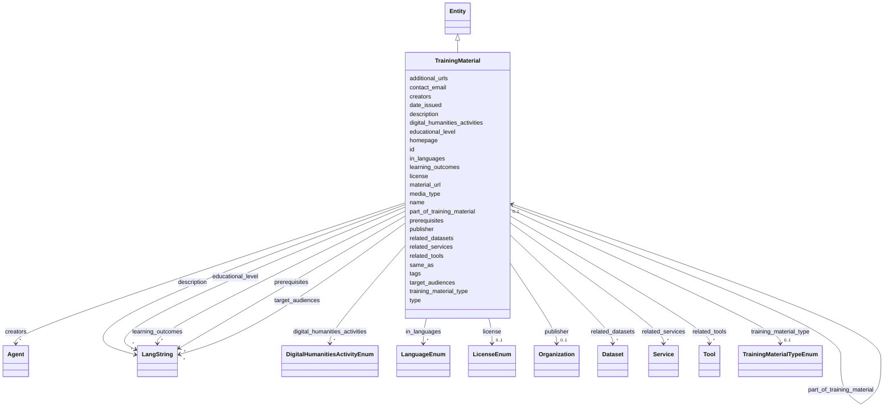

---
search:
  boost: 10.0
---

# Class: TrainingMaterial 


_A tutorial, lesson or other didactic resource that explains how to perform an action or states learning outcomes gained by using it. Use TrainingMaterial for resources intended to teach; use Publication for scholarly communication and Tool for software that performs the action itself._


<div data-search-exclude markdown="1">


URI: [schema:LearningResource](http://schema.org/LearningResource)





## Inheritance
* [Entity](../classes/Entity.md)
    * **TrainingMaterial**


## Class Properties

| Property | Value |
| --- | --- |
| Class URI | [schema:LearningResource](http://schema.org/LearningResource) |


## Slots

| Name | Cardinality and Range | Description | Inheritance |
| ---  | --- | --- | --- |
| [name](../slots/name.md) | <span title="Required: exactly one value">1</span> <br/> [String](../types/String.md) | <span title="The single name or title used to identify the entity. Use one plain-text value only; do not use LangString or provide translated variants. Prefer a sortable name for organizations; for projects, tools and services, use the name the team itself uses.">The single name or title used to identify the entity</span> | direct |
| [training_material_type](../slots/training_material_type.md) | <span title="Optional: at most one value">0..1</span> <br/> [TrainingMaterialTypeEnum](../enums/TrainingMaterialTypeEnum.md) | <span title="The material's primary didactic form. Choose the single value that best describes how learners engage with it, not its file format.">The material's primary didactic form</span> | direct |
| [creators](../slots/creators.md) | <span title="Optional: zero or more values allowed">*</span> <br/> [Agent](../classes/Agent.md) | <span title="People or organizations responsible for creating the training material (by IDHI URN). Use publisher for the organization that formally releases it when that differs from its creators.">People or organizations responsible for creating the training material (by ID...</span> | direct |
| [publisher](../slots/publisher.md) | <span title="Optional: at most one value">0..1</span> <br/> [Organization](../classes/Organization.md) | <span title="The organization formally publishing the dataset, publication or training material (by IDHI URN); use creators for responsibility for making a training material.">The organization formally publishing the dataset, publication or training mat...</span> | direct |
| [learning_outcomes](../slots/learning_outcomes.md) | <span title="Optional: zero or more values allowed">*</span> <br/> [LangString](../classes/LangString.md) | <span title="Knowledge or skills a learner should gain by completing the material, as multilingual statements. Use one entry per distinct outcome; do not use this for prerequisites.">Knowledge or skills a learner should gain by completing the material, as mult...</span> | direct |
| [target_audiences](../slots/target_audiences.md) | <span title="Optional: zero or more values allowed">*</span> <br/> [LangString](../classes/LangString.md) | <span title="Intended learner groups, as multilingual labels such as researchers, librarians or students. Use educational_level separately for the expected level of study or expertise.">Intended learner groups, as multilingual labels such as researchers, libraria...</span> | direct |
| [prerequisites](../slots/prerequisites.md) | <span title="Optional: zero or more values allowed">*</span> <br/> [LangString](../classes/LangString.md) | <span title="Knowledge, skills, software or prior material learners should have before starting, expressed as multilingual text. Omit when no prerequisites apply.">Knowledge, skills, software or prior material learners should have before sta...</span> | direct |
| [educational_level](../slots/educational_level.md) | <span title="Optional: zero or more values allowed">*</span> <br/> [LangString](../classes/LangString.md) | <span title="Expected learner level, as multilingual text such as beginner, intermediate or graduate. Use target_audiences for who the material serves rather than their proficiency.">Expected learner level, as multilingual text such as beginner, intermediate o...</span> | direct |
| [in_languages](../slots/in_languages.md) | <span title="Optional: zero or more values allowed">*</span> <br/> [LanguageEnum](../enums/LanguageEnum.md) | <span title="Languages in which the instructional content is available. Record every complete language version; do not include a language used only in captions or examples.">Languages in which the instructional content is available</span> | direct |
| [material_url](../slots/material_url.md) | <span title="Optional: at most one value">0..1</span> <br/> [Uri](../types/Uri.md) | <span title="Direct landing or access URL for the instructional resource. Use homepage for a broader site about the material and material_url for the resource learners open.">Direct landing or access URL for the instructional resource</span> | direct |
| [media_type](../slots/media_type.md) | <span title="Optional: at most one value">0..1</span> <br/> [String](../types/String.md) | <span title="Technical media type of the primary resource, preferably an IANA media type such as text/html, application/pdf or video/mp4. Do not use this for the didactic form; use training_material_type instead.">Technical media type of the primary resource, preferably an IANA media type s...</span> | direct |
| [license](../slots/license.md) | <span title="Optional: at most one value">0..1</span> <br/> [LicenseEnum](../enums/LicenseEnum.md) | <span title="The license under which the tool, dataset or training material is released. Required for anything advertised as reusable; omit only if genuinely unknown.">The license under which the tool, dataset or training material is released</span> | direct |
| [date_issued](../slots/date_issued.md) | <span title="Optional: at most one value">0..1</span> <br/> [Date](../types/Date.md) | <span title="Formal publication date (or year-01-01 if only the year is known).">Formal publication date (or year-01-01 if only the year is known)</span> | direct |
| [digital_humanities_activities](../slots/digital_humanities_activities.md) | <span title="Optional: zero or more values allowed">*</span> <br/> [DigitalHumanitiesActivityEnum](../enums/DigitalHumanitiesActivityEnum.md) | <span title="Digital-humanities research activities practiced in this project, tool or service, or taught by this training material. Prefer the most specific applicable activity; multiple values are expected. This is the primary DH-facet for discovery.">Digital-humanities research activities practiced in this project, tool or ser...</span> | direct |
| [related_tools](../slots/related_tools.md) | <span title="Optional: zero or more values allowed">*</span> <br/> [Tool](../classes/Tool.md) | <span title="Tools whose use the material teaches or demonstrates (by IDHI URN). Do not use this merely for software used to produce the material.">Tools whose use the material teaches or demonstrates (by IDHI URN)</span> | direct |
| [related_services](../slots/related_services.md) | <span title="Optional: zero or more values allowed">*</span> <br/> [Service](../classes/Service.md) | <span title="Services that the material explains how to access or use (by IDHI URN). Do not use this for the organization publishing the material.">Services that the material explains how to access or use (by IDHI URN)</span> | direct |
| [related_datasets](../slots/related_datasets.md) | <span title="Optional: zero or more values allowed">*</span> <br/> [Dataset](../classes/Dataset.md) | <span title="Datasets used as the subject or worked example of the material (by IDHI URN). Do not use this for incidental source data that learners never encounter.">Datasets used as the subject or worked example of the material (by IDHI URN)</span> | direct |
| [part_of_training_material](../slots/part_of_training_material.md) | <span title="Optional: at most one value">0..1</span> <br/> [TrainingMaterial](../classes/TrainingMaterial.md) | <span title="The larger training material of which this resource is a module or lesson (by IDHI URN). Use only for formal instructional containment, not loose topical similarity.">The larger training material of which this resource is a module or lesson (by...</span> | direct |
| [additional_urls](../slots/additional_urls.md) | <span title="Optional: zero or more values allowed">*</span> <br/> [Uri](../types/Uri.md) | <span title="Further relevant web pages beyond the homepage (blog, social-media profile, registry entry, press coverage...). For records describing the same entity in other systems use same_as instead.">Further relevant web pages beyond the homepage (blog, social-media profile, r...</span> | direct |
| [contact_email](../slots/contact_email.md) | <span title="Optional: at most one value">0..1</span> <br/> [String](../types/String.md) | <span title="A published contact address for the entity (office, team or service-desk mailbox). For a person's own addresses use 'emails'.">A published contact address for the entity (office, team or service-desk mail...</span> | direct |
| [type](../slots/type.md) | <span title="Required: exactly one value">1</span> <br/> [Curie](../types/Curie.md) | <span title="Discriminator identifying the record's class; used for polymorphic serialization and deserialization.">Discriminator identifying the record's class; used for polymorphic serializat...</span> | [Entity](../classes/Entity.md) |
| [id](../slots/id.md) | <span title="Required: exactly one value">1</span> <br/> [String](../types/String.md) | <span title="The entity's primary identifier: an IDHI URN of the form&#10;  idhi:&lt;class name>:&lt;random short alphanumeric id>&#10;e.g. idhi:person:x7k2m9 or idhi:project:a83bq1. Minted by IDHI at record creation and never reused or changed. The class token is the lowercase snake_case class name; each concrete class enforces its own token via slot_usage. External identifiers (ORCID, ROR, DOI...) are supplementary and go in their dedicated slots — never here.">The entity's primary identifier: an IDHI URN of the form</span> | [Entity](../classes/Entity.md) |
| [description](../slots/description.md) | <span title="Optional: zero or more values allowed">*</span> <br/> [LangString](../classes/LangString.md) | <span title="Multilingual free-text description (a few sentences aimed at index visitors, not internal notes).">Multilingual free-text description (a few sentences aimed at index visitors, ...</span> | [Entity](../classes/Entity.md) |
| [homepage](../slots/homepage.md) | <span title="Optional: at most one value">0..1</span> <br/> [Uri](../types/Uri.md) | <span title="Public landing page of the entity, if one exists.">Public landing page of the entity, if one exists</span> | [Entity](../classes/Entity.md) |
| [same_as](../slots/same_as.md) | <span title="Optional: zero or more values allowed">*</span> <br/> [Uri](../types/Uri.md) | <span title="URIs of records in OTHER systems describing the same real-world entity (Wikidata, PeriodO, GeoNames...). Use for linked-data alignment, not for the entity's own pages (use homepage).">URIs of records in OTHER systems describing the same real-world entity (Wikid...</span> | [Entity](../classes/Entity.md) |
| [tags](../slots/tags.md) | <span title="Optional: zero or more values allowed">*</span> <br/> [String](../types/String.md) | <span title="Free-text tags for discovery, filtering and grouping; usable on any top-level entity. Deliberately NOT a controlled enum, but prefer wording that matches a concept in an established ontology or thesaurus (e.g. Wikidata, Getty AAT, TaDiRAH) so tags can later be reconciled against it.">Free-text tags for discovery, filtering and grouping; usable on any top-level...</span> | [Entity](../classes/Entity.md) |


## Usages

| used by | used in | type | used |
| ---  | --- | --- | --- |
| [Project](../classes/Project.md) | [outputs_training_materials](../slots/outputs_training_materials.md) | range | [TrainingMaterial](../classes/TrainingMaterial.md) |
| [TrainingMaterial](../classes/TrainingMaterial.md) | [part_of_training_material](../slots/part_of_training_material.md) | range | [TrainingMaterial](../classes/TrainingMaterial.md) |
| [IndexContainer](../classes/IndexContainer.md) | [training_materials](../slots/training_materials.md) | range | [TrainingMaterial](../classes/TrainingMaterial.md) |


## In Subsets


* [ToplevelEntity](../subsets/ToplevelEntity.md)


## Identifier and Mapping Information


### Schema Source


* from schema: https://idhi_placeholder/linkml/idhi


## Mappings

| Mapping Type | Mapped Value |
| ---  | ---  |
| self | schema:LearningResource |
| native | idhi:TrainingMaterial |


## LinkML Source

### Direct

<details>
```yaml
name: TrainingMaterial
description: A tutorial, lesson or other didactic resource that explains how to perform
  an action or states learning outcomes gained by using it. Use TrainingMaterial for
  resources intended to teach; use Publication for scholarly communication and Tool
  for software that performs the action itself.
in_subset:
- toplevel_entity
from_schema: https://idhi_placeholder/linkml/idhi
is_a: Entity
slots:
- name
- training_material_type
- creators
- publisher
- learning_outcomes
- target_audiences
- prerequisites
- educational_level
- in_languages
- material_url
- media_type
- license
- date_issued
- digital_humanities_activities
- related_tools
- related_services
- related_datasets
- part_of_training_material
- additional_urls
- contact_email
slot_usage:
  type:
    name: type
    equals_string: idhi:TrainingMaterial
  id:
    name: id
    structured_pattern:
      syntax: ^idhi:training_material:{shortid}$
      interpolated: true
class_uri: schema:LearningResource

```
</details>

### Induced

<details>
```yaml
name: TrainingMaterial
description: A tutorial, lesson or other didactic resource that explains how to perform
  an action or states learning outcomes gained by using it. Use TrainingMaterial for
  resources intended to teach; use Publication for scholarly communication and Tool
  for software that performs the action itself.
in_subset:
- toplevel_entity
from_schema: https://idhi_placeholder/linkml/idhi
is_a: Entity
slot_usage:
  type:
    name: type
    equals_string: idhi:TrainingMaterial
  id:
    name: id
    structured_pattern:
      syntax: ^idhi:training_material:{shortid}$
      interpolated: true
attributes:
  name:
    name: name
    description: The single name or title used to identify the entity. Use one plain-text
      value only; do not use LangString or provide translated variants. Prefer a sortable
      name for organizations; for projects, tools and services, use the name the team
      itself uses.
    from_schema: https://idhi_placeholder/linkml/idhi
    rank: 1000
    slot_uri: skos:prefLabel
    owner: TrainingMaterial
    domain_of:
    - Organization
    - Facility
    - Project
    - Tool
    - Service
    - Publication
    - Event
    - Dataset
    - TrainingMaterial
    range: string
    required: true
  training_material_type:
    name: training_material_type
    description: The material's primary didactic form. Choose the single value that
      best describes how learners engage with it, not its file format.
    from_schema: https://idhi_placeholder/linkml/idhi
    rank: 1000
    slot_uri: schema:learningResourceType
    owner: TrainingMaterial
    domain_of:
    - TrainingMaterial
    range: TrainingMaterialTypeEnum
  creators:
    name: creators
    description: People or organizations responsible for creating the training material
      (by IDHI URN). Use publisher for the organization that formally releases it
      when that differs from its creators.
    from_schema: https://idhi_placeholder/linkml/idhi
    rank: 1000
    slot_uri: dcterms:creator
    owner: TrainingMaterial
    domain_of:
    - TrainingMaterial
    range: Agent
    multivalued: true
  publisher:
    name: publisher
    description: The organization formally publishing the dataset, publication or
      training material (by IDHI URN); use creators for responsibility for making
      a training material.
    from_schema: https://idhi_placeholder/linkml/idhi
    rank: 1000
    slot_uri: dcterms:publisher
    owner: TrainingMaterial
    domain_of:
    - Publication
    - Dataset
    - TrainingMaterial
    range: Organization
  learning_outcomes:
    name: learning_outcomes
    description: Knowledge or skills a learner should gain by completing the material,
      as multilingual statements. Use one entry per distinct outcome; do not use this
      for prerequisites.
    from_schema: https://idhi_placeholder/linkml/idhi
    rank: 1000
    slot_uri: schema:teaches
    owner: TrainingMaterial
    domain_of:
    - TrainingMaterial
    range: LangString
    multivalued: true
    inlined: true
    inlined_as_list: true
  target_audiences:
    name: target_audiences
    description: Intended learner groups, as multilingual labels such as researchers,
      librarians or students. Use educational_level separately for the expected level
      of study or expertise.
    from_schema: https://idhi_placeholder/linkml/idhi
    rank: 1000
    slot_uri: dcterms:audience
    owner: TrainingMaterial
    domain_of:
    - TrainingMaterial
    range: LangString
    multivalued: true
    inlined: true
    inlined_as_list: true
  prerequisites:
    name: prerequisites
    description: Knowledge, skills, software or prior material learners should have
      before starting, expressed as multilingual text. Omit when no prerequisites
      apply.
    from_schema: https://idhi_placeholder/linkml/idhi
    rank: 1000
    slot_uri: schema:coursePrerequisites
    owner: TrainingMaterial
    domain_of:
    - TrainingMaterial
    range: LangString
    multivalued: true
    inlined: true
    inlined_as_list: true
  educational_level:
    name: educational_level
    description: Expected learner level, as multilingual text such as beginner, intermediate
      or graduate. Use target_audiences for who the material serves rather than their
      proficiency.
    from_schema: https://idhi_placeholder/linkml/idhi
    rank: 1000
    slot_uri: schema:educationalLevel
    owner: TrainingMaterial
    domain_of:
    - TrainingMaterial
    range: LangString
    multivalued: true
    inlined: true
    inlined_as_list: true
  in_languages:
    name: in_languages
    description: Languages in which the instructional content is available. Record
      every complete language version; do not include a language used only in captions
      or examples.
    from_schema: https://idhi_placeholder/linkml/idhi
    rank: 1000
    slot_uri: dcterms:language
    owner: TrainingMaterial
    domain_of:
    - TrainingMaterial
    range: LanguageEnum
    multivalued: true
  material_url:
    name: material_url
    description: Direct landing or access URL for the instructional resource. Use
      homepage for a broader site about the material and material_url for the resource
      learners open.
    from_schema: https://idhi_placeholder/linkml/idhi
    rank: 1000
    slot_uri: schema:url
    owner: TrainingMaterial
    domain_of:
    - TrainingMaterial
    range: uri
  media_type:
    name: media_type
    description: Technical media type of the primary resource, preferably an IANA
      media type such as text/html, application/pdf or video/mp4. Do not use this
      for the didactic form; use training_material_type instead.
    from_schema: https://idhi_placeholder/linkml/idhi
    rank: 1000
    slot_uri: dcterms:format
    owner: TrainingMaterial
    domain_of:
    - TrainingMaterial
    range: string
  license:
    name: license
    description: The license under which the tool, dataset or training material is
      released. Required for anything advertised as reusable; omit only if genuinely
      unknown.
    from_schema: https://idhi_placeholder/linkml/idhi
    rank: 1000
    slot_uri: dcterms:license
    owner: TrainingMaterial
    domain_of:
    - Tool
    - Dataset
    - TrainingMaterial
    range: LicenseEnum
  date_issued:
    name: date_issued
    description: Formal publication date (or year-01-01 if only the year is known).
    from_schema: https://idhi_placeholder/linkml/idhi
    rank: 1000
    slot_uri: dcterms:issued
    owner: TrainingMaterial
    domain_of:
    - Publication
    - Dataset
    - TrainingMaterial
    range: date
  digital_humanities_activities:
    name: digital_humanities_activities
    description: Digital-humanities research activities practiced in this project,
      tool or service, or taught by this training material. Prefer the most specific
      applicable activity; multiple values are expected. This is the primary DH-facet
      for discovery.
    from_schema: https://idhi_placeholder/linkml/idhi
    rank: 1000
    slot_uri: dcterms:subject
    owner: TrainingMaterial
    domain_of:
    - Project
    - Tool
    - Service
    - TrainingMaterial
    range: DigitalHumanitiesActivityEnum
    multivalued: true
  related_tools:
    name: related_tools
    description: Tools whose use the material teaches or demonstrates (by IDHI URN).
      Do not use this merely for software used to produce the material.
    from_schema: https://idhi_placeholder/linkml/idhi
    rank: 1000
    slot_uri: schema:about
    owner: TrainingMaterial
    domain_of:
    - TrainingMaterial
    range: Tool
    multivalued: true
  related_services:
    name: related_services
    description: Services that the material explains how to access or use (by IDHI
      URN). Do not use this for the organization publishing the material.
    from_schema: https://idhi_placeholder/linkml/idhi
    rank: 1000
    slot_uri: schema:about
    owner: TrainingMaterial
    domain_of:
    - TrainingMaterial
    range: Service
    multivalued: true
  related_datasets:
    name: related_datasets
    description: Datasets used as the subject or worked example of the material (by
      IDHI URN). Do not use this for incidental source data that learners never encounter.
    from_schema: https://idhi_placeholder/linkml/idhi
    rank: 1000
    slot_uri: schema:about
    owner: TrainingMaterial
    domain_of:
    - TrainingMaterial
    range: Dataset
    multivalued: true
  part_of_training_material:
    name: part_of_training_material
    description: The larger training material of which this resource is a module or
      lesson (by IDHI URN). Use only for formal instructional containment, not loose
      topical similarity.
    from_schema: https://idhi_placeholder/linkml/idhi
    rank: 1000
    slot_uri: dcterms:isPartOf
    owner: TrainingMaterial
    domain_of:
    - TrainingMaterial
    range: TrainingMaterial
  additional_urls:
    name: additional_urls
    description: Further relevant web pages beyond the homepage (blog, social-media
      profile, registry entry, press coverage...). For records describing the same
      entity in other systems use same_as instead.
    from_schema: https://idhi_placeholder/linkml/idhi
    rank: 1000
    slot_uri: foaf:page
    owner: TrainingMaterial
    domain_of:
    - Organization
    - Facility
    - Project
    - Tool
    - Service
    - Event
    - TrainingMaterial
    range: uri
    multivalued: true
  contact_email:
    name: contact_email
    description: A published contact address for the entity (office, team or service-desk
      mailbox). For a person's own addresses use 'emails'.
    from_schema: https://idhi_placeholder/linkml/idhi
    rank: 1000
    slot_uri: schema:email
    owner: TrainingMaterial
    domain_of:
    - Organization
    - Facility
    - Project
    - Tool
    - Service
    - Event
    - TrainingMaterial
    range: string
  type:
    name: type
    description: Discriminator identifying the record's class; used for polymorphic
      serialization and deserialization.
    from_schema: https://idhi_placeholder/linkml/idhi
    rank: 1000
    slot_uri: rdf:type
    owner: TrainingMaterial
    domain_of:
    - Entity
    range: curie
    required: true
    equals_string: idhi:TrainingMaterial
  id:
    name: id
    description: "The entity's primary identifier: an IDHI URN of the form\n  idhi:<class\
      \ name>:<random short alphanumeric id>\ne.g. idhi:person:x7k2m9 or idhi:project:a83bq1.\
      \ Minted by IDHI at record creation and never reused or changed. The class token\
      \ is the lowercase snake_case class name; each concrete class enforces its own\
      \ token via slot_usage. External identifiers (ORCID, ROR, DOI...) are supplementary\
      \ and go in their dedicated slots — never here."
    from_schema: https://idhi_placeholder/linkml/idhi
    rank: 1000
    slot_uri: dcterms:identifier
    identifier: true
    owner: TrainingMaterial
    domain_of:
    - Entity
    range: string
    required: true
    pattern: ^idhi:[a-z_]+:[0-9a-z]{4,12}$
    structured_pattern:
      syntax: ^idhi:training_material:{shortid}$
      interpolated: true
  description:
    name: description
    description: Multilingual free-text description (a few sentences aimed at index
      visitors, not internal notes).
    from_schema: https://idhi_placeholder/linkml/idhi
    rank: 1000
    slot_uri: dcterms:description
    owner: TrainingMaterial
    domain_of:
    - Entity
    range: LangString
    multivalued: true
    inlined: true
    inlined_as_list: true
  homepage:
    name: homepage
    description: Public landing page of the entity, if one exists.
    from_schema: https://idhi_placeholder/linkml/idhi
    rank: 1000
    slot_uri: foaf:homepage
    owner: TrainingMaterial
    domain_of:
    - Entity
    range: uri
  same_as:
    name: same_as
    description: URIs of records in OTHER systems describing the same real-world entity
      (Wikidata, PeriodO, GeoNames...). Use for linked-data alignment, not for the
      entity's own pages (use homepage).
    from_schema: https://idhi_placeholder/linkml/idhi
    rank: 1000
    slot_uri: schema:sameAs
    owner: TrainingMaterial
    domain_of:
    - Entity
    range: uri
    multivalued: true
  tags:
    name: tags
    description: Free-text tags for discovery, filtering and grouping; usable on any
      top-level entity. Deliberately NOT a controlled enum, but prefer wording that
      matches a concept in an established ontology or thesaurus (e.g. Wikidata, Getty
      AAT, TaDiRAH) so tags can later be reconciled against it.
    from_schema: https://idhi_placeholder/linkml/idhi
    rank: 1000
    slot_uri: dcat:keyword
    owner: TrainingMaterial
    domain_of:
    - Entity
    range: string
    multivalued: true
class_uri: schema:LearningResource

```
</details></div>